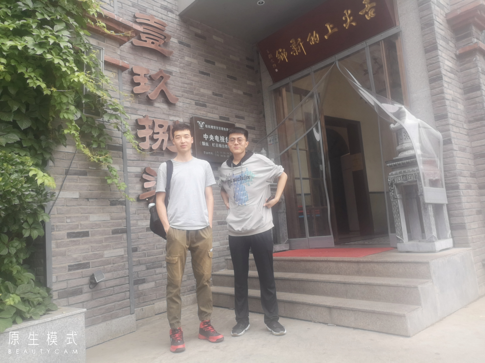
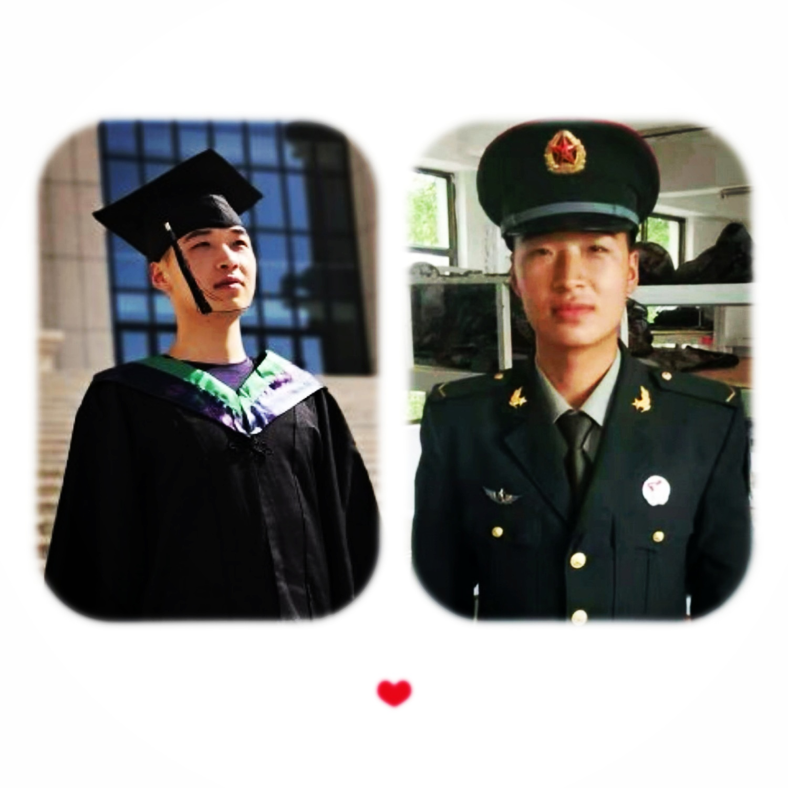

# 5月

<audio id="audio" controls="" preload="none" >
	<source id="mp3" src="../audio/A L'Ombre.mp3">
</audio>

---

&nbsp;&nbsp;&nbsp;🍔2021年5月3日，星期一，上午起床时在下小雨，很快就不下了。今天是五一劳动节放假第三天。前天在操场跑了5km,今下午去洗了牙齿，用的我爸的美团号，新用户首单19.9元，我的账号去年用过一次，原价好像100多元。目前自己的的实训项目做的不错，在阮一峰的周刊上发现了几个可以用的上的小工具，我对评审充满了期待。   

---

&nbsp;&nbsp;&nbsp;🍕2021年5月4日，星期二，天气晴。早上8点多起床，上午在做项目，放假的这几天项目进展的很快，几乎一天一个功能，下午李梦丹把她的分页功能代码给我，项目功能基本完成，自我感觉良好，看一下别人做的项目，垃圾。

&nbsp;&nbsp;&nbsp;今中午给我我二姨打了电话，她在周口干活，简单说了几句，我二姨对我很好。我的思想和想法有时真的是无法理喻，匪夷所思，不配做人，对不起。自己担心什么呐！可恶！印度新冠死亡很多人，火葬场就地焚烧，这种事情就算在历史上也算骇人听闻的事情，但它就发生在当下。

---

&nbsp;&nbsp;&nbsp;🥚2021年5月12日，星期三，天气晴，实训结束，失败。

##### 摘抄：

###### &nbsp;&nbsp;&nbsp;从甲午战争看清末中日国防动员差距

&nbsp;&nbsp;&nbsp;124年前的7月25日，日本海军在丰岛海面对中国北洋海军舰艇发起突然袭击，标志着中日甲午战争正式拉开帷幕。在这场事关国运的关键性战争中，中方投入总兵力63万人，日方投入总兵力24万余人，战争的结果却是63万输给了24万，中国引以为傲的北洋海军灰飞烟灭。

&nbsp;&nbsp;&nbsp;100多年来，痛定思痛的国人一次次把甲午战争放到历史的手术台上，用深刻反省的手术刀一遍遍解剖战败原因，从国防战略、战役、战术、装备等多角度探究悲剧背后的病灶，种种答案不胜枚举。然而，无论如何，国土面积相当于对手30多倍的中国，竟然输给了日本。这一明显违反综合国力估算和战争潜力较量的现象，反映出的是中日两国在国防动员方面的巨大差距，今天看来依然值得深思。

&nbsp;&nbsp;&nbsp;三心二意与蓄谋已久的战前准备差距。如果把甲午战争的中日战争动员较量比作一场接力赛，中国一开始就输在了起跑线上。在战争爆发之前，清政府上下安于“太平盛世”，总幻想着距离下一场战争很远。直到战争爆发前，清廷对日军的战争准备和军事行动情况几乎一无所知，更没有认真准备。经远舰管驾二副陈京莹在家信中披露，“中国只有北洋数舰可战，而南洋及各省差船，不特无操练，且船如玻璃”。在日本磨刀霍霍，蓄意挑起战争的危急关头，身为清朝重臣的李鸿章仍不做军事准备与战前部署，竟然抱着“我不先与开仗，彼谅不动手。此万国公例，谁先开战，即谁理诎”的天真想法，耽误了宝贵的备战时间。由于准备不足，致使清军从战争一开始就陷入了全面被动的局面。反观日本方面，在甲午战争前，日本前后8次实施了《扩充军备案》。战前几年，平均年度军费开支高达总收入的31%以上，1892年更是高达41%。战前，日本陆军扩充到7个师团、总人数10余万人；其海军无论是装备还是兵员的素质，都赶上甚至可以说是部分超越中国，扎实做好了与中国进行“国运相赌”的战争准备。

&nbsp;&nbsp;&nbsp;低效无能与高效运转的作战决策差距。从战争开始到结束，清朝始终没有建立起一套完整的战争组织体制，战争决策靠传统的廷议制度，主战派、主和派相持不下，政治体制和政权运转方式根本不适应战时决策需求。而日本战前就组建了由天皇主持的战时大本营，实行一元化垂直战争组织体制，下设参谋部负责制订作战计划，统一协调指挥陆海军作战，战时运行十分顺畅高效。日方战略层面虽然是豪赌，决策指挥上却精心编设作战预案，甚至做好了海战失利、清军攻击日本本土的最坏打算。从中日国力消耗的角度看，如果甲午战争再坚持几个月，最先垮掉的说不定是日本。日本外务大臣陆奥宗光承认：“国内海陆军备几成空虚，而去年来持续长期战斗之我舰队及人员、军需等，均告疲劳缺乏。”曾与邓世昌、林永升等第一批出国留学的严复曾公开上书，提出与日本打持久战的建议，“十年二十年转战，以任拼与贼倭寇没尽而已”。奈何清廷既没有认真的战略战役规划，更无法保持承受挫折的定力、战斗到底的勇气，在挫折面前成了惊弓之鸟，很快选择了投降路线。

&nbsp;&nbsp;&nbsp;粗放混乱与认真细致的战争组织差距。纵观甲午战争全程，清军的战争组织和实施，从指挥机构的组建、作战计划的制订，到战时兵员扩充、兵力调动部署、军需前运后送，都非常混乱、毫无章法。以兵员扩充为例，当时中国约有4亿人口，而日本大约只有7000万，中国的总人口和适龄兵员数量都远远大于日本。但清军实行临时招募兵役制度，军中老中青混杂不说，吃空饷更是司空见惯，战时不得不大量招募新兵。更糟糕的是，这些新募的乌合之众往往没有经过临战训练即开赴前线，既不懂作战技巧，更没有作战勇气，一碰到日军就蜂拥而退。日军方面，早在1873年就颁布了《征兵条例》，规定所有适龄男性均有服兵役的义务，并建立起完善的现代常备兵役和预备兵役制度，日本战时扩充的兵员绝大部分都是曾服过现役、预备役和后备役的老兵，战时只需经过短时的恢复性训练即可形成有效战斗力。另外，由于缺乏战役组织能力，清军虽然人多势众，战场上却基本是各自为战，形不成有效的组织和协同。日军进攻辽东兵力不到5万人，清军调集的援军先后有十几万人，但体系庞杂、多头指挥、互相观望、各不相救，一仗接着一仗败。威海卫之战中，防守威海军港和要塞的都是李鸿章的北洋系统部队，但同属北洋派系的陆海军将领却各行其是、互不协同，结果陆上防御很快溃散，炮台尽失，陷北洋水师于绝境。诗人黄遵宪痛心而泣：“海陆军，人力合，我力分!”

&nbsp;&nbsp;&nbsp;麻木不仁与兵民一体的民力动员差距。德国军事思想家克劳塞维茨在《战争论》中指出，民众力量既是战争的人力源泉、物力源泉，又是战争的精神源泉；尽最大努力动员可以动员的一切力量，是战争指导必须遵循的首要原则。清政府长期实行愚民政策，对于民众的战争动员也是无从谈起。底层民众对战事漠不关心，更不会支持战争。当甲午战争硝烟弥漫之际，中国不但南方歌舞升平，即便在战火蔓延的北方，民众最关心的仍然只是生计。与此形成鲜明对比的是，日本政府高度注重争取民众对战争的支持。开战后，日本开动传媒机器传播所谓“朝鲜独立论”“义战论”“文野之战论”“中国愚昧落后论”和“日本人优越论”等，大肆制造“战争有理”的舆论氛围。报界派遣战地记者跟随作战部队和军舰，随时传递前线最新战报。国内掀起捐献热潮，民间团体和个人自愿捐出大量金钱财物。日本1.5亿日元临时军费预算中，1亿日元额度以发行军事公债形式向社会筹集，结果是两次组织公债募集活动均超额完成任务。日本民间各地及地方政府自发掀起征朝义勇军活动，向政府请愿参加赴朝作战。不得不承认，当时偌大的中国竟如一盘散沙，小小的日本却动员起全体国民的力量参战，这也是中国在甲午战争败给日本的重要原因之一。

##### 摘抄半月谈文章

&nbsp;&nbsp;&nbsp;“演戏盼着能得奖，说相声盼死同行”，郭德纲语出惊人，但生活远比相声“精彩”，这个世界上总有那么一些人，他并不盼着你好，你的些点滴成就都会引来他的嫉妒，甚至伤害。对于这种人来说，你的卓越是对他的伤害，而你主动向他分享卓越与喜悦，更令其扎心折磨。

&nbsp;&nbsp;&nbsp;生活中，人们只会崇拜那些水平层次明显高出自己一大截的人。但是，对于身边比自己稍微优秀的人，却嫉妒甚至嫉恨非常，见不得别人好，表面上笑嘻嘻，背地里似毒蛇一样，隐藏在某个角落里，趁你不注意就咬你一口，想方设法把你拉下马，即便你们之间没有利益冲突。

&nbsp;&nbsp;&nbsp;对于那些表面君子，你更不能告诉他你有多么的卓越，因为在他们眼里，你的喜剧就是他们的悲剧，何不让你也演演悲剧呢？

##### 英文

&nbsp;&nbsp;&nbsp;You guys right now are constructing the person you're going to be for the rest of your life. Human behaviour is mostly a matter of habits. People talk as if you make big decisions all the time about what to do, but that's not true. Almost all the time, you just do what you're in the habit of doing. 

&nbsp;&nbsp;&nbsp;If you get in the habit of cutting corners this early in your career, how are you going to make it through the harder upper-division classes? And then what are you going to do when you actually get a job? What's the best thing that can come out of cheating? You condemn yourself to a life of doing something you don't know how to do and don't like doing.

&nbsp;&nbsp;&nbsp;So don't cheat. If you do, you're really hurting yourself.

---

&nbsp;&nbsp;&nbsp;🍠2021年5月16日，星期日，天气阴，昨天下雨。昨天和今天学校有社团文化节，前天中午有个19级的小学弟在东区三楼请我吃饭，昨天中午我和小学弟，小学弟他姐一起去新乡红焖羊肉1987吃羊肉。

 

&nbsp;&nbsp;&nbsp;今天同学们体侧，自习室里只有我自己。上午查了计算机二级考试成绩，依然不合格。上午在网上看的一些话感觉挺有意思。

##### 摘抄

**1**  &nbsp;&nbsp;&nbsp;
“欲望的规律”：人生就是由欲望不满足而痛苦和满足之后无趣这两者所构成。你满心期待着未来的某个快乐，却未必理智认知到了它是短暂的而不会持久。人的本质是痛苦，快乐充满幻灭感，只是昙花一现。
——这个描述有两层含义：一、人的欲望生发的必然规律。充满无意义感；二、人的欲望实现后的感受的规律。感受只发生在认知的“陌生”阶段，一旦“熟悉”了对象，大脑就不再接受刺激，感受就消失了。

没有人的生活是值得羡慕的，因为每一个人的生命都由相同的元素构成：无处不在的空虚、无聊，一个痛苦接着一个痛苦地轮番上演，快乐幸福短暂稀有如梦幻泡影，不过是让你继续去忍受痛苦的安慰剂。你所羡慕的生活也终究不过是一次短暂的梦幻泡影。

人的一生就是不断对抗熵增（宇宙定律，事物始终趋向混乱和无序）以维持自身存在的一生，和推石头上山的西西弗斯并无区别，痛苦周而复始，无穷无尽。
神不得已做出这样的安排，因为使人行动起来的力量无法是“快乐”而只能是“避免痛苦”，“快乐”只能是稍纵即逝充满幻灭感的存在，我们对生命的指望不可能是快乐。
人以痛苦为食，充满荒诞感，而对抗这一荒诞的就是人所发明的“意义”，人是如此悲剧而伟大。

**2**  &nbsp;&nbsp;&nbsp;
你想获得强烈的快乐感吗？我们知道通常建立在强烈痛苦上的快乐是强烈的快乐。这样你就要先邀请别人痛殴你一顿，或者让自己保持长时间的饥饿，方法是很多的。饥饿的乞丐获得一个馒头的幸福快乐岂是富翁所能想象的？

**3** &nbsp;&nbsp;&nbsp;
想象和现实是不同的，它们是两个独立的意识系统，而人们经常将它们混为一谈。

**4** &nbsp;&nbsp;&nbsp;
照片、视频中的事物给人的审美感受和该事物在现实中给予我们的审美感受是不同的，人们常常沉醉于照片、视频中的女子的美，而这种审美感受只存在于照片、视频中，现实中是没有的。
现实世界与非现实世界你是否能厘清？现实世界是你此刻真实感知到的这个世界，而非现实世界是对现实世界的模拟，常发生的情形有想象（含回忆）、照片、视频等，在这些情形中我们大脑里呈现的事物在现实世界中是找不到的，你不应去欲求得到现实世界中根本不存在的事物。

**5** &nbsp;&nbsp;&nbsp;
人们总是以为在富翁、贵族、明星的生活里，有一种非凡的幸福，它诱惑着我们。人们频繁地在网络、电视、报纸、杂志中受到美女所带来的情欲诱惑，我们嫉妒那些美丽女子属于权贵、富人、明星，我们认为他们得到了多么美好的生活，我们也渴望得到，这让我们充满欲望，而现实却是平凡的，你所想象的美女给人带来的快乐幸福在现实中根本不存在。

**6** &nbsp;&nbsp;&nbsp;
我们总是悲伤地沉湎于回忆，回忆过去的美好，而这所回忆的只不过是你“想象”的创造，回忆的的快乐幸福在现实中根本不存在。

**7** &nbsp;&nbsp;&nbsp;
“想象”这个汉语词语有三种含义，一种是作为"体验感受"的，一种是作为"审美感受"的，还有一种是“想的”（以为的）。我们现在来讨论“想的”。
在生活中我们常有这样的体会：我们渴望得到某种生活，以为得到了人生就圆满了，就拥有了一生的快乐幸福（这是多么令人鼓舞的事），而得到后发现和我们“想的”不一样。通常人们不会去反思，不会由此形成经验和智慧，我们仍然在生活中不断地去渴望，不断地因为没有得到而痛苦。比如一个人长期远离亲人，忍受着孤独和思念的时候会想：啊！如果我能回去以后都和她们厮守在一起，那样我以后的人生都是幸福的了；比如一个人向往远方忍受着对当下生活的不满，会想：啊！如果我能去远方，过那诗意的生活，那我往后的生命都是快乐的了；比如一个人忍受着平凡会想：啊！如果我像他一样获得了金钱、权利和名誉，那是多么美好的人生啊；比如一个人没有女友，忍受着性欲不能释放，忍受着没有爱和归属的时候，见到某个他中意的女子，会想：啊！如果我得到了她，便每天都是多么快乐、幸福的啊！（现实是这只不过是短暂的激情期，很快就进入平淡和糟糕的生活，在性爱方面也越来越平淡乏味）；……太多太多的渴望了，我难以一一去举例并告诉你现实经验是什么，我很遗憾，真的很遗憾，我知道这实在太重要了，能免于人们承受根本不存在的诱惑，但我没有办法把现实的真实感受一一告诉你，只能粗糙地说：你在此犯了两个错误，一是“静态思维”：你没有考虑到“欲望的规律”，二是“单点思维”：你想象的生活只有那一个愉快的点，而生活还有无数的点，充斥着各种不愉快的点，是你没有考虑进去的。现实总是和你以为的不一样，现实总是败坏的。

**8** &nbsp;&nbsp;&nbsp;
人们常常被美女所诱惑，也承受着因得不到而导致的痛苦和嫉妒。在此，我们不去讨论审美感受，只讨论要去审美的对象是否是客观真实的。其一、如果你是在照片、视频中看到的美女，则要明白这是非现实世界的存在，现实世界中既无这种审美感受，也无这样物理状态的容貌（对审美结果的影响可能极大）。其二、"化妆"的因素对容貌的影响巨大。其三、"光线""观察距离"都会使她们的容貌发生更好的改变。只有排除这些因素，审美的对象才是客观真实的。

**9** &nbsp;&nbsp;&nbsp;
我们对一个陌生姑娘产生了爱慕之心，总是很轻易认为她是单纯善良、美好的，文学和影视尤其善于塑造"美好"的人，让人畅想娶她为妻在一起的美好生活。而真实的情况是——在世俗中生活的人都是不堪的。
很多失恋者痛苦于失去了一个"美好"的人，这只是因为他（她）对人性的无知！不懂心理学！ 
另外，我们所为之痛苦的失去的“美好”还包括对生活情景的美好的“想象”，而这是现实世界中不存在的。   

---

&nbsp;&nbsp;&nbsp;🎈2021年5月21日，星期五，天气晴。昨天5月20日，我在花店给她买了一束花，晚上送给了她，送给她时她的反应不是我想象的样子，我感到失望，难过，气愤。在网上买的拖鞋明天就要到了，胡幸举今晚把我的微信删了，我把我的所有事情都给他说了，自己的事情什么都给他说过，他应该也有很多烦恼，我没有听到过他给我说过什么，他是个好人，很好的人，他马上就要离开学校，今年毕业了，反思自己，我感到自己在他这里比较自私，自己在他这里总是有意无意的炫耀自己，我有什么烦心事都给他说，他在微信里总能回我，我在他身上看到有点像自己的影子，不愿给别人添麻烦，最后受伤的却是自己。这半年自己什么都没有去全力以赴。生活真的好奇妙，五月份以来，我的好运不断，欣喜不断，这些快乐，一件件的破灭，最后什么都没有。人的一生应该也是这样。   

---

&nbsp;&nbsp;&nbsp;🍝2021年5月25日，星期二，天气晴。昨天软件测试线上考试结束，这应该是我大学最后一门课。大前天袁隆平院士去世，最近几天手机公众号上都在推送祭奠袁隆平院士的文章。

&nbsp;&nbsp;&nbsp;现在进入了全面备战考研阶段，所有课程都已经结束，前天晚上一夜没有睡着，早上5点去操场锻炼了一个小时。周六和周日学校有淘宝文化节，大四的人把自己不需要的物品卖给需要的学弟学妹们，顺便说一下，晚上我去逛的时候，我得到了一个蓝牙耳机的外壳套，因为我长得帅，她直接送给了我，可能最近俯卧撑做的有些频繁，现在感觉腰有些酸痛，去年这时候在家吃了不少蒜，学校最近有很多人拍毕业照片，昨天自己也去拍了几张。

 

##### 摘抄：

**1**

**好人难做**

你做了一辈子好事，忽然干了一件“坏事”，那么你一生做的所有好事都会被清空，大家会指着鼻子骂你。

但是如果你干了一辈子坏事，忽然心血来潮干了一件“好事”，那么所有的人都会来称赞你，把你捧到天上，认为之前都错怪了你。

好人的修行要历尽千险万阻，九九八十一难一样都不能少；而坏人的修行只需放下屠刀，只要一瞬间。

这个世界对好人的要求，真的是非常严苛的，如果别人称你为好人，你必须做到完美无缺，大家会把所有的道德枷锁戴在你身上，哪天万一你要是有一丝一毫没有做到位，你所有的修行都会前功尽弃，甚至被当成妖魔。

而这个世界对坏人的要求，却是十分宽容，那些做过很多坏事的人，无论之前的罪孽多么深重，如果有一天准备改邪归正了，都会被大家捧的非常高。

**好人得道需要历尽千山万阻，坏人得道却只需转一个念。**

这个世界的好人，天生就是要接受更多的磨难。

**2**

**见不得身边人好**

人最大的痛苦，就是看到身边人飞黄腾达。

人性里有一种基本属性：总担心别人比自己活的好。绝大多数人痛苦，并不是因为自己平庸、贫穷而痛苦，而是看到别人比自己成功，而感到无比痛苦。

因此大众有一个基本特征，他们总喜欢把各种高高在上的人拉下马，踩在脚下，以此能获得心理上的满足，这种感觉甚至比取得成就还快活。

每个人心中都有一种对自尊的保护机制。这是一种与生俱来的意识，但凡接触到外界那些出乎自己意料的优秀之后，他们会感到惊慌错乱，这时他们大脑里就会收集一切线索去证明别人的成功是侥幸的，如果自己要是有同样的客观条件，只会比他们更好。

就像上学的时候，我们热衷于讨论学习好的人都是书呆子，漂亮的姑娘往往没大脑；长大之后则变成了：同事升职了是因为会拍领导马屁，同学创业成功了因为家里给了巨额的资金支持。

很多人对社会上一切的事情，非要往最下三滥的地方想才安心。仿佛只有这样，才能证明自己的庸俗不是孤立的，并为自己的”“不成功”和“生活在底层”找到理由。

**人啊，宁可证明别人的平庸，也不愿意面对自己的平庸。**

**3**

**低级的爱**

人人都能张口谈“爱”，但世界上真正懂“爱”的人不到1%。

99%的人对“爱”的理解都错误的：他们总以为无条件的对一个人好就是“爱”，愿意为对方牺牲自己的一切就是“爱”，这是一种非常低级的观念，它广泛的存在我们周围，包括父母之间，恋人之间等等。

在任何关系中，因为只要有牺牲，就意味着不公。这个世界上只要有不公的地方，就会在另外一个地方，或者以另外一种形式补偿回来。这就是很多悲剧的根源。

经济越发达，人就会越独立。未来我们都是独立的个体，人一旦走向独立，就不再需要互相牺牲/付出，而是需要互相成全。这早已不是那个谁可以为谁去死，或者谁需要谁为自己去死的时代了。

**我们首先要学会独立，包括人格的独立和经济的独立，然后要学会爱自己，就是展现你的个人魅力和社会价值，当你做到这一点，你爱的人自然就会来。**

这个世界上没有任何一个人能为你的幸福负责。千万不要试图从另一个人那里获得幸福，我们必须有一种把自己变的完整且幸福的能力。

无论你跟谁在一起，无论你选择一份怎样的事业，你到最后遇到的都是自己，一个更加完整/完美的自己。恋爱如此，亲情如此，事业亦如此。

**4**

**活在假象里**

这个世界的真相是非常残忍的，要想看到真相不仅需要莫大的智慧，还需要莫大的勇气，而一般的人根本没有那么高的智慧和勇气，无法面对真实的世界，所以大家只能活在假象里。

正是因为99%的人都活在假象里。他们崇拜的英雄，都是传说里的英雄，而不是现实中的英雄；他们崇拜的方法，都是具有传奇色彩的方法，并不是真正切实有效的方法；他们追求的并不是真理，而是各种情绪抚慰，那些让他们感到平平淡淡的“现实”，大家会一直充耳不闻。相反，那些能让大众产生美好幻想的传奇，却可以让大众疯狂和着迷。

所以你只要讲好一个故事，抚慰好他们的心灵，给他们带来希望，你就可以大获成功。

因此，人既不能活在假象里，也不能是活在真相里，而是应该活在希望里，人一旦发现了人生没有希望了，才是真正的绝望。

我们最大的挑战，是如何给残酷的真相穿上一层糖衣，让世人吃下这片甜甜的药，给他们看到希望，而不是看到真相。

**人生的意义，不是追求真相，而是要看透世界的真相后依然热爱它。**那些能够带领大家看到希望的人，就是这个世界真正的英雄。   

---

&nbsp;&nbsp;&nbsp;🍣2021年5月26日，星期三，天气晴。中午和晚上在东区食堂吃饭，臊子面很不错，我吃了她家可多蒜。今天俯卧撑练习手上起了两水泡，下午吃完饭看到要毕业的人拍毕业照片，我拍了几张，很好看。

---

&nbsp;&nbsp;&nbsp;🥣2021年5月29日，星期六，天气晴。今天胡幸举走，昨晚去和他在操场说了会儿话，2017届的同学最近会陆陆续续离校，记得我退伍那天，天气下着小雨，旅队门口放着大鼓，鼓旁一个人给我们敬礼，和迎接旅队比武凯旋时同一种礼仪，时光荏苒，转眼已过去两年，好快。在学校时我是和胡幸举联系比较多的人，送别别人时总是离愁别绪。

&nbsp;&nbsp;&nbsp;昨晚室友们一块去学校旁的烧烤店吃烧烤，鹿军和笙徽要去工作。昨天在朋友圈发了一张自己的照片。

 

---

&nbsp;&nbsp;&nbsp;🍡2021年5月30日，星期天，天气晴。刚在微信公众号上看到一篇关于何兆武教授的文章，一篇纪念何兆武先生的文章，何教授5月28日在北京逝世，刚在百度上上搜索‘何兆武’，百度百科的搜索结果显示内容为黑白色。文章结尾有这样一段话“1939年至1946年，他在西南联大度过了整整七年，读过四个系，‘现在回想起来，那是我一生中最惬意、最值得怀念的好时光。’ 先生说，原因是：自由。”

&nbsp;&nbsp;&nbsp;我想我现在正在用文字记录这美好的时光。

##### 摘抄（阮一峰网络博客）

&nbsp;&nbsp;&nbsp;2008年，哈工大研究生毕业后，我和同宿舍的同学一起来了上海。他在盛大游戏工作几年后，回了广州老家，我们就很少联系了。

前一段时间，我有事找他，就聊了一下近况。他本科和硕士都是计算机专业，现在广州的一家游戏公司上班，还在写代码。我们都已经35岁了，我也想知道，这个年龄段的中年码农，现在的行情怎么样？

他跟我说了几个情况。首先，跟大家想的一样，加班非常厉害。周一到周五，每天基本是晚上十点下班，如果遇到项目上线或者重大更新，那肯定是凌晨两三点下班，通宵也是有的。周六还要正常上班。

他现在的这家公司比较坑。游戏公司给研发人员的基本工资不会太高，你的很大一部分收入来自项目奖金。去年他们公司有一个项目上线，就在上线之前，把整个项目组解散了，要么辞退，要么分配到其他的项目组。公司这是为了节省成本，少发奖金。很多公司都这么干，没有办法的，员工永远是处在弱势的地位。

然后，我很好奇，也是很多人好奇的，985高校的计算机硕士，工作到现在有12年了，收入是多少呢？他跟我说，他的月薪是每月税后三万多，具体多少他没说，奖金我也没问。

我是自由职业者，会担心下个月的收入，我觉得他在公司上班，可能相对稳定一点。他说自由职业者的所有担心，他作为上班族都有，担心会被裁员。裁员是所有中年码农，或者说所有中年职场人士，都避不开的一个话题。35岁到40岁的这些职场人士，如果职位做不到中层，你的人力成本是很贵的。把你优化掉，雇佣那些刚毕业的年轻人，对公司是更优的选择。他们更有体力，也更听话，执行力也更强。很多公司裁员时，第一考虑的就是中年的中低层职员。作为中年人，如果你平时不加班，万一绩效评得不好，那就可能被优化掉。

我刚毕业时，很多同学和同事可能心里想的是，写几年代码，代码写得好之后去转管理层。后来有一些人真的转了管理，但是更多的人是转行，不做码农了，因为年纪大了，各种体力都跟不上了。转管理层毕竟是少数，因为僧多粥少，只有那么几个位置，而且有些人就不适合做管理，喜欢写代码。就算成功晋升管理层，往上走就更难了，很多时候只能走到中层，很难走到高层。所以，对于中层管理者，前面说的那些中年危机，他同样都有。

现在已经有很多三四十岁的码农了，好消息是有一小撮人，像我同学那样，依然在写代码，坏消息是很多公司对于中年的码农比较苛刻，由于他们的综合人力成本比较高，很容易被优化掉。这就是现状。

下面对于那些年轻的码农，我给几个建议吧。

（1）要有积累。不管是文字、视频、项目、代码等等，一定要有积累，要在本职工作以外，有一个东西你可以慢慢的累积下来。最开始的几年，可能都没有什么收益，但你最好还是要坚持下去。我觉得，积累是一种很强大的力量，比学习能力更重要。因为随着年龄的增长，你的学习能力是在下降的，而且行业和技术迭代比较快，一直有新东西出现，你必须不断地保持学习，这很困难。

（2）要让自己不可或缺。公司制定了很多很完善的流程和制度，目的就是为了让每一位员工都可以被替代，一旦有人离职，都可以在短时间内找到替代他的人，这样才能保持公司的正常运转。个人的策略其实就是跟公司相反，让公司不容易找到替代你的人。如果公司需要花费较长时间或者较大的成本，才能找到合适的人来替换你，那么你就是不可或缺的。

（3）要保持开放的头脑，要善于接受。每个人的见识是有局限的，世界是多元的，每一次交流都是认知的碰撞。很多人就是不善于接受别人的观点，很固执。我并不是说，让你无脑地赞同别人，而是你愿意去尝试或者验证别人的观点。这样才会给自己带来更多的机会，蛮干是没有出路的。中国大部分码农的现状是不乐观的，如果你不多去思考的话，情况可能会更加的不乐观。

