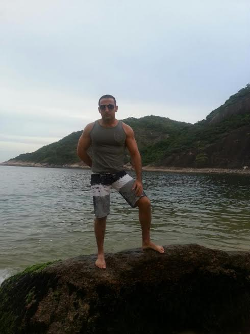
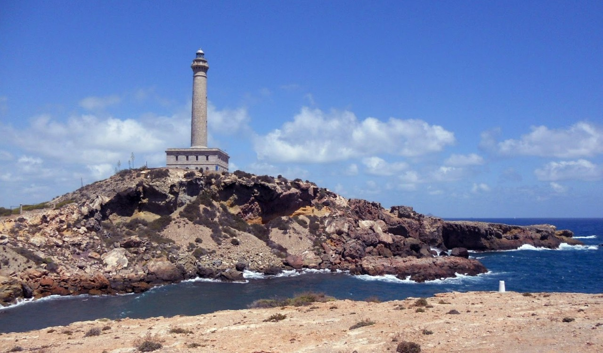
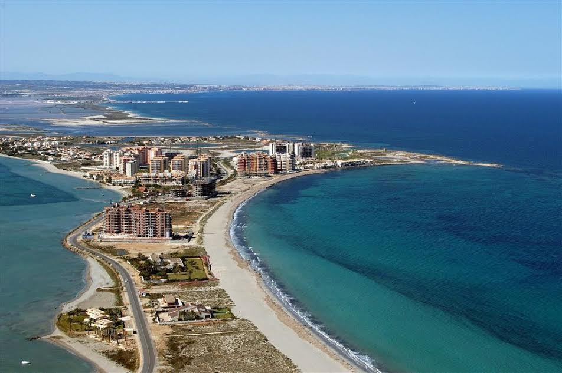
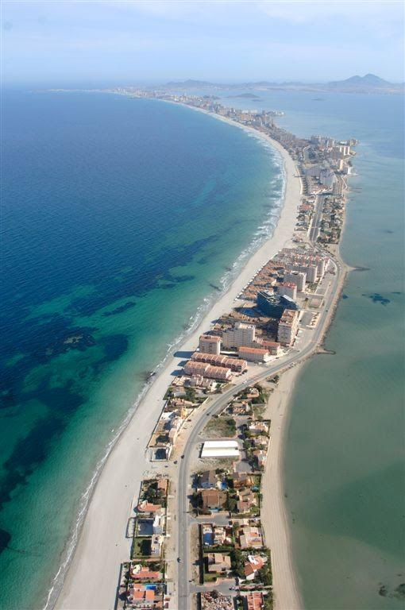
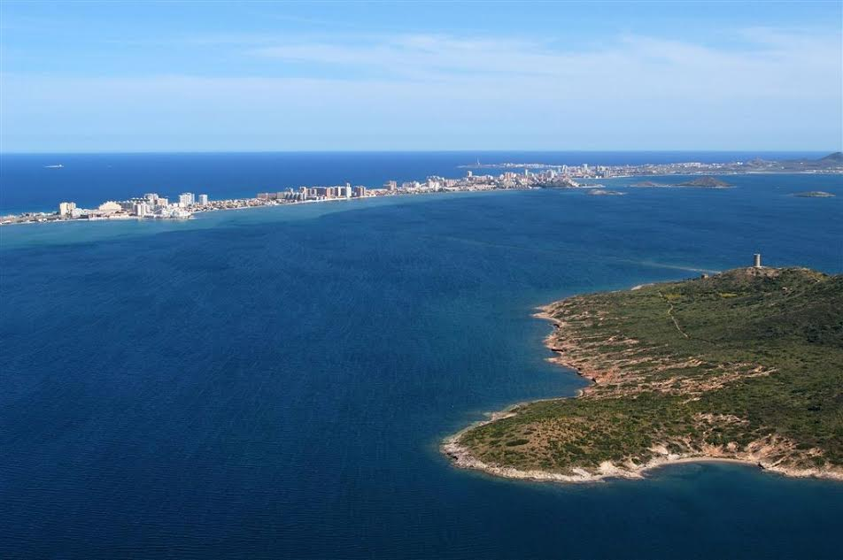

&nbsp;&nbsp;&nbsp;🥘2021年6月1日，星期三，多云。早上8点40左右起床，洗完澡10点左右到实训楼，来时看到王晗她们在实训楼前拍毕业合影，刚在微信公众号上看到一篇文章，很好很好，公众号名字叫‘杨国斌的精神家园’，杨老师的公众号是微信推荐功能推荐给我的，杨老师在公众号上记录自己的生活，读来很亲切，很接地气，杨老师现在是华北水利水电大学马克思主义学院教授，本科也在河南师范大学读书。

##### 摘抄

&nbsp;&nbsp;&nbsp; 如果爱就深爱，这个爱绝不是一味护短，看到它的缺陷就要想法设法尽力弥补，积极建言献策！明明看到不对的地方却文过饰非甚至假装看不见，那不是爱而是害，是自己的明哲保身在作怪！鲁迅当年深刻批判我们国民性 ，陈独秀在《觉醒年代》中大声疾呼中国是胡适之太多了而那个死掉的北大的学生太少了就是这个意思。我们所在的单位所在的国家可能还有这样那样不太好的地方甚至对不起你，但是正因为如此我们才要奋发有为尽快改变现状而不是冷眼冷语袖手旁观。

   如果爱就深爱，要有大爱不要自私自利，干什么事情首先想着对自己有什么好处，对自己有好处的就着急忙慌，对自己没有好处没有关系的置若罔闻，岂不知我们都是需要同舟共济的，如果人人只关心自己的一亩三分地而置整体不管不问，那一个单位一个国家怎么可能建设好？杨靖宇将军对一个劝他投降的人说，如果一个个中国人都为了自己的生计投降了，还有中国吗？

 &nbsp;&nbsp;如果爱请深爱，要努力本职工作，坚定不移矢志不移，时刻具备能力，不要朝三暮四朝秦暮楚，只要人人都努力工作，在自己的工作岗位上出彩，发挥自己的优势，不断奉献自己的智慧和力量，一个单位一个国家怎么可能建设不好呢？最讨厌那些对别人营营苟苟说三道四，真正让他去干一干的时候他又说自己这不行那不行的，理由一大堆，条件一箩筐，推诿扯皮，而自己肚里脑袋里始终空空如也。

   您所在的就是中国，您什么样中国就什么样？！您所在的就是河南，您什么样河南就什么样？！您所在的就是华水，您什么样华水就什么样？！

​    如果爱，请深爱，抛弃徘徊犹豫、抛却胆怯羞涩，大胆热烈直接深沉的爱，深刻的爱，深远的爱！

---

&nbsp;&nbsp;&nbsp;🚩2021年6月2日，星期三，天气晴，刚才突然刮风下起了雨，只下了一小会儿，昨天洪立和我去吃饭时洪立告诉我如果要考研最好把每个阶段学习什么做好规划。鹿军前天去的郑州亚信，刚看到QQ群消息他要被调到武汉一个月，每周工作六天半，每天早上9点上班，晚上10点下班。如此看来，学校里的生活确实是一生中最好的时间段，工作了根本没有时间谈恋爱，也没有时间去学习，可恶！今天把高考3500单词过完了一遍，在学校收二手书那里买了3本英语书，下午做了一篇英语真题阅读理解，生词很多，各种考研经验贴上都强调每天背单词，这一点，我一定要做到。上周在新联楼预约了心理咨询，到现在还没给我打电话，自己感觉也没什么问题，就是想去看看心理咨询都干些什么，听说外边心理咨询一小时要好几百。下午去吃饭时遇到麦超杰，他也是退役学生，和胡幸举一个班，去年就在学校外边开了家面馆儿。

---

&nbsp;&nbsp;&nbsp;🚗2021年6月3日，星期四，天气晴，早上8点多起床，9点左右班里，中午午休了一个多小时，要缩短午休时间！中午饭前给我妈打了视频电话，昨天我爸发微信说‘孙好想不好好学习，死不听话’，今天打视频把孙好想说了一顿，当然她很不屑听我说她，孙好想脾气比我大的多，谁打她她都还手，我打她她还手，我妈打她她还手，我没见我爸打过她。性格难道是出生就带的？我和她性格完全相反，我像我爸，听话老实，好想像我妈，大大咧咧。摘抄一段2021年政治考研题目的短文，这段话对人生指导也有很好的作用。

##### 摘抄

&nbsp;&nbsp;&nbsp;效防范化解重大风险的治理智慧。坚持底线思维，对可能出现的最坏情形有充分的预见和准备，时刻保持如履薄冰的谨懊、见叶知秋的敏锐、未雨绸缪的忧患，オ能做到“明者防祸于未萌，智者图惑于将来”。这次国际疫情蔓延带来的风险挑战是显著的、严峻复杂的，而且时间较长，需要按照进行具有许多新的历史特点的伟大斗争的要求，善于从纷繁复杂的矛盾中把握规律，抓住主要矛盾和矛盾的主要方面，在大是大非问题上敢于碰硬较真，敢于针锋相对。敢于担当不是盲目冲动、不讲变通，而是在坚持原则、坚定立场的基础上因时因势采取最有效的行动，以实现既定的目标。

---

&nbsp;&nbsp;&nbsp;👒2021年6月4日，星期五，天气晴。昨晚大概4点左右睡着，这两天我总是失眠，昨晚10点多我和成炤桦在实训楼的后边，我们叫它‘后山’，我们在这里走了走，天气凉爽，很不错，成炤桦拍了些照片

 

&nbsp;&nbsp;&nbsp;我问她我送的花是不是已经在垃圾桶了，她说‘没有，把花风干了，要留起来’。

&nbsp;&nbsp;&nbsp;上午看到一个有意思的脑筋急转弯

Three tourists stop at a hotel, and the manager tells them that a shared room will cost $30. Finding the price agreeable, they pony up $10 each and retire to the room. Later that afternoon, the manager, who is honest, realizes that the room was meant to be priced at $25. The manager orders the bellhop to return the excess $5 to their guests. The bellhop, who is not honest, takes $5 from the register and return only $1 to each tourist, pocketing the remaining $2—the guests don’t have to fuss over uneven change that way.

Now, each of the three tourists has spent $9, for a total of $27. The bellhop has retained $2, which brings the total to $29. Where did the other dollar go?

The puzzle uses mathematical sleight of hand to put together an equation, 3 × 9 + 2 = 29, that appears to model the situation described, but really it does not. By juxtaposing dollars spent with dollars held, the equation manages to double-count some dollars while failing to represent others, leaving a total that is just slightly off what we would expect.

Most of us learned in school that it is an error to add measurements that have different units: ten meters and five minutes don’t add up to fifteen of anything. This puzzle teaches us that the inverse is not true: two measurements that have the same unit attached (dollars, in this case) may still sum to a value that represents nothing meaningful.

&nbsp;&nbsp;&nbsp;自己看了好几遍，把解析也看了一遍，才发现其中的错误，把这个发给了孙好想，她立刻发现了错误,下午跑了5km。

<audio id="audio" controls="" preload="none" >
	<source id="mp3" src="../audio/puzzleSolving.mp3">
</audio>

---

&nbsp;&nbsp;&nbsp;🚕2021年6月6日，星期天，天气晴。昨天早上吃完饭在学校献血400ml, 累计献血已经1000ml, 昨上午没有学习，在哔哩哔哩上看了些视频。

---

&nbsp;&nbsp;&nbsp;🚙2021年6月7日，星期一，天气晴。昨天和朱沛琳发微信，她说她和她对象已经分手了。我感觉在现实中男女双方个人具备的某些‘力量’要相差不大才可能会结婚或谈恋爱，谈恋爱可能没有太多条件，可能是他或她长的漂亮，男生对女生好或时刻关心女生，便可以谈恋爱，但现实是一旦毕业，就会考虑到结婚，这时态度便会产生变化，在‘力量’强的的一方便可随意提出分手，‘力量’弱的一方就很被动，没有什么竞争力加持在身，一旦对方厌倦了这种感觉，便可随时抛弃你。

&nbsp;&nbsp;&nbsp;我的现实感受就是如此，朱沛琳对象大专毕业，现已外工作2年，他追的朱沛琳，上次帮朱沛琳修电脑时朱就直言给我说道她不想和她对象谈恋爱了。反观自己，也是如此，自己退伍找周梦洁，自己失去了身处部队的价值，失去了上军校做军官的价值，自己也是被分手者。只有不断提高自己的‘力量’才是万事之本。下午发现了一个Moviepy模块，可以制作视频。

---

&nbsp;&nbsp;&nbsp;🚚2021年6月8日，星期二， 天气晴。早上7点多起床，下午开年级考研交流会，李淳老师说要调整作息，早起比晚睡好，我一定要控制自己。中午吃完饭在餐厅门口遇到荣帅，和他聊到了西方的资本主义与我国的社会主义，这是我20多年来第一次如此一本正经的谈话，荣帅知道的真的多，他今年考到了山东大学读研究生。

---

&nbsp;&nbsp;&nbsp;🚛2021年6月9日，星期三，多云，早上6点30左右起床，看到邮箱有一个38岁的西班牙人给我发了邮箱，内容如下

Hi Sun:

I saw your email on the Students of the World website and I would very much like you to accept my friendship. . I am waiting that we will become good friends. ¿In which city do you live?

 

Your friendship is welcome and appreciated. We can talk about many topics and share many things. 
Well, my name is Roge (diminutive of Rogelio) (Roger); I am Special Education teacher (disabilities), I also studied half of the Psychology degree and two postgraduate degrees and the Doctorate. I am currently working as a teacher and research at the University of Murcia. I am 38 years old.

University classes began on September 15. From September to December three subjects I teach two groups of 4th year master degree in Primary Education. It's nice to find among students, familiar faces. I mean that many of my students who are now in 4th year, I gave them when they were in class 1 college course. That is, we are old acquaintances.

At University he taught subjects related to intellectual disability, physical disability, hearing impairment, visual impairment and learning in reading, writing and Mathematics problems.

I live in Murcia capital, located in the southeast of Spain. In my family we are three: my mother (my father died last October 25,2017), a brother and me. I live in an apartment myself, although very close to my parents' home.

I think it's good to find friends with whom to share many things and good times, although sometimes people act selfishly, or simply have their lives made, family responsibilities, etc. and it is difficult to coincide or remain, or they have distanced themselves.

As for my hobbies I like to read a lot (historical novel, best sellers, adventure novel, science fiction, horror, classic and contemporary literature); cinema, in all its genres (comedy, mystery, action, science fiction, horror, musicals, police, etc.). In my apartment I have a good library with more than 1,200 books

I think and believe that friendship should be valued above social, political, religious, cultural, sexual, racial, and economic differences and that it is very enriching to know people from different places, countries, races, etc. respecting the whole world and offering and sharing the best of each one of us.

I like to go out with my friends (I do not have many, I've been practically alone since people have been married, has left work to other cities, or simply, have not kept contact) to walk, to the cinema, to have a coffee, a beer (in moderation), or an ice cream and above all to talk.

 When I have free time I usually go for a walk, ride a bike, and in the summer I love to walk along the seashore (I walk about 15 kilometers a day), sunbathe, swim and play beach volleyball, although I have to confess that during this year due to work I have led a somewhat sedentary life and I have to put my batteries and use myself thoroughly in sports (do not expect to find an Olympic athlete, but not a round obelix type fat ball).

I love to travel, although most of the time I do it is for professional reasons, although there is always a little bit of time to do some tourism. In Spain I know a few cities like: Madrid, Toledo, Barcelona, Zaragoza, Palma de Mallorca, A Coruña, Santiago de Compostela, Granada, Cordoba, Seville; in Italy, Milan and Genoa and in Scotland, Glasgow and Edinburgh and last year I visited Paraguay for professional reasons).

I will be very happy to help you to progress in the English language and you have total freedom and confidence to talk and ask about any topic you want., I want to explain many things about the culture, history, traditions, festivals, monuments, gastronomy of Spain. You can also ask what you want about my life, now you are my friend, I trust you and I am an open book for you

 

¿Can you send me some pictures of you?

I await your news. And of course I'm going to keep writing to you.
I appreciate your friendship

Please send me some pictures of you with your new mail to meet you
Many hugs

Your friend

##### 我的回复

Hello Mr. Roge:

 I am honored to receive your reply. It's great to meet you online. I come from Henan Province, China. I am 23 years old. I am currently studying for my undergraduate degree at Henan Normal University. My major is computer technology.

 In daily life, I like running and reading books, such as literature books, IT technology books and so on. When I received your email yesterday, it was 1:00 a.m. here. When you receive this email from me, is it already evening in your place? In your email, I read that you have a personal library, which is really an exciting thing. As a Chinese saying goes, "Read 10,000 books and travel 10,000 miles." I look forward to your way of life. My English level is not very good, may not be so precise in the expression, please forgive me. I would also like to make friends with your students.

 In my country, Facebook is not available, but I feel E-mail is also a good way to communicate. Below the email is my photo. I don't know how to reduce the size of the photo. Please forgive me.😅

 I hope everything with you is fine.

##### 摘抄

“慈不掌兵 情不立事 义不理财 善不为官”。白话翻译是：“带领军队必须要狠，心慈手软的人干不了；讲情面成就不了大事；掌管财务必须认真负责。讲义气，不把钱当回事的人做不了；心地善良的人，做不了官。”

---

&nbsp;&nbsp;&nbsp;👕2021年6月10日，星期四，天气晴，上午学校在图书馆前有学位授予仪式，昨下午跑了5km, 在西区操场收到了西班牙老外的邮件，他给我发了好几个邮件，有他写的文字邮件和他的照片还有他生活的城市照片。内容如下

Dear little brother and friend Sun:

Thank you for your message and your friendship . Please call me Roge (short for my name). My family and friends call me that. Now you are my friend, my little brother and you are part of my family 

¿Your name is Sun and your last name is Fuxiang? Or on the contrary, ¿your name is Fuxiang and your last name is Sun? I want to call you by your first name correctly

Please ¿can you send me some pictures of yourself to meet you?

I deeply appreciate the confidence you have in me to talk to me, about you, about your feelings, emotions and needs. Sometimes it's good to have someone to share what happens to us in our lives, to talk, to exchange ideas, opinions, or just to have someone to lean on and give us advice, guide us and give us encouragement and strength to go on in bad times or when we feel emotionally fragile and needy. I consider myself and my friends, always, I tell you sincerely, from the heart, without expecting anything in return or demand anything.

I will be very happy that you explain me about the culture of your country, its customs, monuments, landscapes, gastronomy, people ... and I will also explain about Spain

Don't worry, we can talk about many issues about what is happening in the world at a political, social, cultural level, etc. I will be delighted to share with you

My father's name was Fulgencio; my father died three years ago as a result of Parkinson's disease. My mother's name is Carmen and my brother's name is Antonio. My mother is already retired or retired from work. My father worked as an administrative commercial company and then worked as an Administrative at a Health Center. My mother worked as an Infant Education teacher an orphanage, with children from birth to 6 years old.

My brother studied French studies at the University of Murcia. In France (Pau, Pyrénées-Atlantiques) he made his Master  and he made his doctoral thesis. The theme of his thesis was a comparative study of Spanish navigators (Domingo de Bonaechea) and the French navigator (Bougainville) of the seventeenth century on his trips to Tahiti.

My brother has a degree in languages in French, English, Italian and Portuguese. And it is also Tourist Guide. I only know a little French and English.

I explain a little about myself, about my studies and about my work

I, am Doctor of Pedagogy (Special Education = study and education and rehabilitation treatment of disabilities )

I'll explain: I have not studied Medicine, I do not work at the level of health. The PhD degree is an academic at the University level. There are several levels:

-Diploma (3 years of College)

-Degree (5 years College)

-Postgrado And Master (2 years of specialization)

-Doctor (1 year training and research profile)

I am Degree in Pedagogy (Special Education). Then I made two Postgraduate: Specialist in Human Psychomotricity; and Therapist in Down Syndrome. And finally I did my PhD and Research (Thesis) on children with visual impairments.

I worked for several years as a teacher of psychomotor development in people with Down Syndrome and blind children.

And  I am Doctor in  Special Education

I currently work as a teacher and researcher at the University.

It may be surprising how sometimes reading a book makes you make a decision that can directly affect a person for the rest of your life. Precisely during my time as a student at the Institute did reading the autobiography of Helen Keller, deafblind, whose teacher Anne Sullivan taught him and made him understand language mixed success (Sign Language) in the palm of the hand, bringing it into contact with the world, people and culture. And despite his severe disabilities, Helen Keller became his doctorate in 1904 and lectured worldwide. This book exerted a great impact in my emotional and influential. Although my grandfather and my mother were teachers, me, not by family influence, but just by reading that book, I had decided I wanted to be a teacher of the blind. And to finish the Bachelor, I studied Education (Special Education) at the University, I did my doctoral thesis on blind children currently impart a course on visual impairment in the University, I have written five books on visual impairment and have completed an research into accessibility for the blind and low vision to art and museums in the city of Murcia. All this thanks to reading a book that made my life take a particular course.

Sometimes dreams change as we become adults. When I was a child of 5 years, I said I wanted to be an astronaut and travel to the Moon and planets unknown. Then I wanted to be a scientist and build robots that were physically like humans. Then he wanted to study ecology. Later I studied Pedagogy (Special Education) and I am a teacher and researcher at the University... My job allows and obliges me to write journal articles, book chapters and books related to special education and disabilities.

I also want to be a writer of literature and become successful. I really like write poetry and short stories. I've even started to write a novel, but I need time for writing.

I have always fascinated me diving; I think that the seabed is a new and beautiful world to explore and learn, but I've never made this experience. In Cabo de Palos (La Manga del Mar Menor beach, Murcia, Spain) there are several centers to learn to dive and organize outings. Maybe one day I decided to learn to dive. It's nice to see the fish, corals, algae, jellyfish, starfish, etc. And there is the advantage that in this part of the Mediterranean there are no sharks

In the little free time that I have I've been investigating and gathering information over the Internet and several books on a subject that even the inhabitants of Murcia themselves ignore or know him only superficially and will explain wishing that you find interesting and entertaining: The shipwreck of the transatlantic Sirio in Cabo de Palos (La Manga, Murcia, Spain), (4 August 1906)

I really love the sea and want to live all year on the beach in La Manga, but it is not possible, as are about 90 km to travel each day to the city of Murcia, where I work and live normally

One of my hobbies is writing poetry and short stories. When I was a student in high school, each course won a prize for Literature. Then I've been writing articles, papers and some books to educational level, but I've never tried to publish a literary book. I would try to publish a novel.

You can ask the questions you want about me or about my life, I am an open book for you. I have full confidence in you. Now you are my little brother and my friend.

The history of Spain is multicultural. More than 2000 years ago lived in Spain some people called Iberians. After the town was settled by the Celts and the people of the Phoenicians. Phoenicians founded a city called Carthage in North Africa and in Spain founded a city called Carthago Nova (now that city exists in my area and called Cartagena. The city of Cartagena de Indias, Colombia, named after the city of Cartagena, Spain.

Later, Spain was occupied by the Roman people. After the end and destruction of the Roman Empire, Spain was occupied by the barbarians of northen Europe, the Visigoths, the Swabians, Vandals and Alans.

Subsequently, Spain was invaded by the Muslim peoples of the North Africa, which remained occupied for 8 centuries. During this time there were periods of peace, prosperity and culture and also of battle and wars between Muslim invaders and Christian inhabitants of Spain.

Finally, all Spain was conquered and liberated by Catholic Monarchs in the fifteenth century, were expelled from the kingdom of Granada to the latter one Muslim Calph .

The current Spanish are the result of the coexistence and misture of all these peoples and cultures throughout history.

Indeed, in Spain we have an immigrant population from other countries, quite large. We have Muslim immigrants (Morocco, Algeria, Senegal, etc...), immigrants from Latin America (Ecuador, Peru, Bolivia, Colombia, Argentina, etc.), immigrants from countries of Eastern Europe (Bulgaria, Ukraine, Romania, etc.) and Eastern immigrants (China, mainly).

Spain is a country of many contrasts both landscapes (forests,mountains, plateaus almost without vegetation, rivers, lakes...) and which (in North Spain rains a lot and it is very cold, in the South, winters are mild and pleasant spring, but the summers are very hot.)

In my country the official and foremost language they speak everyone is Spanish; However, not be if you know that in next Spain to the Spanish there are other co-official languages spoken in certain regions of the country. For example, in addition to the Spanish is also speak the following languages: Galician, Basque, Catalan and Valencian.

The Spanish cuisine and gastronomy cuisine specifically Murcia is varied and rich: omelette, eggplant pie, paella, vegetables (potatoes, onions, zucchini, artichoke) stuffed with minced meat) etc.

When you come to Murcia prepare for you a dessert or sweet called "torrijas". It is made with bread, eggs, milk, sugar, olive oil, cinnamon and grated lemon rind. It's delicious .

Sun I would like very much to meet you in person and I hope that one day in the future you can come on holiday to Spain. Both in my apartment in Murcia and in our second residence in La Manga del Mar Menor beach, my house is your home and you can stay for free with us. There is a bedroom just for you. Here you have your Spanish family.

I want to establish with you a deep, sincere friendship, with great confidence, a friendship lifelong I'm looking forward your news

A big hug for you

 Roge

 

 

 

 

 

##### 我的回复

Dear Roge:

 I was very glad to receive your reply. I hope to be friends with you forever. My first name is Sun and my last name is Fuxiang. Please call me Fuxiang.😊

 I will take an English level examination the day after tomorrow. After the exam is over, I will introduce myself to you in detail. I am preparing for the exam these days.

 Below the email is my photo.

 Best wishes to you.

##### 他的回复

Dear Fuxiang

Thank you very much for your email and for your pictures. You are handsome and you are fit, you are athletic,
I also hope and wish that we are friends forever.

I let you study for the English test and I wish you good luck and success. You are my champion and I am very proud of you!

Once you take the exam I will wait with great enthusiasm and joy for your news. I think of you
Many hugs.

Roge

---

