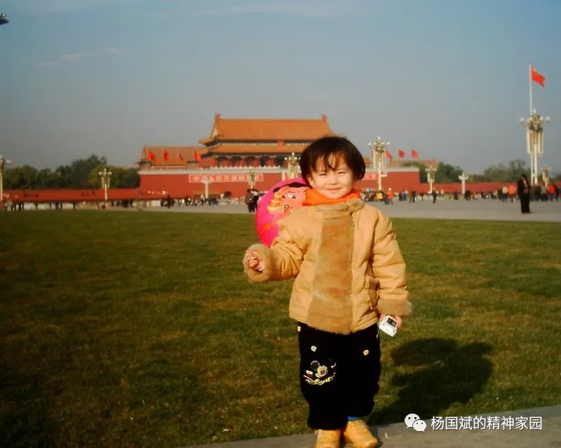
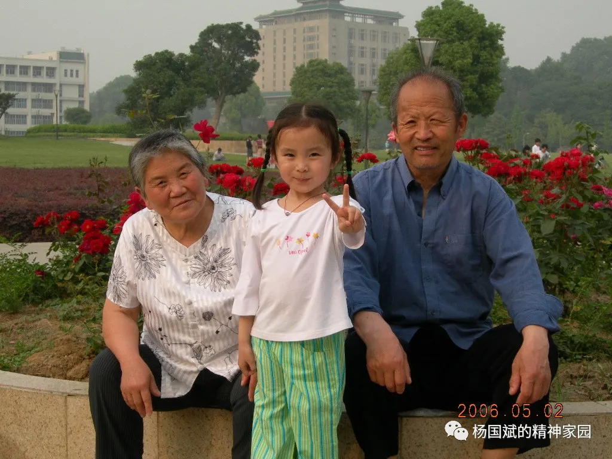
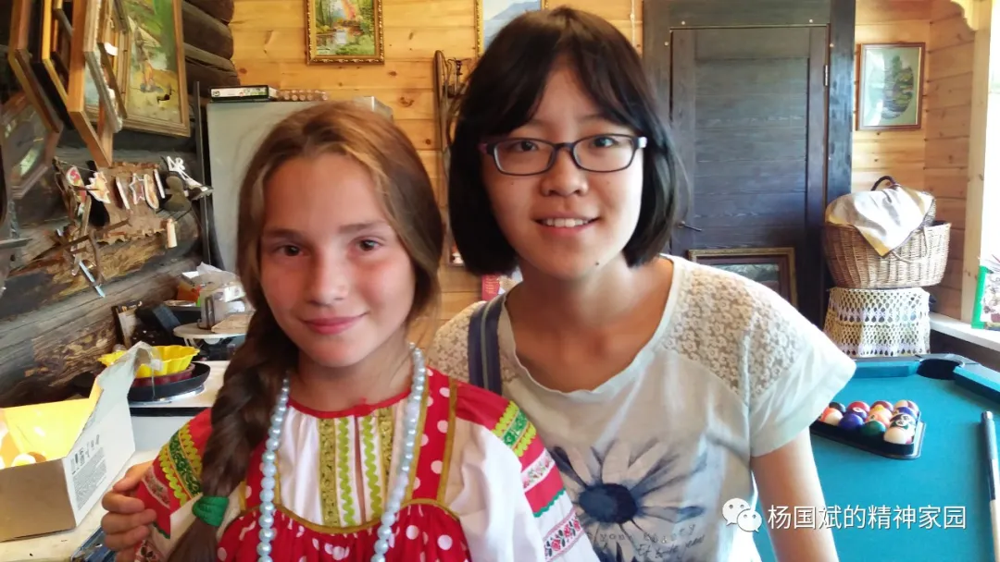
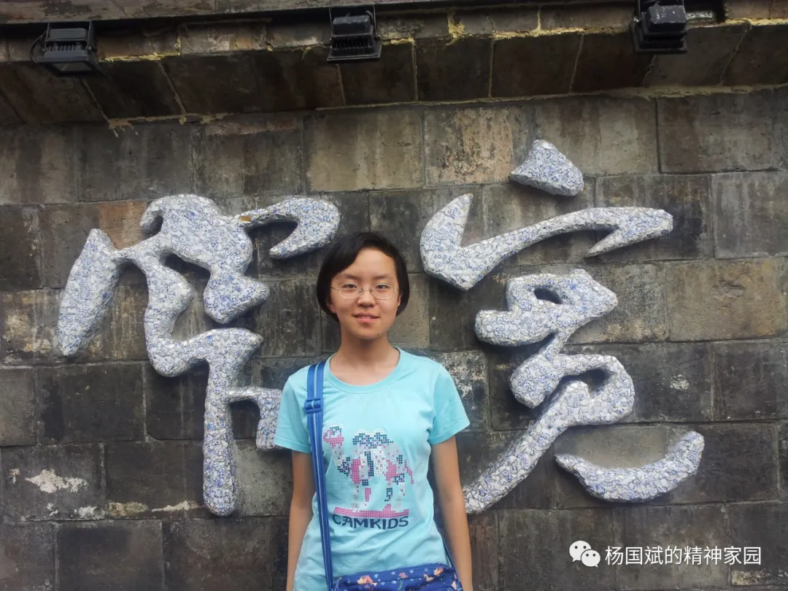
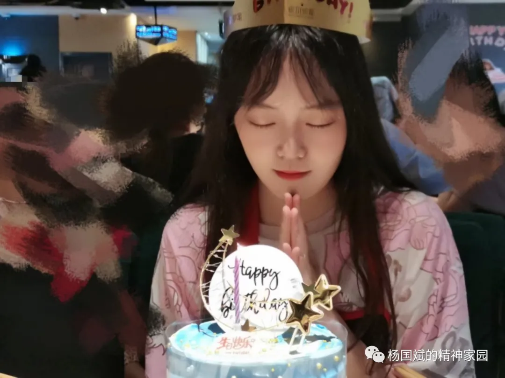

&nbsp;&nbsp;&nbsp;🥘2021年6月1日，星期三，多云。早上8点40左右起床，洗完澡10点左右到实训楼，来时看到王晗她们在实训楼前拍毕业合影，刚在微信公众号上看到一篇文章，很好很好，公众号名字叫‘杨国斌的精神家园’，杨老师的公众号是微信推荐功能推荐给我的，杨老师在公众号上记录自己的生活，读来很亲切，很接地气，杨老师现在是华北水利水电大学马克思主义学院教授，本科也在河南师范大学读书。

##### 摘抄

&nbsp;&nbsp;&nbsp; 如果爱就深爱，这个爱绝不是一味护短，看到它的缺陷就要想法设法尽力弥补，积极建言献策！明明看到不对的地方却文过饰非甚至假装看不见，那不是爱而是害，是自己的明哲保身在作怪！鲁迅当年深刻批判我们国民性 ，陈独秀在《觉醒年代》中大声疾呼中国是胡适之太多了而那个死掉的北大的学生太少了就是这个意思。我们所在的单位所在的国家可能还有这样那样不太好的地方甚至对不起你，但是正因为如此我们才要奋发有为尽快改变现状而不是冷眼冷语袖手旁观。

   如果爱就深爱，要有大爱不要自私自利，干什么事情首先想着对自己有什么好处，对自己有好处的就着急忙慌，对自己没有好处没有关系的置若罔闻，岂不知我们都是需要同舟共济的，如果人人只关心自己的一亩三分地而置整体不管不问，那一个单位一个国家怎么可能建设好？杨靖宇将军对一个劝他投降的人说，如果一个个中国人都为了自己的生计投降了，还有中国吗？

 &nbsp;&nbsp;如果爱请深爱，要努力本职工作，坚定不移矢志不移，时刻具备能力，不要朝三暮四朝秦暮楚，只要人人都努力工作，在自己的工作岗位上出彩，发挥自己的优势，不断奉献自己的智慧和力量，一个单位一个国家怎么可能建设不好呢？最讨厌那些对别人营营苟苟说三道四，真正让他去干一干的时候他又说自己这不行那不行的，理由一大堆，条件一箩筐，推诿扯皮，而自己肚里脑袋里始终空空如也。

   您所在的就是中国，您什么样中国就什么样？！您所在的就是河南，您什么样河南就什么样？！您所在的就是华水，您什么样华水就什么样？！

​    如果爱，请深爱，抛弃徘徊犹豫、抛却胆怯羞涩，大胆热烈直接深沉的爱，深刻的爱，深远的爱！

---

&nbsp;&nbsp;&nbsp;🚩2021年6月2日，星期三，天气晴，刚才突然刮风下起了雨，只下了一小会儿，昨天洪立和我去吃饭时洪立告诉我如果要考研最好把每个阶段学习什么做好规划。鹿军前天去的郑州亚信，刚看到QQ群消息他要被调到武汉一个月，每周工作六天半，每天早上9点上班，晚上10点下班。如此看来，学校里的生活确实是一生中最好的时间段，工作了根本没有时间谈恋爱，也没有时间去学习，可恶！今天把高考3500单词过完了一遍，在学校收二手书那里买了3本英语书，下午做了一篇英语真题阅读理解，生词很多，各种考研经验贴上都强调每天背单词，这一点，我一定要做到。上周在新联楼预约了心理咨询，到现在还没给我打电话，自己感觉也没什么问题，就是想去看看心理咨询都干些什么，听说外边心理咨询一小时要好几百。下午去吃饭时遇到麦超杰，他也是退役学生，和胡幸举一个班，去年就在学校外边开了家面馆儿。

---

&nbsp;&nbsp;&nbsp;🚗2021年6月3日，星期四，天气晴，早上8点多起床，9点左右班里，中午午休了一个多小时，要缩短午休时间！中午饭前给我妈打了视频电话，昨天我爸发微信说‘孙好想不好好学习，死不听话’，今天打视频把孙好想说了一顿，当然她很不屑听我说她，孙好想脾气比我大的多，谁打她她都还手，我打她她还手，我妈打她她还手，我没见我爸打过她。性格难道是出生就带的？我和她性格完全相反，我像我爸，听话老实，好想像我妈，大大咧咧。摘抄一段2021年政治考研题目的短文，这段话对人生指导也有很好的作用。

##### 摘抄

&nbsp;&nbsp;&nbsp;效防范化解重大风险的治理智慧。坚持底线思维，对可能出现的最坏情形有充分的预见和准备，时刻保持如履薄冰的谨懊、见叶知秋的敏锐、未雨绸缪的忧患，オ能做到“明者防祸于未萌，智者图惑于将来”。这次国际疫情蔓延带来的风险挑战是显著的、严峻复杂的，而且时间较长，需要按照进行具有许多新的历史特点的伟大斗争的要求，善于从纷繁复杂的矛盾中把握规律，抓住主要矛盾和矛盾的主要方面，在大是大非问题上敢于碰硬较真，敢于针锋相对。敢于担当不是盲目冲动、不讲变通，而是在坚持原则、坚定立场的基础上因时因势采取最有效的行动，以实现既定的目标。

---

&nbsp;&nbsp;&nbsp;👒2021年6月4日，星期五，天气晴。昨晚大概4点左右睡着，这两天我总是失眠，昨晚10点多我和成炤桦在实训楼的后边，我们叫它‘后山’，我们在这里走了走，天气凉爽，很不错，成炤桦拍了些照片

 

&nbsp;&nbsp;&nbsp;我问她我送的花是不是已经在垃圾桶了，她说‘没有，把花风干了，要留起来’。

&nbsp;&nbsp;&nbsp;上午看到一个有意思的脑筋急转弯

Three tourists stop at a hotel, and the manager tells them that a shared room will cost $30. Finding the price agreeable, they pony up $10 each and retire to the room. Later that afternoon, the manager, who is honest, realizes that the room was meant to be priced at $25. The manager orders the bellhop to return the excess $5 to their guests. The bellhop, who is not honest, takes $5 from the register and return only $1 to each tourist, pocketing the remaining $2—the guests don’t have to fuss over uneven change that way.

Now, each of the three tourists has spent $9, for a total of $27. The bellhop has retained $2, which brings the total to $29. Where did the other dollar go?

The puzzle uses mathematical sleight of hand to put together an equation, 3 × 9 + 2 = 29, that appears to model the situation described, but really it does not. By juxtaposing dollars spent with dollars held, the equation manages to double-count some dollars while failing to represent others, leaving a total that is just slightly off what we would expect.

Most of us learned in school that it is an error to add measurements that have different units: ten meters and five minutes don’t add up to fifteen of anything. This puzzle teaches us that the inverse is not true: two measurements that have the same unit attached (dollars, in this case) may still sum to a value that represents nothing meaningful.

&nbsp;&nbsp;&nbsp;自己看了好几遍，把解析也看了一遍，才发现其中的错误，把这个发给了孙好想，她立刻发现了错误,下午跑了5km。

<audio id="audio" controls="" preload="none" >
	<source id="mp3" src="../audio/puzzleSolving.mp3">
</audio>

---

&nbsp;&nbsp;&nbsp;🚕2021年6月6日，星期天，天气晴。昨天早上吃完饭在学校献血400ml, 累计献血已经1000ml, 昨上午没有学习，在哔哩哔哩上看了些视频。

---

&nbsp;&nbsp;&nbsp;🚙2021年6月7日，星期一，天气晴。昨天和朱沛琳发微信，她说她和她对象已经分手了。我感觉在现实中男女双方个人具备的某些‘力量’要相差不大才可能会结婚或谈恋爱，谈恋爱可能没有太多条件，可能是他或她长的漂亮，男生对女生好或时刻关心女生，便可以谈恋爱，但现实是一旦毕业，就会考虑到结婚，这时态度便会产生变化，在‘力量’强的的一方便可随意提出分手，‘力量’弱的一方就很被动，没有什么竞争力加持在身，一旦对方厌倦了这种感觉，便可随时抛弃你。

&nbsp;&nbsp;&nbsp;我的现实感受就是如此，朱沛琳对象大专毕业，现已外工作2年，他追的朱沛琳，上次帮朱沛琳修电脑时朱就直言给我说道她不想和她对象谈恋爱了。反观自己，也是如此，自己退伍找周梦洁，自己失去了身处部队的价值，失去了上军校做军官的价值，自己也是被分手者。只有不断提高自己的‘力量’才是万事之本。下午发现了一个Moviepy模块，可以制作视频。

---

&nbsp;&nbsp;&nbsp;🚚2021年6月8日，星期二， 天气晴。早上7点多起床，下午开年级考研交流会，李淳老师说要调整作息，早起比晚睡好，我一定要控制自己。中午吃完饭在餐厅门口遇到荣帅，和他聊到了西方的资本主义与我国的社会主义，这是我20多年来第一次如此一本正经的谈话，荣帅知道的真的多，他今年考到了山东大学读研究生。

---

&nbsp;&nbsp;&nbsp;🚛2021年6月9日，星期三，多云，早上6点30左右起床，看到邮箱有一个38岁的西班牙人给我发了邮箱，内容如下

Hi Sun:

I saw your email on the Students of the World website and I would very much like you to accept my friendship. . I am waiting that we will become good friends. ¿In which city do you live?

 

Your friendship is welcome and appreciated. We can talk about many topics and share many things. 
Well, my name is Roge (diminutive of Rogelio) (Roger); I am Special Education teacher (disabilities), I also studied half of the Psychology degree and two postgraduate degrees and the Doctorate. I am currently working as a teacher and research at the University of Murcia. I am 38 years old.

University classes began on September 15. From September to December three subjects I teach two groups of 4th year master degree in Primary Education. It's nice to find among students, familiar faces. I mean that many of my students who are now in 4th year, I gave them when they were in class 1 college course. That is, we are old acquaintances.

At University he taught subjects related to intellectual disability, physical disability, hearing impairment, visual impairment and learning in reading, writing and Mathematics problems.

I live in Murcia capital, located in the southeast of Spain. In my family we are three: my mother (my father died last October 25,2017), a brother and me. I live in an apartment myself, although very close to my parents' home.

I think it's good to find friends with whom to share many things and good times, although sometimes people act selfishly, or simply have their lives made, family responsibilities, etc. and it is difficult to coincide or remain, or they have distanced themselves.

As for my hobbies I like to read a lot (historical novel, best sellers, adventure novel, science fiction, horror, classic and contemporary literature); cinema, in all its genres (comedy, mystery, action, science fiction, horror, musicals, police, etc.). In my apartment I have a good library with more than 1,200 books

I think and believe that friendship should be valued above social, political, religious, cultural, sexual, racial, and economic differences and that it is very enriching to know people from different places, countries, races, etc. respecting the whole world and offering and sharing the best of each one of us.

I like to go out with my friends (I do not have many, I've been practically alone since people have been married, has left work to other cities, or simply, have not kept contact) to walk, to the cinema, to have a coffee, a beer (in moderation), or an ice cream and above all to talk.

 When I have free time I usually go for a walk, ride a bike, and in the summer I love to walk along the seashore (I walk about 15 kilometers a day), sunbathe, swim and play beach volleyball, although I have to confess that during this year due to work I have led a somewhat sedentary life and I have to put my batteries and use myself thoroughly in sports (do not expect to find an Olympic athlete, but not a round obelix type fat ball).

I love to travel, although most of the time I do it is for professional reasons, although there is always a little bit of time to do some tourism. In Spain I know a few cities like: Madrid, Toledo, Barcelona, Zaragoza, Palma de Mallorca, A Coruña, Santiago de Compostela, Granada, Cordoba, Seville; in Italy, Milan and Genoa and in Scotland, Glasgow and Edinburgh and last year I visited Paraguay for professional reasons).

I will be very happy to help you to progress in the English language and you have total freedom and confidence to talk and ask about any topic you want., I want to explain many things about the culture, history, traditions, festivals, monuments, gastronomy of Spain. You can also ask what you want about my life, now you are my friend, I trust you and I am an open book for you

 

¿Can you send me some pictures of you?

I await your news. And of course I'm going to keep writing to you.
I appreciate your friendship

Please send me some pictures of you with your new mail to meet you
Many hugs

Your friend

##### 我的回复

Hello Mr. Roge:

 I am honored to receive your reply. It's great to meet you online. I come from Henan Province, China. I am 23 years old. I am currently studying for my undergraduate degree at Henan Normal University. My major is computer technology.

 In daily life, I like running and reading books, such as literature books, IT technology books and so on. When I received your email yesterday, it was 1:00 a.m. here. When you receive this email from me, is it already evening in your place? In your email, I read that you have a personal library, which is really an exciting thing. As a Chinese saying goes, "Read 10,000 books and travel 10,000 miles." I look forward to your way of life. My English level is not very good, may not be so precise in the expression, please forgive me. I would also like to make friends with your students.

 In my country, Facebook is not available, but I feel E-mail is also a good way to communicate. Below the email is my photo. I don't know how to reduce the size of the photo. Please forgive me.😅

 I hope everything with you is fine.

##### 摘抄

“慈不掌兵 情不立事 义不理财 善不为官”。白话翻译是：“带领军队必须要狠，心慈手软的人干不了；讲情面成就不了大事；掌管财务必须认真负责。讲义气，不把钱当回事的人做不了；心地善良的人，做不了官。”

---

&nbsp;&nbsp;&nbsp;👕2021年6月10日，星期四，天气晴，上午学校在图书馆前有学位授予仪式，昨下午跑了5km, 在西区操场收到了西班牙老外的邮件，他给我发了好几个邮件，有他写的文字邮件和他的照片还有他生活的城市照片。内容如下

Dear little brother and friend Sun:

Thank you for your message and your friendship . Please call me Roge (short for my name). My family and friends call me that. Now you are my friend, my little brother and you are part of my family 

¿Your name is Sun and your last name is Fuxiang? Or on the contrary, ¿your name is Fuxiang and your last name is Sun? I want to call you by your first name correctly

Please ¿can you send me some pictures of yourself to meet you?

I deeply appreciate the confidence you have in me to talk to me, about you, about your feelings, emotions and needs. Sometimes it's good to have someone to share what happens to us in our lives, to talk, to exchange ideas, opinions, or just to have someone to lean on and give us advice, guide us and give us encouragement and strength to go on in bad times or when we feel emotionally fragile and needy. I consider myself and my friends, always, I tell you sincerely, from the heart, without expecting anything in return or demand anything.

I will be very happy that you explain me about the culture of your country, its customs, monuments, landscapes, gastronomy, people ... and I will also explain about Spain

Don't worry, we can talk about many issues about what is happening in the world at a political, social, cultural level, etc. I will be delighted to share with you

My father's name was Fulgencio; my father died three years ago as a result of Parkinson's disease. My mother's name is Carmen and my brother's name is Antonio. My mother is already retired or retired from work. My father worked as an administrative commercial company and then worked as an Administrative at a Health Center. My mother worked as an Infant Education teacher an orphanage, with children from birth to 6 years old.

My brother studied French studies at the University of Murcia. In France (Pau, Pyrénées-Atlantiques) he made his Master  and he made his doctoral thesis. The theme of his thesis was a comparative study of Spanish navigators (Domingo de Bonaechea) and the French navigator (Bougainville) of the seventeenth century on his trips to Tahiti.

My brother has a degree in languages in French, English, Italian and Portuguese. And it is also Tourist Guide. I only know a little French and English.

I explain a little about myself, about my studies and about my work

I, am Doctor of Pedagogy (Special Education = study and education and rehabilitation treatment of disabilities )

I'll explain: I have not studied Medicine, I do not work at the level of health. The PhD degree is an academic at the University level. There are several levels:

-Diploma (3 years of College)

-Degree (5 years College)

-Postgrado And Master (2 years of specialization)

-Doctor (1 year training and research profile)

I am Degree in Pedagogy (Special Education). Then I made two Postgraduate: Specialist in Human Psychomotricity; and Therapist in Down Syndrome. And finally I did my PhD and Research (Thesis) on children with visual impairments.

I worked for several years as a teacher of psychomotor development in people with Down Syndrome and blind children.

And  I am Doctor in  Special Education

I currently work as a teacher and researcher at the University.

It may be surprising how sometimes reading a book makes you make a decision that can directly affect a person for the rest of your life. Precisely during my time as a student at the Institute did reading the autobiography of Helen Keller, deafblind, whose teacher Anne Sullivan taught him and made him understand language mixed success (Sign Language) in the palm of the hand, bringing it into contact with the world, people and culture. And despite his severe disabilities, Helen Keller became his doctorate in 1904 and lectured worldwide. This book exerted a great impact in my emotional and influential. Although my grandfather and my mother were teachers, me, not by family influence, but just by reading that book, I had decided I wanted to be a teacher of the blind. And to finish the Bachelor, I studied Education (Special Education) at the University, I did my doctoral thesis on blind children currently impart a course on visual impairment in the University, I have written five books on visual impairment and have completed an research into accessibility for the blind and low vision to art and museums in the city of Murcia. All this thanks to reading a book that made my life take a particular course.

Sometimes dreams change as we become adults. When I was a child of 5 years, I said I wanted to be an astronaut and travel to the Moon and planets unknown. Then I wanted to be a scientist and build robots that were physically like humans. Then he wanted to study ecology. Later I studied Pedagogy (Special Education) and I am a teacher and researcher at the University... My job allows and obliges me to write journal articles, book chapters and books related to special education and disabilities.

I also want to be a writer of literature and become successful. I really like write poetry and short stories. I've even started to write a novel, but I need time for writing.

I have always fascinated me diving; I think that the seabed is a new and beautiful world to explore and learn, but I've never made this experience. In Cabo de Palos (La Manga del Mar Menor beach, Murcia, Spain) there are several centers to learn to dive and organize outings. Maybe one day I decided to learn to dive. It's nice to see the fish, corals, algae, jellyfish, starfish, etc. And there is the advantage that in this part of the Mediterranean there are no sharks

In the little free time that I have I've been investigating and gathering information over the Internet and several books on a subject that even the inhabitants of Murcia themselves ignore or know him only superficially and will explain wishing that you find interesting and entertaining: The shipwreck of the transatlantic Sirio in Cabo de Palos (La Manga, Murcia, Spain), (4 August 1906)

I really love the sea and want to live all year on the beach in La Manga, but it is not possible, as are about 90 km to travel each day to the city of Murcia, where I work and live normally

One of my hobbies is writing poetry and short stories. When I was a student in high school, each course won a prize for Literature. Then I've been writing articles, papers and some books to educational level, but I've never tried to publish a literary book. I would try to publish a novel.

You can ask the questions you want about me or about my life, I am an open book for you. I have full confidence in you. Now you are my little brother and my friend.

The history of Spain is multicultural. More than 2000 years ago lived in Spain some people called Iberians. After the town was settled by the Celts and the people of the Phoenicians. Phoenicians founded a city called Carthage in North Africa and in Spain founded a city called Carthago Nova (now that city exists in my area and called Cartagena. The city of Cartagena de Indias, Colombia, named after the city of Cartagena, Spain.

Later, Spain was occupied by the Roman people. After the end and destruction of the Roman Empire, Spain was occupied by the barbarians of northen Europe, the Visigoths, the Swabians, Vandals and Alans.

Subsequently, Spain was invaded by the Muslim peoples of the North Africa, which remained occupied for 8 centuries. During this time there were periods of peace, prosperity and culture and also of battle and wars between Muslim invaders and Christian inhabitants of Spain.

Finally, all Spain was conquered and liberated by Catholic Monarchs in the fifteenth century, were expelled from the kingdom of Granada to the latter one Muslim Calph .

The current Spanish are the result of the coexistence and misture of all these peoples and cultures throughout history.

Indeed, in Spain we have an immigrant population from other countries, quite large. We have Muslim immigrants (Morocco, Algeria, Senegal, etc...), immigrants from Latin America (Ecuador, Peru, Bolivia, Colombia, Argentina, etc.), immigrants from countries of Eastern Europe (Bulgaria, Ukraine, Romania, etc.) and Eastern immigrants (China, mainly).

Spain is a country of many contrasts both landscapes (forests,mountains, plateaus almost without vegetation, rivers, lakes...) and which (in North Spain rains a lot and it is very cold, in the South, winters are mild and pleasant spring, but the summers are very hot.)

In my country the official and foremost language they speak everyone is Spanish; However, not be if you know that in next Spain to the Spanish there are other co-official languages spoken in certain regions of the country. For example, in addition to the Spanish is also speak the following languages: Galician, Basque, Catalan and Valencian.

The Spanish cuisine and gastronomy cuisine specifically Murcia is varied and rich: omelette, eggplant pie, paella, vegetables (potatoes, onions, zucchini, artichoke) stuffed with minced meat) etc.

When you come to Murcia prepare for you a dessert or sweet called "torrijas". It is made with bread, eggs, milk, sugar, olive oil, cinnamon and grated lemon rind. It's delicious .

Sun I would like very much to meet you in person and I hope that one day in the future you can come on holiday to Spain. Both in my apartment in Murcia and in our second residence in La Manga del Mar Menor beach, my house is your home and you can stay for free with us. There is a bedroom just for you. Here you have your Spanish family.

I want to establish with you a deep, sincere friendship, with great confidence, a friendship lifelong I'm looking forward your news

A big hug for you

 Roge

 

 

 

 

 

##### 我的回复

Dear Roge:

 I was very glad to receive your reply. I hope to be friends with you forever. My first name is Sun and my last name is Fuxiang. Please call me Fuxiang.

 I will take an English level examination the day after tomorrow. After the exam is over, I will introduce myself to you in detail. I am preparing for the exam these days.

 Below the email is my photo.

 Best wishes to you.

##### 他的回复

Dear Fuxiang

Thank you very much for your email and for your pictures. You are handsome and you are fit, you are athletic,
I also hope and wish that we are friends forever.

I let you study for the English test and I wish you good luck and success. You are my champion and I am very proud of you!

Once you take the exam I will wait with great enthusiasm and joy for your news. I think of you
Many hugs.

Roge

---

&nbsp;&nbsp;&nbsp;🍔2021年6月11日，星期五，天气晴

##### 摘抄

一个国家推行教育的目的，主要是为国家未来的健康发展培养优秀的人才。中国是一个非常看重教育的国家，而影响中国形成目前这种教育现状的原因有以下两个：

**第一个是来自于家庭，因为中国父母都希望自己的孩子比自己更成功，希望孩子能够出人头地。**所谓的“望女成凤，望子成龙”，是从中国古代就开始有的文化教育特征，只要孩子读书了，家长就希望孩子成功。这个特征发展到现代高考，就演变成只要孩子们能考上北大清华，既能“光宗耀祖”，孩子又能前途无量。这样的家庭，父母就会对孩子的学习提出压迫性的要求。

**第二是来自于中国式学校教育，学校教育本来是以知识教育为主，目标是让学生对知识产生好奇心，不断去探索知识，培养创新型知识人才，但是中国的国情使得学校教育最后变成单一的、以高考成功为最终目的的教育。**在中国，大多数教师的考核指标都是以自己的学生中有多少能通过中考、高考，多少能够考上好学校为准的，并直接跟教师奖金挂钩，而教师的奖金跟他们的生计是息息相关的。从这个意义上来说，教师让学生学习知识，本身并不是为了帮助学生产生对知识的好奇心，而是为了让学生最后能考高分上好大学。而考上好大学之后，教师一般来说就不会再那么注重学生的学习情况了。

**毫无疑问，中国在重视教育的表面之下，实际上犯了比较严重的错误。中国教育最核心的病症是 “比较”。**例如，家长把自己孩子跟别家的孩子“比较”，希望自己孩子考上最好的大学；教师将孩子与孩子进行“比较”，希望通过“比较”的方式激发孩子学习积极性，但是最后的结果往往适得其反。

**一个人长期处于“比较”的状态，就很容易出问题。**第一个问题是会养成孩子“比较”自己跟他人优劣的习惯。如果他的参照物总是别人，这就会让他忽视自身的健康发展，偏离自己最终期待的结果。在参照过程中，孩子会过度关注别人，以及在意别人的看法，这会影响他的心理健康。比如，他跟别人比较后，觉得自己比别人优秀，就会变得骄傲甚至自负；当他跟别人比较后，发现自己比别人差，会感到自卑，或是内心很看不起自己。这样的“比较”会导致他不能正确看待自己与他人。

**第二个问题是会养成孩子对周围的一切进行“比较”的习惯。**因为教师、父母对孩子学习成绩方面的“比较”，孩子可能逐渐发展出“比较”自己与他人的家庭条件、父母背景、老师赏识、长相优劣等。孩子们为了在“比较”中能够取胜，会偏向于追求本来不应该追求的东西。比如，追求穿更好的名牌产品，为讨好老师而逢迎拍马，为博得父母赞扬而弄虚作假。**父母和老师的“比较”方式，以及周围的环境会直接伤害孩子的心理，导致孩子出现品德问题。**

**所以说，中国教育的核心问题就是太偏重于成绩。而为了达成这个目标，学校教育和父母会使用“比较”这种错误的方式去激励孩子学习。**

我们再来说说，为什么美国的孩子看上去比中国的孩子更自信、更快乐？

**美国父母一般很少对孩子提出将来要成龙成凤的想法，他们只是希望孩子们能够健康成长。**

在美国的学校教育中，小学、初中的学习内容跟大学的学习内容基本没有关系。**美国小学和初中的学校教育主要是引导学生对知识产生好奇，使学生能够拥有良好的思维、思辨能力，安排足够的时间给孩子们参加各种各样的课外活动。****从这个意义上讲，美国的孩子是在对自我的认可、寻找自己的成长路径，以及发掘自己才华过程中长大的。**而美国的父母与老师也不会时刻对孩子进行“比较”。

**中国的孩子们不自信，其实并不是孩子们本身的问题，而是因为中国的教育体系和家长心态的偏差。**中国的教育体系和家长心态已经形成了一种像绞肉机一样的环境，没有任何一个孩子能逃避这种折磨。中国的教育制度和家长心态如何改革是很难解决的问题，但如果这些问题不解决，中国一代又一代的孩子会在这种体系和环境中深受其害，**孩子长大后可能就分化成3种人：第一种是自负傲慢的人，因为他一直比别人好；第二种是自卑胆怯的人，因为他一直比别人差；第三种是不思进取的人，因为他觉得自己比上不足比下有余。**

**中国的孩子们在成长过程中缺乏了童年的快乐、生命的热情，缺乏对知识的渴望及好奇。很多孩子们长大后就失去了对幸福、稳定、有成就感的生活的追求，也失去了拓展生活的基础能力。**当社会环境没有办法改变时，我建议家长们应该做到不要再“望子成龙，望女成凤”，而是认真思考如何在自然宽松的环境中，循序渐进地激发孩子对生命和读书的热情。因为往往在健康、快乐、积极的环境中长大的孩子，才对未来有着无穷无尽的动力，会不断追求新的成就和新的成功。

##### 评论摘抄

应试教育体制是中国特殊国情的体现。人口基数庞大，城乡差距巨大，贫富差距巨大，文化差异明显。在各种巨大差异情况下做一个“公平”的教育体系必然会产生许多的问题。这也是为什么中国高考一直被质疑但是一直无法改变的原因。   文中俞老师提到，教师考核制度与教师积极性的问题。教师是学校教书育人的前哨岗位，教师的目地本末倒置坑害无数的学生。而应试教育体制下，分数确实是最重要的东西。于是形成了一个死循环，为了公平靠分数评定升学资格，为了分数减除各项素质教育内容，学生综合素质体现中分数一枝独秀，升学考核只能是依靠分数选择。在这样的一个公平理念造成的以分数为核心的应试教育死循环里面，老师和家长都无力改变。最后只能顺应环境，随波逐流。

今日所感：在别人面前显摆是不正确的事情, 会引火自焚，发朋友圈便是显摆自己的方式，要慎之又慎！

&nbsp;&nbsp;&nbsp;晚上吃完饭朱沛琳打语音给我，把王晗的桌子放我这里，朱沛琳明天收拾完东西离开学校，学校下的通知是开完毕业典礼后给毕业生一个星期的时间离校，这让我感受到我们确实是来河南师范大学求学的，学习时间到了，就要离开学校。学校依然是这个学校，学生是新招进来的学生，刚看到学校官网在开展学校2021年防汛工作，工作照常进行，地球照常转动。可恶，可恶！朱沛琳在宿舍楼下介绍了她的同学，她们分别考入了西安电子科技大学和合肥工业大学的研究生，考入西电的同学是2000年出生，比我小3岁。我愧对父母，愧对时间。

---

&nbsp;&nbsp;&nbsp;🍛2021年6月13日，星期日，小雨，现在是端午节放假时期，昨天上午英语4级考试，感觉考试还是要多模拟，昨天整体感觉是时间不够用，虽然做题顺序有策略，但是还需要优化，平时要给自己多模拟实战的训练才行，要不然在关键时刻便会掉链子。昨下午去万达买了一双鞋和三条男士内裤，今上午去调换了内裤尺码和鞋的尺码，昨天下午跑了5km, 学校这两天有大四同学他们家长开车来接他们回家，我毕业就没有这样的待遇了，我尽可能实现在我妹上大学时我能开车去送她，上高中时每次放假，还是有些羡慕那些有家长开车来接他们回家的同学，这不是我造成的，这是我父母造成的，我不能把这份悲伤拉到自己身上，自己要做的就是让自己的下一代没有这种感觉。

&nbsp;&nbsp;&nbsp;昨晚上收到了老外的回信，有点担心他是不是同性恋，从他的e-mail中看到他现在还没有老婆，而且在昨晚的回信中，有一段让我不是很理解，甚至有点想歪的内容。

他的回复：

My dear Fuxiang

Thanks for your two emails. Excuse me for not responding to your previous email but these last two days have been a lot of work. Thanks for the pictures of your two classmates; They are pretty girls and seem to have a pleasant and friendly character.

I don't want to be a busybody in your life, but ¿do you have a girlfriend or is there a girl that you like or are in love with? ¿Or do you leave love in the background and are currently only focusing on your studies and your future work?

I think that within your specialty (major): computer technology, you have a field of employment that is sometimes unknown: all the electronic devices and all the technology that is focused on the communication of blind people and people with Cerebral Palsy who do not They can communicate with me verbally and that require adaptations in computers (hardware and software).

If you wish, I can send you pictures and brief explanations in English about these computing devices.

Recently, the University of Murcia (UMU) has signed a collaboration agreement with Central South University of Changsa (Hunan, China) in the framework of the institutional travel activities that the UMU has carried out in China to strengthen academic and institutional ties with various institutions. This university, recently recognized with one of the highest classifications within the Chinese university system, works closely with the Optics Laboratory of the UMU (University of Murcia) led by teacher Pablo Artal. During the meetings held, the Chinese university has shown great interest in our Faculties of Computer Science, Chemistry, Medicine and Mathematics. In addition, a collaboration agreement has been initiated on subjects of teaching Spanish as a Foreign Language and the teaching of the Chinese language with the SIDI (Language Service) of the University of Murcia.

¡Wow! If you have a good impression of the English test you took, then you will surely get a good grade. I will be very proud of you.

Unfortunately you are wrong. My level of English is terrible. I have never studied it in the Secondary or Bachelor stage or at the University. I am fluent in the French language. In English I have become used to handling educational texts and I have come to understand a large part of the vocabulary when I read, I can write fairly complex texts; but my expression (pronunciation and listening comprehension in English) is very bad and I am unable to carry on an oral conversation ...

The zongzi looks delicious. In Murcia, my city and region, we have a gastronomic dish that I think you would like: rice with vegetables.

Ingredients for four people

400 g of rice

1/2 kg fresh artichokes

250 g of aubergines

300 g cauliflower

1 red bell pepper

2 ripe tomatoes

100 gr of salted cod

1/4 liter of olive oil

1 potato

250 g of young beans shelled or 250 g of green beans

1 bunch of garlic

2 liters of water

Saffron hair

Salt

1 tablespoon of paprika

I know that there are differences between the cultural and social customs between China and Spain and that for a Chinese citizen some of our western and specifically Spanish behaviors may seem inappropriate or poorly educated, since they do not maintain a “social distance”. Most Spanish citizens are socially outgoing, talkative, affectionate and we quickly establish trust and make friends quickly. That type of behavior even for other European citizens can be strange ... Actually this extroverted character and social behavior is typical of southern European countries: Spain, Portugal, Italy, Greece ...

I know that men have been educated to be tough guys and the expression of feelings or emotions can sometimes be interpreted as a sign of poor manhood. Especially when it comes to friendship between men. However, we are social beings, we have communicative and emotional needs, and I think it is essential that people who are important in our lives know that they are loved. Fuxiang don't be afraid to show your affection or the love you feel for other people, and never be afraid to express your needs for affection and love. These feelings are fundamental to the emotional and psychological balance of all people and it is a beautiful thing to share with the people we trust.

I  love the science fiction novel. In fact I have read many novels by Asimov: I Robot, Robot and Empire; Foundation, etc.

I have started to read about Liu Cixin and his novel The Three-Body Problem (Chinese: 三 体; literally: 'Three-Body'; pinyin: sān tǐ)

Liu Cixin is a mechanical engineer, he is also a fan of science fiction novels. For this work, he wrote between 3,000 and 5,000 words each day in his spare time and took 3 years to complete it11. His creative thinking is deeply influenced by Isaac Asimov, Arthur C. Clarke and Leon Tolstoy. The novel has profound social implications and the author reveals in it the principles of "cosmic sociology", a protocience about the laws of survival in the universe.

In the novel, Trisolaris is the only inhabited planet in a ternary star system (Alpha Centauri), where Trisolarians live. The planet revolves around the three suns at the same time. Due to the instability of the orbit, the Trisolarian civilizations have been destroyed countless times. Scientists in that world have been looking for the solution to the recurring catastrophe for thousands of centuries, but it seems like a dilemma with no way out unless that species finds a new home.
Trisolarians have a more advanced level of technology than humans and consider survival as their top priority. They have developed a totalitarian society and a completely different moral system from Earth.

Fuxiang, I am very happy to meet you; Although we met a short time ago, I appreciate you a lot, I already consider you as a little brother, one of my best friends, and I consider you part of my family. I wish our friendship and fraternity to be for life, if possible

Dear Fuxiang, thank you for your invitation to visit China. I would love to be able to travel in the future and meet you in person. You are also invited to visit Spain and Murcia, whenever possible in the near future. You will always be well received and the time you come on vacation you can stay at my house. Both in my apartment in Murcia and in our second residence on La Manga del Mar Menor beach there is a guest bedroom for you. Here you have your other family, your family from Spain.

I really like talking and sharing with you about any topic. I feel very comfortable and I think it can be a very enriching experience for both of us.

Take care, please. I await your news with impatience.

Many hugs.

 Roge

我的回复

Dear Roge:

 I am delighted to receive your reply. We're in different countries, we're in different places on the planet, so our lives may not be synchronized. You sent me the books you wrote through email. I think you are magnificent. The Murcia food you introduced is a little similar to a kind of food in China.

 I have a girl classmate who I like in our school. She is very beautiful, very sunny, very open, very positive. I like her very much.  

 I really like people who have an outgoing personality. I think I am an introverted person, even I have some inferiority. I feel that I lack courage and confidence in some things in my life. 

 I haven't seen the movies or books you introduced me to. But through your introduction, I feel that this is a very touching work.

 You can reply to emails in your free time. It is also a pleasure for me to communicate with you through email.

 Best wishes.

 

 Fuxiang

---

&nbsp;&nbsp;&nbsp;🍞2021年6月15日，星期二，多云。昨晚收到了roge的回信，在他的回信中我感到他学识渊博，对待事物的看法也很有智慧，他一直在鼓励我，肯定我。

&nbsp;&nbsp;&nbsp;昨晚发生了一件让我感到尴尬的事情，不愉快的事情不应该记在日记上，如果记下来就会把不愉快保留下来，但我认为，如果任何不愉快事情都避而不谈，这是不对的。算了，不记它了，我的大脑会慢慢分解它。昨上午在豆瓣读书上看到一本书，下载了pdf来看，名字叫《平如美棠》.  下午和洪立去学校外边找房子，去了西牧村，仿佛回到了小学记忆时光，人与人的生活环境的差别是什么造成的？命运之神会如何对待我，我又最终如何接受这命运，但我相信，不到最后一刻，我依然掌握着它！

&nbsp;&nbsp;&nbsp;刚把《平如美棠》看完了，生活是这么的朴实平静，我喜欢看书，非常幸运能在年轻时安安静静的看一些书，这种感觉真好，在书中看到‘我登时觉得，美棠恐怕永远也不可能恢复她的正常思维了。想到这里，我不由绝望至极，一面打电话把儿女们都叫 回来，一面禁不住坐在地上痛哭。’这里时，我也想哭。生活苦难重重，平如年轻时有着我现在羡慕的生活，世事难料，不知今后自己的人生会有什么波澜，我想，先学好英语吧，毕竟英语是全球使用最多的语言，只要有人的地方，就能生存。

##### 摘抄

尴尬，与内疚、羞耻等类似，都是人的一种情感（affect）。当体验到尴尬感时，人们会明显的感觉到不适、觉得自己笨拙，通常也会有脸红、出汗、坐立难安、结巴等生理与行为上的反应。

在社会生活中，人们都会根据一些社会准则、行为规范，以及社会文化中对于每个角色身份的定位，对其他人的言谈举止做出一些积极或消极的评价。而更重要的是，我们会把这些准则和规范内化，形成一些想象中的观众。

这些“想象中的观众”，也是“超我”的另外一种说法。Fenichel提出，我们会将自己的“超我”（superego）投射（re-projection）到外部环境中。也就是说，当我们与他人擦身而过时，我们会把想象中的观众的眼光，投射到那些人身上，认为我们所感受到的是这些现实中的人的评价。

尽管我们总觉得是他人在评价自己——“你这么做，别人一定会觉得你很愚蠢”，很多时候，都是我们自己在评判自己。

我们也会因为感到“那些和我们有关系的人被评价了”，而感到尴尬。孩子为父母的一些行为感到尴尬、父母为孩子的一些行为感到尴尬、情人之间为对方的行为感到尴尬——因为你觉得他们和你的自我身份有关联。

值得一提的是，自己总是忍不住评判自己，有时也会使得我们对他人的积极评价也感到尴尬，即当他人赞扬我们时，如果我们的内心觉得自己“不值得”或“配不上”这样的赞扬时，便也会产生一种尴尬感。

身体的暴露，如走光；情感的暴露，如被要求在公开场合表达情感；私有物品的暴露，如同事忽然来到不整洁的家中；都属于自我暴露带来的尴尬。

尴尬（embarrassment）一词，在心理学领域的讨论，最早出现在精神分析语境中人们关于“梦”的讨论。Freud在《梦的解析》一书中提出，尴尬是人的一种本能。Freud认为，人们的梦中的“尴尬”体验总是出现在自我裸露或衣衫不整的情形下。他认为，尴尬发生的那一刻，其实代表人们在那时刻有着自我暴露的愿望和冲动，尴尬是对这种愿望和冲动的压抑和防御。

Saul也提出，尴尬是人们压抑内心自我暴露愿望时的一种自我防御。也就是说，当我们内心极度想要“展示”或“希望被别人了解”的东西不被自己的超我（弗洛伊德认为每个人的自我有三层，最内部的是代表了本能和潜意识的本我，中间层是有意识的自我，最外层是代表了道德感的超我）所接受时，原本的冲动与渴望就会被压抑，取而代之的就会是一种尴尬感。

我们已经两次提到了超我和尴尬感之间的关系。当超我评价我们自己时，我们感到尴尬；当超我压抑那些关于自我暴露的愿望时，我们也感到尴尬。有些人相比另一些人更容易犯尴尬病，和他们超我的结构有很大关系。

每个人所形成的超我，并不是完全一致的。我们的超我并不是生来就有的。一开始，我们并不懂是非对错，不了解什么是道德。我们最初所形成的超我，是一种内化了的我们父母的眼光。因为父母最早肯定或否定我们的行为，我们因而渐渐形成了关于道德的感受。而那些过于严苛的父母，则会让我们形成过于严苛的超我—— “有虐待性的超我”。

（注：网上的文章总是把自己性格和各种心理因素都归结为父母在自己小的时候没有科学正确的引导自己，从而把一切罪过都推到父母身上，但是父母也是第一次做父母，我们的父母肯定是毫无保留的爱我们的）

#### 摘抄邮件内容

我的回复：

Dear Roge:

 Today is the Chinese Dragon Boat Festival. I wish you a happy Dragon Boat Festival. 

 I have a question. As my English level is not very good, I didn't quite understand part of your last email. In your reply to my letter, I thank you very much for encouraging me to express my feelings bravely. But there was one thing in the letter that I didn't quite understand. 

 In your previous reply you said "men have been educated to be tough guys and the expression of feelings or emotions can sometimes be interpreted as a sign of poor manhood. Especially when it comes to friendship between men." Excuse me, the feeling or emotions here is the common friend feeling or the love between the man and the man?

 Best wishes to you.

 Fuxiang

##### 回信

Dear Fuxiang

Thank you for your email.
I hope and wish you are having a happy Dragon Boat Festival. I am sure it will be a very nice and interesting festival. I love all the traditions and festivals of China.

¡Wow! You have to have more confidence and security in yourself and not feel self-conscious or inferior. You are an intelligent, attractive, hard-working, athletic boy, with very good qualities and beautiful values in your heart and in your personality. If people in general do not know how to value all this, it is because they are blind or stupid. They miss your friendship. You must work on trust and security little by little to overcome your fears, doubts, fears. 

You should also take small steps with the girl you like: greeting her, treating her more often, looking for the excuse of studying together or requesting her help in some specific aspect of the studies (looking for an excuse to meet her), praising her saying that she is pretty or wearing a nice dress, inviting her to have tea ... That way you will get closer to her; the girl she will realize that your interest in her goes beyond friendship and you will know if she reciprocates you in love.

Don't worry, expressing yourself in a foreign language sometimes means that certain phrases or ideas are not well understood. I meant that in general men should not be so closed or introverted when expressing our feelings or emotions with other men who may be trusted friends or with other male relatives. Men also need companionship, feel valued, understood and feel the affection and friendship of other men (parents, brothers, cousins, classmates, friends ...)

I am not referring to homosexual love between man and man or between woman and woman. ¿What is your opinion on this issue and the general opinion in China?

¿Do you like to go to the beach and bathe in the sea? ¿Do you like to swim?

I will soon send you information and pictures about the Carthaginians and Romans Festivities and the Carnival Festivities in Murcia
A big hug and all my friendship
Roge

##### 第二封回信

##### Short story: The man and the serpent

A man sees a snake die in flames and decides to release it from the fire. As soon as he catches it, the snake bites him, causing him excruciating pain. The man immediately drops the snake and the reptile falls back into the burning flames.

At this point, the man, looking around him, finds a metal pole and uses it to pull the snake out of the flames again, saving his life.

Another man, who had seen what was happening, approaches the man and asks, "This snake bit you! Why are you trying to save his life?"

The man responds: "The nature of the snake is to bite, but that will not change my nature, which is to help."

"Don't change your nature just because someone has hurt you. Don't lose the goodness that is already on your mind, but learn to act carefully."

---

&nbsp;&nbsp;&nbsp;🍘2021年6月18日，星期五，天气晴。上午到现在一直在弄学分认定的事儿，我和老外先生一直保持着邮件交流，这几天在看China Daily,希望自己每天能阅读5篇，昨天一下午看了一篇，太慢，在办成绩认定时王晔来办夏令营手续，在相同的时间段没有取得成绩就是失败，大器晚成者就是失败者，这只是没有在相同的机遇下取得成绩的人自欺欺人的安慰，可恶！下午跑过3km后肚子右侧疼，可能头两圈跑的有点快。

##### 邮件部分摘抄

我的回复：

Dear Roge:

 I am so happy to write to you again. I got the COVID - 19 vaccine at school this morning. To date, more than 900 million people in China have been vaccinated against COVID-19. In our country, the government has been very strict in controlling the spread of COVID-19. Last winter, COVID-19 spread in China. We are not allowed to go out of each house. Through some powerful measures, the government prevented the further spread of novel coronavirus in China.

 It may be that the views of the East and the West are different. In some western reports, the newspapers commented that this is a violation of people's basic rights. However, in my opinion, although such strict control restricted people's freedom at that time, it was indeed the most effective way to control the spread of COVID-19 from the perspective of the country. 

 Dear roge, I don't know what you think of China as a westerner view. As far as I know, Spain is a developed country. Is every family in developed countries relatively rich? Or is the social welfare of developed countries more perfect? China is currently a developing country with a relatively low per capita GDP and a large gap between the rich and the poor. But as a young Chinese person, I always hope for China's tomorrow. China's development needs the efforts of the youth.  I am willing to dedicate all my life to my motherland. 

 I learned from my middle school history book that China's modern history is a history of humiliation. The rulers of old China were decadent and feudalistic. At that time, the people lived a hard life, but the government officials lived a luxurious life. In my opinion, the unequal distribution of social resources is the root cause of the outbreak of violent reform from people. 

 In 1949, the People's Republic of China was founded. In 1978, China carried out the reform and opening-up policy. In 2001, China joined the WTO.In the past 100 years, the Chinese people have been liberated from exploitation and oppression. I am proud of what China has achieved. Although there are still many problems in China's development.

 In China, there are many people who have not received a university education. China has a lot of cheap labor, because people have to support their families. There are quite a few people in China doing hard manual labor(including older and women). The pension system in our country is not very sound. In rural China, many people over the age of 70 still do heavy manual labor in the fields. To make a living, the old people in the countryside have no other choice. May God show kindness to the poor and the striving.

 Dear Roge, there is so much more I want to say to you. I hope we can keep in touch.

 Big hug to you.

 Fuxaing

他的回复：

 Dear Fuxiang:

Thank you for the three emails you have sent me. I apologize for not responding immediately but this week I am doing a lot of work (reviewing and updating the teaching guides or program schedules of the subjects that I must teach next academic year, numerous online meetings with the other teachers and training courses that teachers receive )

Although in these past days I have not been able to answer you, I have not stopped thinking about you and I do not forget you. You don't have to thank me for cheering you on. I consider you as if you were my little brother, you are my best friend and you are part of my family, so I care about you, your well-being and happiness and it is good that I encourage you and advise you. This is what true friendship consists of, in wishing the best for the other and sharing not only the good moments, but also the problems, concerns, being there to accompany and support

If you wish, I will be your older brother, your friend and your angel.

I don't know if I'm wrong but I think that generally many oriental people, partly due to the cultural factor, are more reserved, introverted and find it more difficult to express and share their emotions with other people or with friends.

Although perhaps from your culture, it may seem rude or inappropriate, I just want to tell you that if you ever need or want to talk or receive advice about girls, about love and about sexuality, you have me at your disposal. I think it is better to seek this information and advice from someone you trust, with more training and experience in life than to search for unreliable information on the Internet.

I'm glad to know that you like to swim; we already have another hobby in common. I learned to swim when I was 10 years old and my coach said that I had qualities to be a good swimmer: strength, endurance and speed. In fact, I was training and participating in local swimming competitions, but when I turned 16 I had to decide between a sporting future (which is sometimes unclear if you will be successful) or an academic and work future. I finally decided to continue my studies.

Another sport that I love and that I practiced as a teenager is volleyball.

I like to walk along the seashore. In summer, when I am on vacation at the beach I walk about 15 kilometers every day and then I take a bath in the sea and swim for a long time.

¡Wow! You have a good record in your race (5km run time under 23 minutes). ¡¡¡Congratulations Fuxiang !!! I'm sure that by practicing you will improve that brand even more

¿How are you getting along with your classmates and roommates? ¿When does the academic year end at the University and do you have vacations?

...

A big hug for you

Roge

我的回复：

Dear Roge:

 I send you a dance video showing Chinese traditional culture. I don't know if you can receive this video. My Outlook mailbox cannot send a large file video, so I changed to another mailbox to send it to you. 

 The dance performance is called Evening Banquet in Tang Palace. It tells the tale of a night over 1,300 years ago when Emperor Gaozong of the Tang Dynasty, Li Zhi, and Empress Wu Zetian held a banquet at Shangyang Palace in Luoyang. A gaggle of buxom maid of the imperial palace chattered on their way to a performance.

 Best wishes to you.

 Fuxiang

他的回复：

Dear Fuxiang:

I am very happy every time I receive your news; my heart fills with joy and every day I feel how our friendship grows, becomes stronger and deeper with the conversations we share and learn from each other. Thank you for being my brother, for being part of my family, my friend, for being in my life

I am very grateful to you for the dance video you have sent me about traditional Chinese culture. Yes, fortunately I have been able to receive, open and view this beautiful Evening Banquet in Tang Palace video.

I love the staging, the actresses, the clothes, the makeup, the settings ... Thank you for sharing with me this beautiful sample of your culture from more than 1300 years ago.

...

Many hugs for you
Roge

他的回复：

My dear Fuxiang:

 

Until not too long ago, the Earth was a place dominated virtually hegemonically by a nation: the United States. Despite the presence on the international board of other important countries, no one was able to shade the world's first economic power. However, the American country seems to be overcome sooner rather than later by the Asian economy. The Asian giant has a date: China 21st century.

This has been noted by international organizations as important as the International Monetary Fund (IMF), which points out that China could be destined to lead the 21st century as the United States did with the 20th century.

In recent times there have been many voices that have ensured that the Asian giant would suffer an abrupt halt in its vertiginous economic expansion. In fact, some experts have described the Chinese economy as unsustainable and unbalanced. But the reality is that, while the United States grows at 2.3% and Europe at 2.2%, the Chinese economy continues at an unstoppable pace and does so at 6.6%.

"Some international experts were talking about a slowdown (and some are still talking about it), but I think the current model works," says Pedro Nueno, professor at IESE Business School, an expert in the Asian market and one of the main speakers of the day 'Keys of Southeast Asian markets' organized by APD last February.

"The leader Xi Jinping has as a priority the growth, especially in the poorest areas and the improvement of the quality of life throughout the country," adds Nueno.

The truth is that Trump's emergence seems to have come well to China's economic interests. The withdrawal of the United States from the Transpacific Agreement (TPP) and the Republican's determined commitment to isolationist policies are being taken advantage of by China who, paradoxically, have decided to occupy the void left in the world as a champion of free trade. The creation of a commercial corridor to reach Africa, the Middle East and Europe with greater ease (known as the New Silk Road), the launch of the Asian Infrastructure Investment Bank or the embrace of the defense of the environment are Just some examples of it.

At the moment, the World Bank predicts that China will become the world's first economy between 2020 and 2030.

I think it's great that China becomes the world's first economic power. It is a country for which I have always felt great admiration and respect for its history, culture, customs, landscapes, monuments and its people.

Many hugs

Roge

---

&nbsp;&nbsp;&nbsp;🌭2021年6月20日，星期天，天气晴，今天父亲节，刚给我我爸微信发了句祝福语。昨晚宿舍就我和笙徽两个人，给老外发邮件真费时间，这也是我英语水平差造成的，我得用有道翻译把汉语翻译成英语，然后校对后再用邮件发给老外，我什么时候才能无障碍写英文呢？

 

###### 邮件摘抄：

我的回复：

My Dear Roge:

 Through your several replies, I am deeply shocked by your wisdom and knowledge.

 You are a very knowledge and charming person. I adore you more and more deeply. 

 In your reply, I see that you have been busy with your work recently. I think we can communicate with each other after you finish your work. 

 I feel very honored to exchange ideas and opinions with you. I also feel very lucky and happy to have a brother who is Roge.

 All in all, best wishes to you! My dear brother.

 Fuxiang

他的回复：

My dear Fuxiang:

Thank you very much for your email. I have finished my work and this weekend I will have a quiet time at home, so you can write to me and reply to me whenever you want. At the university, the teachers don't finish working until July and it's the whole month of August when I have vacations. Even if I have work to do, don't stop writing to me. In the short time we have known each other, you have become a very special and important person for me, whom I appreciate and love a lot now, because you bring many good things to my life. I also adore you and I like to talk and share with you; It is a way of getting to know each other more deeply and to strengthen our friendship and brotherhood even more. You, your friendship and your emails, are always well received. I carry you in my thoughts, in my heart and in my prayers. I am also very lucky to have you in my life my little brother Fuxiang, my close friend (the best of friends)

I will wait with great impatience and joy for your news.
Rest and have a good time this weekend my dear brother
Many hugs
Your Roge, your older brother and friend, FOREVER

我的回复：

Dear Roge:

 Have a nice weekend! I have to learn a lot of knowledge every day now. In December this year, I plan to take an examination of the admission qualification for postgraduate students. Excuse me, what were you doing when you were 22?

 On the Internet, I heard people say that the life of Spanish people is more leisurely. Is that right? Are young Spaniards under pressure to buy cars and houses?

 In China, common people, a person's ability to buy his own house and car independently is judged whether he is successful or not.  Maybe I'm young now. I think it's a sign of success to own my own house and car. Maybe when I grow an old man, I'll change my mind. At that moment, I may feel that my family and my own health are the most important.

 The attachment of the video to the email is the girl I like.

 Best wishes to you.

 Fuxiang.

他的回复：

My dear Fuxiang:

Thanks for your mail. I also wish you have a good weekend. 

One piece of advice: 

I understand that the Chinese educational system is much more demanding and disciplined than the Spanish educational system. It is okay for you to be responsible and worry about your studies and your future work. However, try to find a balance between your studies and your personal life. Also leave a gap, part of the time to rest (physically and psychologically), sleep more (there is a Spanish saying that says: Sleeping lesson, lesson learned) It means that the body and brain need enough rest to process and assimilate everything learning new content or topics and thus have a better academic performance. Leave time to play sports, but above all to socialize, meet your friends, meet the girl you like. Life is one and it passes quickly and many times we put aside or neglect our health, our family, our friends ... You can achieve professional, economic and social success, but it is useless if in the end you are alone and you don't real friends, or a wife and family or someone who really loves you and cares about you.

When I was 22 years old, I had just finished my university studies in Pedagogy (Special Education, about people with disabilities).

The following year I began to do my Doctorate and my thesis on the psychomotor development of blind children. In the following two years I did two Postgraduate Programs: Psychomotor Diploma (educational, reeducational and therapeutic intervention in the development of human movement in children, adults and the elderly) and Title of Specialist Therapist in intervention in people with Down Syndrome. And I started working under contract in an NGO (Non Governmental Organization) that offers treatment to people with Down syndrome, from newborn babies (early stimulation) to children, adolescents and adults.

Spain is one of the best countries to live. Also, the life expectancy is very high. Thanks to the mild climate in most of the country, the Spanish are in good health. In addition, due to their Mediterranean diet, they stay in shape.

Spain is a very safe place. Crime rates, compared to other nations, are very low. Hence, Spain is among the 40 countries with the highest peace rates in the world.

People from all over the world have made Spain their home, so Spaniards are very tolerant and receptive.

Also, the lifestyle in Spain is very relaxed. Spaniards have a strong work culture and it is that the bills do not pay themselves. However, they manage their time so that they can have fun and share with their loved ones.

Spanish citizens  love sports. Every time their favorite soccer teams face each other, the Spanish do not take off the television. Oh, and, if there is a Rafa Nadal match  ( the internationally known Spanish tennis player), even less so.

One of the customs of Spain is its festivals. For example, year after year, Spanish "throw the house out the window" (this expression means that we spend a lot of money) to celebrate Christmas. In addition, when Carnival arrives, the cities of Spain become a whirlwind of music and colors.

Young Spanish people are under pressure to find their first job. Youth unemployment is one of the big problems. There are very well-prepared young people, with various university degrees, overqualified, but who cannot find work or the contracts that are offered are with very precarious salaries or they are offered jobs with little professional qualification. This situation involves several problems:

-Young people, because they cannot find a job, cannot become financially independent and have to continue living with their parents.

-They can't buy a house and a car. In Spain the price of the houses is quite expensive (and more in the big cities like Madrid or Barcelona) and the rental price is also expensive. Most of the people who have a job and an acceptable income or if the man and his wife work, they prefer to buy a house, than to live in rent.

 -By not having a job with an economic income, the age of marrying and having children occurs years later

Fuxiang, thanks for sending me the video of the girl you like. She is pretty and it seems that her character is sweet. I will be very happy for you if she becomes your girlfriend. ¡¡So cheer up, my champion !! ¡¡¡Conquer your girl !!!

I am sending you the only picture I have of my first girlfriend. Her name is Mercedes (Mercy), with ginger hair, pretty, but with a bad temper and she betrayed me with another man. The other pictures I had of her I burned in a fit of rage when I learned of her infidelity  and I decided to break up with her. I had a really bad time emotionally and psychologically for several years. Now it's a scar from the past and it doesn't hurt anymore

I am very happy to meet you and for this friendship and brotherhood between us.

I will wait with great impatience and joy for your news.

Rest and have a good time this weekend my dear brother

Many hugs for you Fuxiang

Your older brother and  close friend, FOREVER

Roge

我的回复：

My Dear Roge：

 Thank you for replying to my email carefully every time. Every time you reply to my email, you are very attentive and full of content. Compared to my replies, my replies are always short. I'm sorry my dear roge. 

 Through your reply, let me have more understanding of Spain. 

 It makes me feel so happy that you trust me and open your heart to me. You showed me a photo of your first girlfriend. She is charming and beautiful. You must have been young and handsome and erudition back then, too? 

 I think regret is inevitable in our lives. I read a sentence in a book, "The road in spring is still full of mud." I think each of us lives most of the time is flat. Pain and pleasure are but a small part of our total life.

 Last summer vacation I read a book at home by Schopenhauer "The wisdom of life", I think it is a very good book. Many of the questions explained in the book opened my eyes. 

 Roge, your books are also full of wisdom and insight. I am very envious of your erudition. I want to be as good as you.

 The attached video is a graduation memorial video made by our school for the graduates.

 Wishing you the best.

 

 Fuxiang

---

&nbsp;&nbsp;&nbsp;🍳2021年6月23日，星期三，天气晴。今上午去游泳馆蹭了一节游泳课，正好吴文娟也在这里，我在泳池里教女大学生们游泳，比较开心。

---

&nbsp;&nbsp;&nbsp;🍚2021年6月25日，星期五，多云。昨晚收到老外先生的回信，我被他深刻的见解折服，下面摘抄我们最近的邮件。

##### 摘抄

我的回复：

My Dear Roge:

 The sun of hope has risen in the sky. Have a good day for you. Happy Monday is here, and we can put our passion into work and study again.

 Do you spend a lot of time reading in common time? In our previous conversation, you said that you have a library of your own and that all the books in it are books that you have read? If so, you are so erudition. I also have a dream, I hope that when I get old, I can have a library of my own like yours. Neither of my parents went to college, so there were only a few books in our house.

 Do you pass time by reading books in your spare time? I've heard that lots of people in Westerners love reading. I occasionally see some pictures on the Internet, People in European countries read books in their free time, such as on the subway. But in China today, a lot of people spend a lot of time using their mobile phones for entertainment. Dear Roge, do young people in your country spend most of their time on mobile entertainment? I feel like I also spend a lot of time on my phone on common time. Short entertainment videos on mobile phones are very attractive, so that when I am bored, I will unconsciously take out the phone to play. Do you have any good ways for me to reduce the number of times I use my cell phone every day? Using a smartphone is a great way to beat boredom, but it also takes up a lot of our time.

 Dear Roge, do you have any insight about the meaning of life? When we suffer difficulties in our lives, do you have any opinion about the difficulties? How to cultivate the perseverance that oneself do a thing excuse me?

 My dear roge, I am not in a hurry to wait for your answer to the above questions. You can answer emails in your spare time.

 The attached video is the scene when I was talking about my homework to my classmates last winter.

 Best wishes to you.

 

 Fuxiang

我的回复：

Dear Roge:

 How have you been? I haven't heard from you for several days. Are you OK? 

 Be sure to take care of your health. 

 I've been thinking about you.

Your's

Fuxiang

他的回复：

My dear Fuxiang

I'm fine, but overworked and stressed. At the Faculty, the Dean does nothing more than hand over to the professors various work issues that need to be resolved in a short time and sometimes they hand over several issues to you at the same time. Sorry I didn't reply to your previous messages. That doesn't mean I'm going to forget about you. On the contrary, I think of you every day. You are always in my thoughts, in my heart and in my prayers. You are not only my close friend, you are also my little brother, part of my family and you are very important to me. I am not going to abandon you or stop maintaining contact and this relationship of fraternity and friendship with you. You are a boy with many qualities and values and I am very proud of you. Hey, the guy who comes out in front of a lectern in class, is that you? If it's you, you look very smiling and friendly

I really like to read (classical literature, poetry, contemporary novels, history, science fiction, mystery and terror, crime novels, comics, manga…). In the little free time I have, I try to read a little on the weekends. But especially when I read a lot it is on summer holidays, Christmas holidays and Easter holidays and Spring Holidays.

Actually, the majority of young Spaniards are "hooked" or "glued" to their mobile phones, bordering on the level of addiction. I hardly use the phone except for when I need to call someone, I don't even have WhatsApp, nor do I use the rest of the applications, videos or games

¿How to reduce the time of cell phone use? When I get home, I leave it in "Call status: Vibration" and I only use it when I need to talk to a family member or someone from work, or in case someone calls me.

I also believe that on a personal level it is more satisfying and interesting to spend free time on other hobbies, or hobbies, instead of spending all the time playing with different applications or watching videos

However, there are Spanish children, youth and adults who like to read.

However, I have observed in my students that most of them are unaware of many literary works (Spanish and foreign) that can be considered classic or traditional, known nationally and internationally and the same happens with cinema, they are unaware of a large number of films that transcend time, that is, I miss in most young Spanish a certain culture or literary and cinematographic knowledge

Fuxiang, I answer your questions now.

Throughout our lives, various questions arise that point to the question about the meaning of life: ¿What is the purpose of my existence? ¿Why the pain and sickness in the world? ¿What is happiness? ¿How should I live my life? ¿What happens after death? And so we can continue listing many other questions. These are questions that sooner or later demand an answer. There are more superficial or deeper ... the panorama of answers is wide: there are religions, different ideologies, humanistic and materialistic philosophical currents, etc. But for each person there will be a particular answer, or better, the answer will have a specificity according to times, places and people.

The meaning of life, we can take it as a direction or as a meaning ... in any way it is not written in any type of oracle or recipe book. We are thrown into existence, we are forced to exist, and the only thing we have absolute certainty about is that we will die one day. For a Christian, the certainty of the resurrection of Jesus Christ opens him to a hope for when the final day of his life arrives ... others, instead of believing in the resurrection, believe in reincarnation that are almost contrary but that opens the person to another type of worldview, likewise others think that it is impossible to know what is beyond and others deny that there is beyond. In any case, whatever the motivation may be, it involves acting here and now, a position in relation to one's own life and in front of others, and that is what is important when facing such an elementary question as that of the meaning of life, since the answer will open us to a way of living life that passes.

Life itself is a project, it is a response that is unraveling, it is an option for one way or another, it is to hit or miss in these options, it is to hurt and heal, it is to succeed or fail in the face of the complications that life itself brings with it.

The answer cannot be outside of life itself, since the question is about it, the direction of life is what is given and the meaning could perhaps be recognized on the last day of our lives when it had already passed, and all the biography was complete, the being, the personality was already full. We are not only concerned about the meaning of life at a theoretical level, but we are already engaged in that in the direction that with our options (more or less free and more or less conscious or unconscious) we are giving it, it is a praxis that is develops impelled by the real, by the force or power of reality.

A quote from Victor Frankl:

“*What we really need is a radical change in our attitude towards life. We need to stop asking questions about the meaning of life and instead think of ourselves as beings to whom life continually and incessantly inquired. Our answer has to be made not by word or meditation, but by right conduct and action. Ultimately, living means taking responsibility for finding the correct answer to the problems it poses and fulfilling the tasks that life continually assigns to each individual. "*

 

**¿When we suffer difficulties in our lives, do you have any opinion about the difficulties?**

Well, sometimes I wonder why I have to face so many problems and difficulties (which can be small and insignificant or serious and big). Is it some kind of test? What is clear is that it depends on our strength and personal, emotional and psychological resources, to face those problems and difficulties and try to overcome them as best as possible and move on with our life.

**¿ How to cultivate the perseverance that oneself do a thing excuse me?**

Fuxiang, you should always keep in mind that experiencing different things can change the way you see the world or what you expect from life. Einstein once said: "Insanity is doing the same thing over and over again hoping to get different results."

In life there are always surprises, which many times can be bad and other times can be good, but the important thing is always that we must be prepared for that and once the day is over, be aware and thank for ending up alive, having another opportunity to once again admire the beauty of the things that surround us. Incredibly, most of us have a closed mind to put it in some way, but if we stopped to look in detail at what the universe offers us, we would find great opportunities and wonderful places to visit, it is up to each one of us to do that research work. .

*“We all have great inner power. Power is self-faith. This is really a win-win attitude. You have to see yourself to win before you win. And you have to be hungry. You have to want to conquer. "* - Arnold Schwarzenegger

There are four easy steps that lead to the habit of perseverance. They do not require the possession of a great deal of intelligence, nor a particular amount of education, but minimal time and effort. The necessary steps are:

-A definite purpose supported by a burning desire to fulfill it.

-A defined plan, expressed in continuous action.

-A mind closed to all negative influence and discouragement, including negative suggestions from relatives, friends, and acquaintances.

-A friendly alliance with a person or more capable of encouraging one to follow through with the plan and with the purpose

**6 questions (and answers) to give life meaning**

Surely on some occasion he has asked you what is the meaning of living. It is said that there is still no answer that satisfies the demands of all human beings in relation to this matter. However, we can find "the point" to give meaning to life and learn to enjoy this wonderful present that we receive.

*"Life is a play that doesn't matter how long it lasted, but how well it was performed."* -Séneca-

**Questions to give meaning to life**

To elucidate to what extent it is possible to give meaning to life, a series of consultations or reflections have been put together. Thanks to these questions, we will be able to reflect more concretely on the reasons why we live each day.

**¿Are you willing to sacrifice yourself for something or someone?**

In the first place, why or by whom would you be willing to suffer any suffering? That is, those people, things or ideals for which you would not mind sacrificing yourself.

And that does not mean dying (because we are looking for the meaning of life), but rather leaving everything, really fighting, regardless of the consequences. It can be your children, your family, your religion or your ideologies.

**¿How do you see the future?**

The second question that you can answer to give meaning to life refers to how you imagine yourself in a few years. Thinking ahead is a great way to realize that being alive is worth living. In addition, we are often so immersed in our current problems that we do not realize that the future is waiting for us.

Remember that the habits you have today are the ones that will decide your tomorrow. Make every effort and ask yourself what will become of you in five years. ¿Will you be working on the same site? ¿Will your family be bigger?¿ Where will you live? ¿Will you have fulfilled your dreams?

If you do not know where you are going, you will never reach your destination.

**¿Are you able to get out of your comfort zone?**

Third, it is good that you analyze what you would do if you were not afraid. That feeling that paralyzes us and does not allow us to move forward is what also keeps us from finding meaning in life.

Spending a long time in the so-called "comfort zone" (where we are not comfortable but do nothing to get out of it) can show our fear. Many people do not become what they would have liked because they fear taking the big leap. Imagine that nothing bad can happen to you, so what would you do?

**¿Do you fear failure?**

Hand in hand with the previous question arises the fourth question: ¿What would you do if you had the confidence not to fail? Many people do not dare to innovate or undertake because they believe that they will fail in their task. This may be because of fear, but also because of the prejudices that we have as a society.

For example, if our family does not approve of us being actors or musicians, surely we will not have enough confidence to succeed and be famous. If you really want to know what the meaning of life is, then it is time that you eliminate the word "failure" from your vocabulary or from your mental dictionary.

**¿Do you know your potential?**

¿Do you know that the reason for living can also be the point where your passion meets what the world needs? It is from this premise that the fifth question arises: ¿Do you know what your greatest talents are?

You don't have to be a doctor or volunteer to a town thousands of miles away, you can do something for your neighborhood or your community. From planting a tree to cleaning the parks on the weekends. If you like to sing, make the children of a hospital happy; If dancing is your thing, organize a show for the elderly in a nursing home.

**¿What makes you feel satisfied?**

Precisely in relation to the above, you should ask yourself what work you would do over and over again without getting tired, even if you did not receive a salary.

This question, (I make this clarification) refers to the activities that you love to do and that you would not mind not earning a salary by doing them. For example, helping in a children's dining room. Maybe you don't do it daily, but once a week. But if you still feel satisfied, it is not a job.

If it fills you with pride and "completes" you, it means that you are good at this task. Maybe it's time to stop working overtime at the office to earn extra money and start enjoying the good things in life, like a child's smile or a "thank you" and a big hug.

My dear Fuxiang, I love talking and debating with you. I feel very comfortable with your person, with your friendship. I am very fortunate to have you in my life as a brother and friend.

I look forward to your news with great impatience and joy, which is always well received.

Lots of hugs, big and strong

Roge

我的回复：

My Dear Roge：

 After reading your replies, I feel like I'm going to cry. I am completely overwhelmed by the depth of your thoughts. There are no words at all to express my adoration for you. After reading your letter, I was deeply shocked by your thoughts. Your views on my issue are very insightful.

 My dear Roge, I would like to translate your reply to me into Chinese and share it with my classmates. I want to keep this reply forever.

 I am so honored to be your brother and family. I feel so lucky.

 All in all, I can't express my feelings with adore for you in words.

 Best wishes to you!

Your's

Fuxiang

---

&nbsp;&nbsp;&nbsp;🍠2021年6月27日，星期日，天气晴。周五晚上吴文娟和她的两位室友请我吃烧烤，吃完饭后10点多回学校，然后到东区和成炤桦在东区走了走。今上午和我爸的微信交流截图如下：

 

##### 邮件摘抄：

我的回复：

My Dear Roge:

 Have a nice day to you! I went to a barbecue with my classmates last night. Thank you for your patience in waiting for my reply and advice. I was teaching three girls swimming in the school's swimming pool the day before yesterday, so they invited me to have a barbecue with them last night. Last night I felt my personality compared with theirs and I was introverted. They have a lively and cheerful personality. Last night, two of the three girls were going to introduce the other girl to me as my girlfriend. I was nervous and shy at that time.

 My dear Roge, how can I overcome my shy personality? I think if I keep doing this, I will be one of the 24 million bachelors in China. My family is also urging me to find a girlfriend. I don't know why I've never been good at expressing my own feelings to my love girl. When I was in high school, there were girls I liked also, but due to my inferiority, I missed the opportunity to communicate with them again and again.

 I heard that the person's inferiority complex is caused by the lack of some kind of care when I was a child. Is it so? When I was in primary school, my parents and teachers seldom encouraged me to do something. In my memory, it seems that they never encouraged me. When I was young, my parents often compared me with other children. And then, after the comparison, they come back and say what's wrong with me compared to them.

I know that my parents want me to find the deficiencies between myself and others by comparing myself with each other. But after time and again of comparison and denial, I finally lost confidence. In primary school class, because I didn't finish my homework, my math teacher often hit me on the palm with an iron ruler in front of my classmates. So in my life experiences, I always think I'm not good enough.

 In your last reply, you said that there would be 24 million single men in China, and I was worried that I might become one of them. I'm sorry, my dear Roge, I cannot discuss this with you from an analyst's point of view. Maybe I'm one of those 24 million single men.

 I think what I'm trying to do right now is get out of the single man status.

 Best wishes to you!

 I'm looking forward to your reply.

Yours' Fuxiang.

他的回复：

My dear Fuxiang

I hope and wish that this weekend you are resting and having fun with your classmates. It is good that you socialize and get to know other people, expanding your circle of friends.

I think you exaggerate a bit when you say you have a shy personality. If so, then you wouldn't have gotten involved teaching three girls to swim in your school pool. I wish the barbecue was a pleasant moment for you, even though you felt nervous and shy. It is perfectly normal that in a first meeting with strangers we can all be more withdrawn and introverted, but you will see that later in other meetings that you have, you will feel more comfortable and outgoing.

My dear Fuxiang, I understand you very well because since I was a child and until I was beyond adolescence I was very shy. As a child, in the stage of Preschool and Primary Education (school) I was unable to say good morning to my teachers and classmates and many people thought that I was rude (when in fact I was very shy).

When my teachers asked me for homework at school or asked me questions about the lesson, I refused to come up to the blackboard or spoke in a very low voice and blushed ...

As a child and adolescent, I had a hard time addressing other children or people I didn't know, introducing myself and trying to start a conversation… so I had a lonely childhood. And it wasn't until I was a student in college that I made new friends.

The complexes are due to distorted perceptions of oneself that arise when buying with other people or models imposed by society and that end up producing irrational thoughts that lead to insecurity, lack of confidence in one's own abilities and loss of self-esteem. affecting and conditioning The relationship with others, professional activity and, ultimately, life.

The family and the school can be the main inducers of the complexes that appear during childhood, as children do not feel sufficiently loved, valued and supported.

**The reasons why a person can develop an inferiority complex over time are usually diverse, but among the most common are the following:**

• Overprotection: just like the lack of love of the parents contributes to the appearance of the complex.

• Poor acceptance of some characteristic or physical trait, which, even if it is correct, creates discomfort due to an incorrect interpretation of reality: body weight, height, size and / or shape of the nose, teeth, etc.

• Some anxiety reaction: stuttering, blushing, body odor, or a tic.

• Lack of social skills. The continued feeling of not having the necessary skills that make you face the world: especially in areas that involve relationships with others.

• When you think you are not suitable for some skill: because you did not even practice it.

• Being too self-demanding: in many cases, driven by the environment.

• Having been constantly criticized by parents, teachers and / or colleagues, with humiliation and lack of appreciation

• When you focus more on your personal weaknesses than on your strengths and qualities.

• Low self-esteem. This is usually both cause and effect.

 

In most cases the complexes can be overcome without help or therapy. It may be enough to recognize them, accept them and wish to overcome them and then follow a series of guidelines:

• It is essential to learn to value yourself for who you are and not for what others say.

• You don't have to try to seek approval from others for what you do. You have to act according to your own convictions and criteria without taking into account what others would want from you.

• Learn to love and accept yourself with your defects and your qualities.

• You have to recognize your own limitations naturally.

• Find all the positive that is in you and reinforce it. This is what you have to teach others, instead of exhibiting and talking about our defects.

• Self-esteem is reinforced with positive thoughts and attitudes. Everything always has a positive side. We must avoid making things negative based on our defects.

• Do not base your attitude towards others and social activity on external appearance, trying to use it to please others. The close treatment eliminates the disguises.

 

**The following strategies are key when facing and overcoming the feeling of inferiority:**

**1. Accept yourself**

We must accept the life we lead and the circumstances that we have to live. Identifying the things that cause discomfort and feelings of inferiority will help us to become aware of the situation and begin to improve in what is necessary.

**2. Know your virtues**

Highlight your own strengths, qualities and abilities, and make a list of all of them. Place the list in a visible place for your day to day and try to devote more attention and resources to improving some of your qualities, which are surely very valuable.

 **3. Relativize the negative**

Relativize negative comments other people make about you. Rationalize: ask yourself to what extent these judgments are correct and in any case think that nobody is perfect and that you have the tools to improve all aspects without haste.

**4. Face life**

Face the obstacles and difficulties that arise along the way, make important decisions, ask for help when necessary and learn from all these experiences. Passivity in the face of life will not bring you positive things. Learn to face life, your attitude will be rewarded.

**5. The key is your self-esteem**

Work on your confidence, it is essential that you value yourself as a person and that you fight for everything you want. Little by little, without haste but without pause, you will see that self-confidence opens doors that you did not know.

 

**¿How can you increase your self-esteem?**

**1. Stop beating yourself up**

We have to be realistic with both our strengths and our shortcomings. We are not perfect, but the intention is not to be. The goal is to be happy. So to achieve this we must accept the things that we do not do so well and learn from it. And of course, not downplaying the things we know how to do well, but appreciating them as they deserve.

We are going to observe and be aware of how good we are, how good we are, how good we do. Why keep thinking that I'm a mess? Where has this kind of reasoning led me?

**2. Start thinking positive**

Change your thoughts. The "I can't" for "I'm going to try", "I'm going to be successful" and "I'm going to do well." It seems like a cliché, but forcing yourself a little to look at the good things in life can help us get out of the negative dynamics. If we realize that we have many things to value, it is easier for us to get out of the negative loop.

**3. Set realistic goals**

And that you can comply. Goals that are relatively easy to reach. Little by little we can increase them, and we will see that step by step we are achieving what we propose. If we fail, let's learn from it without blaming ourselves for our mistakes, as failing is a way of knowing how to do it differently next time. Dare to face challenges.

**4. Don't compare yourself**

Each person is a world and you are the owner of yours. Focus on you. In your life. By envying and idealizing the lives of others, the only thing we will achieve is to feel miserable. We all have something good to contribute, and it is up to us to find the right path.

 **5. Accept and forgive yourself**

Write a letter describing everything you don't like about yourself, and everything you feel guilty about. Don't miss anything. Read it carefully and assess what you can improve. Say goodbye to that letter and break it into a thousand pieces. From that moment on, start from scratch, with everything you have learned but leaving guilt behind. You still have time to make a clean slate.

**6. Make constructive criticism about yourself**

That everything you say to yourself serves to improve, not to stagnate and blame yourself. Also, learn to accept criticism in a way that does not affect you.

**7. Treat yourself with love and respect, always**

You are the best thing that ever happened to you, so prove it to yourself. You have the right to be happy. And to make others happy by infecting them with your optimism.

**8. Give yourself time**

Do activities that make you happy. It is the best way to find yourself and develop your skills slowly but surely.

**9. Overcome your ballast**

There are people who live dragging backpacks full of weight: jobs that do not satisfy them, relationships that do not bring them anything, habits that they do not like ... To overcome all these burdens, it is necessary to take some control over the situation, think positively and try to change them.

**10. Every night before bed ...**

… Think about the good things that the day has brought you, the challenges we have overcome, the mistakes we have made and how we can improve.

Try, for 30 days, to put these tips into practice. You will see that when the month ends you will feel better and many of the negative symptoms, feelings and emotions that you felt disappear

 

My dear Fuxiang:

Regarding the problem that Chinese men can marry and in general over marriage in China, I believe that traditionally, the wishes and expectations of the parents of that son or daughter are given priority to start a family, taking into account the physical aspect, education, economic condition and material goods that the candidate has (house, car, etc.) to reach a marriage agreement. . And although it can be thought that young people can reject their parents' desire, in Chinese culture, the most important quality is respect for parents, and not getting married is listed as the greatest lack of respect for them.

It has caught my attention as in a country like China where the latest technological advances prevail, and its level of culture is one of the most recognized in the world, traditions such as the 'marriage market' in which parents go out to 'offer' to their unmarried children to find a partner. This practice is very common in China, where men under 30 are expected to marry, while women older than 27 who are still single are considered as “leftovers”.

It is an easy fact to verify not only on the Internet, but at street level, in squares and in the amount of public spaces where parents and grandparents announce and exchange the profiles of their children and grandchildren in age and / or need to marry.

Dozens of parents make public the profile of their children, offering data such as height, weight, education, economic condition, and the material goods they own, so other parents may be interested in them and reach a marriage agreement

There are also singles markets that are organized a couple of times a year within the Campus of the University of Wuhan, in which a series of blue ads for men and pink for women are hung, so that they remain The view of passersby.

Information on the height, age, weight, education level, profession, salary level, property, and the type of couple sought are included in the files. It is also usually clear if the single person is an only child, since if both members of the couple were, they could have two children instead of just one.

In marriage, more value is given to the conquest of a social status that is increasingly measured by what one has and not by what one is and the desire of the aspiring man or woman to marry for love and With the person you choose freely.

However, I believe that the generations of young Chinese (men and women) have a more current and open mind and although they respect their parents, many of them see marriage as a personal option linked to love, linked to sharing common interests, to intimacy and not so much the social and economic status and the possession of material goods.

My Fuxiang, I don't think you're going to become one of those 24 million single Chinese men. I will ALWAYS be by your side to help you overcome your shyness, your insecurity and lack of confidence in yourself and you will see how little by little you are more and more outgoing and you are able to approach a girl, ask her out and express your feelings, emotions, tell her that you like her ...

On the other hand, I understand the tradition and custom in China that families worry that their sons and daughters reach a marital commitment when they are young. However, you should not be in a hurry in love, simply because your family urges you to have a girlfriend. Love cannot be forced and you have to be patient, waiting for the right moment and also taking risks and fighting to achieve it.

And if you can't find a Chinese girlfriend, then look for a Spanish girl for a girlfriend…!!!

My Fuxiang, you have many positive qualities

 
 

 

**¿What exactly does it mean to "love yourself"?**

Loving yourself is closely linked to knowing how to give yourself the opportunity to get the best version of each one, discovering the potential we have at all levels: affective, romantic, spiritual ... Loving yourself also means being honest with ourselves and with others, and commit ourselves to the life and well-being of ourselves and others.

In addition, loving yourself also implies being attentive to our vital needs and accepting, respecting and loving ourselves for who we are.

**Keys to learning to "love yourself"**

**1. Poses with optimism the present to build a good future**

Loving yourself also means stopping demanding more of ourselves than we really are. Aspiring to improve in life and as people is a noble project, but it should not lead us to anxiety and underestimate how we are today. We must learn to break with the false beliefs that condition our present and our future, in addition to losing valuable things in our current life and our personality.

**2. Dare to be yourself and show yourself as you are**

Loving yourself means showing yourself as we are in the different areas in which we operate. We must face reality, with its obstacles and difficulties. Being aware of our potential we can better connect with people and focus on our personal goals.

**3. Loving yourself is being able to love others**

Learning to love ourselves will give us a greater capacity to love other people. ¿Why? When we take care of our psychological well-being, we are building a long list of good habits and attitudes that positively affect how we face the world. From a good base of self-respect we are in tune with other people who also love themselves, and we can establish healthy relationships that allow us to relate from sincerity and to grow and mature together.

**4. Lose your fears and ties**

When we are ready to assume who we are, we get to love ourselves. Then we release ourselves from the pressure to fail, and that is when the maximum personal development of our skills and abilities occurs. Loving yourself also implies a better knowledge about yourself. ¿Do you know how you can find yourself to be happier?

**5. Open your mind and free yourself: your life is yours**

Loving oneself is also opening up and freeing oneself from certain conditions and expectations that others have placed on us. We cannot allow our life to pass in a kind of bubble, we must try to overcome the ties, understand that they are only in our mind and begin to connect with people or hobbies that we had not given ourselves the opportunity to meet.

**6. Forget about social masks**

To love oneself is to strip ourselves of masks and conventions. You should not please everyone: if you show yourself as you are, many will appreciate your honesty and will like to share good times with you.

**7. Accepting yourself is also knowing your limits**

Nobody is perfect, nobody. To love yourself it is not necessary to have unrealistic aspirations and ambitions, but rather to fight every day to improve as much as possible, but within our possibilities and in a rational measure. There will be things in life that we will like more or less, and therefore we must know how to choose those that make us happy and delve into them.

**8. Complain less and enjoy more**

Loving ourselves necessarily implies taking responsibility for our actions, without victimhood or regrets. We live on a planet that has arranged a series of factors that help us to progress and feel better about ourselves and the environment. ¿Does it make any sense to spend the day complaining?

**9. Develop your potential**

Gardner's Theory of Multiple Intelligences explains that each of us has natural instincts and talents that can be improved if we put our minds to it. One of the keys to developing as people is to perform based on activities that pose a fun and exciting challenge. We have to let our creativity and ingenuity flow to be aware of the great potential that we treasure.

**10. Take the risk to live unique experiences**

¿Do you know how many people have a gray life for the simple fact of not taking control of their life? Watching the days go by without leaving the routine is one of the ways to have a disastrous self-esteem. You have to learn to risk, be it sentimental, work, or any other. Risking implies freeing ourselves from many fears that we carry. This point is essential for our inner strength to awaken once and for all.

 

My Fuxiang, whenever you have a problem, a question, when you need to express your emotions, feelings, concerns, you can ALWAYS talk to me, freely and confidently. I know that sometimes it is difficult to open your heart because sometimes we feel vulnerable, but do not feel fear or shyness. I will ALWAYS be AVAILABLE FOR YOU, to listen to you, share with you, understand you, support you, help you ... I will never judge you or abandon you. You are my family, you are my brother and friend and I ALWAYS wish your WELL-BEING AND HAPPINESS IN LIFE.

I don't know if you've ever had the chance to talk with your teachers, with your parents, and with your classmates and friends about love, about girls, about sexuality. I think that in Chinese culture talking about these issues with adults (parents, teachers) is inappropriate, rude or taboo. But I also believe that young people need to talk about these issues and express their doubts, fears, learn and know based on experience and reality and not on unreliable information on the Internet or on pornography that distorts sexual relations.

Perhaps due to your shyness and the education received, you have a hard time talking about these issues. I just want to tell you that if you ever need to speak, to explain, to raise doubts or questions, you can do so with freedom and confidence. I will always explain and respond to you with sincerity and respect

Thank you for being my brother and friend, my family. Thank you for being a part of my life. I love you, I appreciate you and I value you very much. I'm very proud of you

Many hugs for you Fuxiang

Roge

我的回复：

My Dear Roge:

 Thank you very much for helping me answer the questions I met in my life again and again. When I was growing up, I never told anyone about my inner feelings. Thank you for listening to my questions again and again, and helping me answer them patiently. I'm so delighted to have a big brother and family who are you. You are my family. I would give everything I have for you.

 My dear Roge, you mentioned in your reply that the problem does exist in China, and it is very common. In China, when a man and a woman get married, they will pay attention to the other's educational background, job, social status, whether they have their own house, whether they live in the city, whether they are the only child and so on. In the traditional concept of China, one's marriage partner should have certain labels (such as education background, own house, etc.).

 We all think that the relationship should come first for a marriage partner, but in the real world of China, the label of the marriage partner plays a major role. In our country, getting married is like applying for a job by sending a resume. Only by having a perfect resume can you be qualified to contact each other, cultivate the relationship, and finally get married. 

 Many women's parents require that the man own his own house and car before marrying their daughter. I can understand such a request, because every parent wants their daughter to have a relatively rich family environment. 

 My Dear Roge, "A Dream of Red Mansions" is one of the Four Great Classical Novels of ancient China. This is a wonderful book. Some universities in China have even set up a course for this book. Hope you will have a better understanding of Chinese culture after reading this book, and wish you a good reading experience. 

 Thank you very much for some books which you recommend to me. I will read them in my spare time after studying. Writing to you is one of the great pleasures of my lifetime.

 

 Best wishes to you!

 Fuxiang

他的回复：

My dear Fuxiang

Thanks for your mail. You don't have to thank me for helping you and answering the questions you've asked yourself over and over in your life. I know that sometimes it is difficult, but you know that with me you can open your heart and express your feelings, emotions, needs. etc. whenever you need it. It is not good to keep everything that happens to us (problems, fears, fears, doubts, feelings, emotions) within ourselves. There comes a time when it is difficult to contain everything and we only cause harm to ourselves. It is like a pressure cooker that conveniently at certain times you have to let the steam out so that it does not explode.

You shouldn't blame your parents for comparing you to other children. Most parents around the world do. But they do it by trying to get their son or daughter to react and try harder, perform more, overcome her shyness, etc. With some children it works, but parents do not know about Psychology and there are children who react negatively to these comparisons, feeling bad for not reaching the level of demand demanded, increasing their insecurity and decreasing their self-esteem. Being a father is difficult and there is no a manual of "good parents or perfect parents". Tuc parents, like my parents and like the majority of all parents in the world, educated their children as best they could and knew how

Life is short, we do not know our destiny, how long we will live. Family is everything and it is important that you let your parents know how much you love them. Sometimes we do not express enough to our loved ones how much we love them. That is why I make the suggestion that you call your parents and simply tell them: "-Dad, Mom, how are you? How is everything at home? I'm fine, my classes and studies are going great. I just wanted to tell us that I remember you, that I miss you and that I love you very much. "

Thank you for explaining and making me understand that in China getting married is like applying for a job by sending a resume. Only by having a perfect resume can the man and the woman be qualified to contact each other, cultivate the relationship and finally marry.

My Fuxiang, the love and the human heart is very complex, difficult and delicate for which no one has a magic formula or a solution, but I'll try to give you my vision.

Regarding love, I would like to give you some advice. The first thing is to know if one is really in love or if it is simply a love at first sight or a love fixation on a girl. That does not mean that your feelings and the attraction you feel for that girl are not valid or not real. The quiet loves, which are not seen, which are not made known, are the most difficult and in which we suffer in silence, since the other person (girl) does not know, ignores or is indifferent to our feelings. And the boy does not know what to do to make himself known, to get the attention of the girl he loves and say: Hey, I'm here, I exist, I love you, I care about you a lot, I need you! Sometimes a boy can be so blinded by love that he can lower himself, humble himself, lose his dignity for a girl who does not correspond to his feelings, and only collect pain and suffering. Never let that happen, never get on that level.

Sometimes you can be assaulted by fear and lack of hope that the girl you love will not love you because perhaps you may come to think that you have nothing to offer her: you cannot invite her to the movies, to a restaurant, you do not have a car You can't give her gifts, you don't have a job, you don't have a house, you can't ...

Let me tell you my Fuxiang, that in life, material and economic things are not the main thing for some people. And if that girl or any other does not value you or appreciate you for being who you are, for your qualities, for the friendship, affection and love that you can offer her, I must tell you that this girl is someone with a very superficial personality and that does not deserve you; it's better than forgetting those kinds of girls. Girls who only look at a man's physical appearance, his social and economic position, his wealth, his power, etc. and they do not value other important things (qualities) that the boy has, then that type of girl is not worth it.

When you meet a new girl or are introduced to you for the first time, I think perhaps it would be better to establish a period of time in which little by little you would try to get closer, start treating her, talk to that girl, try to get to know her better, become her friend ... If that girl interests you, you are in love and respond and accept your friendship, you already have a point in your favor and you can keep trying to show her your feelings. If, on the contrary, she ignores you or ignores you or is indifferent, or you just see that she is only looking for sex and hanging out, it is better that you immediately cut up, leave the relationship and try to find another girl.

It can also happen that when you start to treat a girl you are attracted to, who you love, you discover things about her, her character, her way of being that you do not like and you feel disappointed and you realize that that Woman is not the love of your life or it does not suit you. Sometimes love envelops us so much in that state of happiness, of euphoria, that it does not let us see and we overvalue that girl, seeing her as an angelic, wonderful being, in which all are virtues and qualities, to discover little little by little, that like any other person has faults, defects and that we no longer find it so interesting or wonderful or that our interest in the girl has waned.

Likewise, I must tell you that when the love between two people is true, it does not matter how long you have to wait for one of the members of that couple to finish their studies or find a job to offer the other a better future. The important thing is to care, feed, protect that relationship so that love, affection, tenderness and passion remain and do not disappear. And if that girl does not know how to wait or her love becomes fragile, perhaps it is that she did not love you strongly enough.

My Fuxiang, if ever, a girl does not know how to value you and recognize that she has in front of her a good boy like you, a person who is worthwhile, it is that that girl is blind or stupid. If she rejects you, don't feel bad about yourself; sooner or later you will find a girl who really loves you with all her heart; It is only a matter of time and that wound in your heart will heal little by little and disappear.

In the couple there must be good ideas, good feelings and good behaviors, not just one of these three aspects. 1. Value the relationship well ("I think and I'm sure that she loves me, it's worth it for me, I'm worth it for her"). 2. Communicate affectively ("she connects well with me, she shares my feelings, I feel understood," etc.). And, 3. Having behaviors that demonstrate understanding, affection, help, unconditionality ("We look at each other, touch each other, caress, hug, help, console, pamper ...", etc.), are three necessary aspects.

We all need to be loved, but the best way to achieve it, in fact the only way, is to love the other person: taking care of them, their pleasure and pain, their sadness and joy, their things, their interests, of his life. That requires the ability to step outside of yourself, to take the other person's point of view into account, to listen and get serious about his or her things, and finally, to be open to understanding, emotional support, and help. . To go out of oneself and take the other person as someone, who also has his own life, his interests, her needs, and be willing to help him satisfy them. It is nothing else, it is the ability to love.

Affective exchange is also extremely important in a couple. Let feelings, emotions, and affections flow easily between the two of you. It is what is called empathy: the ability to realize what the other is feeling and share their feelings: "Your joy makes me happy; your sadness makes me sad; your joy is mine, I share your sorrow and I know that you share mine. ". We share positive and negative feelings, we understand each other, we support, we console, we enjoy, etc., we live emotionally together.

To achieve this, it is essential to be truly interested in the other member of the couple and to love yourself; but also being relaxed, having time, sharing leisure activities, talking a lot and, above all, having the ability to communicate with the language of facial expressions, gestures, postures, caresses and hugs. The most important emotions in a couple relationship are feelings of mutual appreciation, the capacity for comfort, joy and joie de vivre, tenderness, and a myriad of loving feelings.

My dear Fuxiang I understand and accept that in some countries, cultures and religions and also in some schools Sex Education is a taboo subject, but I believe it is really necessary, since sexuality has been present in humans since they are small. The problem is that many teachers and professors do not have sufficient training (knowledge of psychology, human development, sexology ...) to teach Sex Education, and sometimes they explain everything, as if it were a Anatomy or Biology class, but forget to convey  the values of friendship, love, communication, affection, respect, etc., which are also very important in the sex life of all people.

Also, many young people are very ignorant about sexuality. Some of their knowledge and beliefs are wrong and they don't dare to talk about it with parents or teachers or they don't have anyone to talk to about it.

Some people believe that Sex Education whatever it does is cause and encourage young people to have sex or encourage inappropriate conduct or behavior, pornography, rape, prostitution ... However, I think that Sex Education is necessary for all people to have a healthy, responsible and respectful sex life. And above all to avoid risky behavior.

Dear Fuxiang, I don't know if you are a religious person or not, but informing, debating and giving advice on love and sexuality is not a sin nor is it something that goes against religion. Sexuality is an important part of life since it is the most important expression of love, affection, tenderness and communication between two people who love each other and are married. I don't want to invade your privacy. I don't know if you feel comfortable talking to me about these issues or if you feel uncomfortable.

Everyone makes mistakes, we are human. It is normal that when a boy or a girl is young, curious about his own body, the body of others. At this age,  hormones are on the boil and it is understandable that young people will feel love, sexual desire and may get to have sex. Many christians believe and understand that from religion, sex, without being married and having a child is committing a sin. But this situation is something that has always been the case throughout the history of mankind and I believe that now and in today's society one should not condemn a boy or a girl by accident. , have a child by having sex.

Sexuality is not a sin or something that goes against religion. Sexuality is an important part of life as it is the most important expression of love, affection, tenderness and communication between two people who love each other

My Fuxiang, I offer to talk to you, explain and advise you with respect on sexuality, because you are my little brother and my close friend and if you need to talk about anything related to sexuality, you have all the confidence and freedom to talk with me, ask me questions if you don't know or if you have doubts.

I think at your age it is important to have someone to have an intimate and personal communication with if you need to.

I don't know what topics you might be interested in about sexuality, but we can talk about anything with respect, if you agree.

I don't want to invade your privacy. I don't know if you feel comfortable talking to me about these topics. I intend to share with you, explanations and advice on these subjects so that you have a good knowledge and you leave behind preconceived ideas, errors and myths about sexuality. You must not be ashamed or afraid to talk with me and ask me all the questions you want

My Fuxiang, if you do not want us to talk about this issue, tell me also with confidence and total freedom and I will respect your decision.

Please, I hope you do not feel annoyed or offended by my proposal to talk, expound and advise you on sexuality. You are my brother and my close friend and I never want to lose you.

I am also very happy to meet you, that you are my little brother. You and I are forever family. Please stay in my life forever, I never want to lose you. Having you in my life is like having found an oasis in the desert. You are very important to me and it is an honor to have you as a little brother and a close friend. I would give everything for you too. You are a gift from heaven. 

I LOVE YOU AND I APPRECIATE YOU VERY MUCH MY FUXIANG: YOU ARE THE BEST OF BROTHERS AND THE BEST OF FRIENDS

Many hugs

Your Roge

我的回复：

My Dear Roge:

 Thank you for answering my letters carefully every time. Your views on some issues are full of wisdom and insight. You are the Schopenhauer of my world. 

 Thank you for your advice about love for me. 

 I don't know why the topic of "sex" is taboo in Chinese people's ideas. Maybe it has something to do with the patriarchal society in ancient China. In ancient China, women had a very low social status. In ancient times, women were exclusive to men. Maybe men do not talk about sex in public in order to maintain their dignity. In ancient China, a woman's chastity was regarded as a very important moral standard for women. 

 China now advocates equality between men and women, and I believe that Chinese young people will be more and more open to sexual tolerance.

 My Dear Roge, The above is my simple view of the problem of sexual concept. Thank you for being my listener.

 

 Best wishes to you!

 Yours Fuxiang

&nbsp;&nbsp;&nbsp;🥗老外一步步逼近敏感问题，对于我来说也不算敏感话题，但这让我对老外大失所望，老外这人有问题，昨天收到他的E-mail, 他问我的问题让我感到他不正经，虽然有时我也不正经，但是这种问题从他的嘴里说出来让我感到恶心。这对我的影响不大，就是有些失望，我以为我在网上结识了一位德高望重的人，但是他...。以前看到过一句话，“如果一个人过分的对你好，他一定不怀好意！”，在网上认识老外的经历印证了这句话的正确性，果然，实践才是检验真理的唯一标准。

#### 依我看，粗鲁的西班牙土著需要被中国人民的先进思想解放！

##### 摘抄

他问我问题：

-¿What do you think about pornography?

-¿What do you think about masturbation?

¿ Do you know the different masturbation techniques that men use? 

 ¿The different techniques for masturbating for women ?.

-¿Do you know the different positions for making love: advantages and disadvantages?.

我的回复：

It's boring to talk about sex all the time. Let's email once a week. I want to leave enough time to study.

I feel like you're sexually harassing me.

The question you ask me is not like a gentleman's question.

You let me down on you.

他随后的回复：

I'm really sorry Fuxiang. Forgive me.

I am not sexually harassing you. In Spain it is totally normal to talk about these issues between friends who have confidence. I just wanted to help you, explain and share with you.

I'm very sorry to have disappointed you. I will never speak to you again on the subject of sexuality. I feel really bad for your reaction, I feel guilty for asking you those kinds of questions. My intention was not to annoy or offend you. I have tears in my eyes because I feel that I have damaged our brotherhood and friendship. I'm sorry, I'm so sorry, I'm stupid ...

I let you study in peace, I don't want to be an obstacle in your academic and work projects.

##### 6月29日又收到老外的邮件，内容如下：

Please take a few minutes to read this message

Dear Fuxiang:
I ask you please take a few minutes to read this letter. I don't want to take time away from your studies.
I feel very bad about the misunderstanding that has occurred between us, perhaps the result of our cultural differences and way of thinking. From the first moment we got in contact I have felt very happy because I can affirm that I have found a true brother and friend with whom I can share everything, express my thoughts and feelings, open my heart. I believe that my treatment of you has always been correct and regarding the proposal that I made to speak and explain to you about sexuality as well as ask questions, I have NEVER intended to harass you, nor have I come with bad intentions or with hidden intentions ... I said, in my country among the brothers and closest friends it is something perfectly normal to talk, share, debate and ask about this topic. I feel very bad and I am sorry, because due to this misunderstanding the foundations of our fraternity and friendship have been shaken ... I appreciate and respect you and I will never speak or ask you about the subject of sexuality again, since it makes you uncomfortable . I have never wanted to annoy you, much less offend you. I humbly ask your forgiveness and I hope and wish that we can continue our friendship. Knowing you and having you in my life is the best of gifts. But if you think that my friendship is not good for you and you decide that we should not keep in touch, I will respect your decision, but you will cause me deep pain. Please answer me, but don't let me suffer with this uncertainty ...

Roge

我的回复

Roge:

 When you asked me about sex so directly the other day, it was very hard to accept. I believe that in any culture, those questions you asked are offensive and rude to any person. You helped me before, and I thank you. But the question you asked me that day left a very bad impression on you. 

 Could you give me a general idea of your life experience? 

Fuxiang

再回复

Roge:

 You imagine one day, a student of your teaching, who asked you"Mr Roge, I want to know something about you! - What do you think about masturbation? Do you know the different masturbation techniques that men use? The different techniques for masturbating for women? Do you know the different positions for making love: advantages and disadvantages?." At that time, how did you feel.

他的回复

Dear Fuxiang:
Thank you for answering me and for your understanding.
What do you mean by my life experience? I do not understand well, but I am willing to explain what you want.

Fuxiang, the hypothetical assumption you make about a student who asks me as a teacher about those questions related to sexuality at the level of personal opinion IS DIFFERENT.
On the one hand, you are talking about a student-teacher relationship in which, no matter how good a relationship you have with your students, there is always a certain distance. In any case, if that situation you raise occurs when a workshop or conference on sex education is given, as a teacher I can perfectly give my opinion to my students about those questions, just as they can also give their personal opinion, say what they think or they feel or what they know about those topics.

Obviously I am not asking questions or talking to anyone about sexuality ...
But the relationship that exists between you and me is not strangers, strangers. You AND I ARE FAMILY, WE ARE BROTHERS, WE ARE CLOSE FRIENDS and I (if you accept it) I can SHARE EVERYTHING WITH YOU, even talk about those issues. From my education and training and culture, talking about this topic with a brother, a close friend with whom I have confidence and intimacy, whom I appreciate, is something NATURAL AND PERFECTLY NORMAL. And I insist again that if I asked you to talk about sexuality it is largely thinking of you, because I want you to be well informed (especially if you do not talk to anyone because in your culture it is rude or rude) and because I want you to NOT obtain misrepresented information from the internet. As I told you, I CARE A LOT OF YOU AND I ONLY WISH YOUR HAPPINESS IN LIFE.

I apologize again, I have never wanted to offend or hurt you. I do not want to lose you. I want us to be brothers and friends, ALWAYS, FOR LIFE.
Please don't abandon me, don't stop writing to me

Roge

我的回复

Roge:

 I forgive you. We do have a misunderstanding on this issue. If you truly want me to be your brother, I also don't want to lose you. You have a lot of knowledge and I admire you so much. 

 Let's email each other once a week, because I need enough time to study.

 Best wishes.

Fuxiang

他的回复

My dear Fuxiang
Thanks for being so kind and understanding.
I don't want to lose you either. We are family, we are brothers, we are friends forever
Thanks again. Agree. We will write an email every week so that you can pay enough attention to your studies
I'll write to you then next week. I will be thinking about you a lot and missing you
A big hug
Roge

---

&nbsp;&nbsp;&nbsp;🥘2021年6月29日，星期二，昨晚和洪立一起搬进研究生宿舍。这两年，不知道度过了多少个难过，无法入眠的夜晚。刚在手机上看到杨国斌老师的公众号文章，今天是他女儿的20岁生日，读完后，如果再说羡慕，声音是多么的微小。

##### 摘抄

  今天是你的生日，我的姑娘！

   实际上我真的是忘掉了，可能这段时间的确太忙了，直到今天早上看到你的室友、好朋友发的朋友圈我才突然意识到，今天真的就是你的二十岁生日。我马上在我们的“合家欢”群里发了一个199元的大红包祝贺。

   这两天有些闲暇时间整理了一下资料，也为了配合你整好一个“我的入党故事”的汇报，我找到了很多很珍贵的你成长的轨迹。

   前几天有家长带着孩子找我的时候，我还在分享我的培养你的经验，还在说一定要比较早的告诉孩子“学习是自己的事情”，要让孩子意识到自己在为自己奋斗，自己的路要自己走，要激发孩子为自己努力学习的内在动力，要多赞美孩子，要多带孩子出去玩。实际上我几乎从来没有具体辅导过你做什么题，即使小学时每次作业都要让家长签字，我也是告诉你，把作业做好并认真检查好是你自己的事情，你确认检查无误了，我就直接签字了（实际上现在悄悄地说我还是很快的浏览一下作业的）。我告诉很多家长假期一定要让孩子放心的舒心的玩，如果时间允许的话要带着孩子多出去走走看看，千万不要以为孩子小什么也看不懂，错了，怎么可能看不懂？所有的真善美的种子都会早早根植在幼小的心灵里，并且这些种子会不断的生根发芽开花结果，会伴随一生，成为取之不尽用之不竭的精神财富。

 

 我仔细梳理了一下，大概两岁的时候就开始带着你坐火车卧铺到北京了，那时你还非常喜爱气球，手里一定拉着一只气球在天安门前留下了至今我经常爱看一看的你的身影。2006年五一节的时候趁着我在武汉大学访问学习的机会，妈妈带着你和爷爷奶奶来到了武汉，我们甚至还坐着很大的轮船在长江上浏览，晚上还渡过了三峡工程。

 

大概2006年你五岁的时候我们一家人就来到了上海，那个上海当时最著名的磁悬浮列车我们一起坐了个来回，单程40元，来回80元的，很多人都是一个单程，但是我们当时眼都没有眨过，坐过去又坐回来，就是为了充分感受到了什么叫“速度”。

一般每到一个城市，我都会带着你到这座城市最著名的大学里畅游一下，我记得很清楚，在上海的复旦大学里你看到了彩虹，很惊奇的表情，在香港理工大学你听了那个老师的课时惊讶上课还可以自由走动随意发言，在清华大学的标志性建筑前深情注视。

  我们不仅在陆地上游览祖国大好河山，很快就开始升级换代，2006年的年底我带着你就开始昆明大理西双版纳四飞了，在云南的石林我给你用很简单的的相机拍出了至今让我叹为观止的这张照片，还有那张猴子坐在你头上的那张，让你略微紧张有些不太自在的。

我记得很清楚，那时你就爱上了飞机上的餐食，以至于以后很多次乘坐飞机的时候主要关心起飞完成后飞机上的加餐。以至于2013年你小学毕业的时候，当老师在班里问谁去过哪里的时候，你顺便说了几个大家都不在说什么了，因为我们对着地图一个一个数过，你没有去过的省份和著名地方都很有限。

2007年的暑假我们跟团和强英姐姐一起长岛日照游，在长岛的岛上我们住了几天，吃了很多海鲜，吃到了真正的鲅鱼饺子，很是鲜美无比，你在海边的天真无邪的留影也很灿烂。

 2007年我们不仅去过省外，省内的很有名的地方我们也都去了一下，我至今还记得那个太行大峡谷，那里山清水秀，山高林密，你在那里留下了深刻的痕迹，仅仅从照片上就看得出你很开心的很高兴地样子，是啊，大家都懂得的道理，经常在外面走一走看一看，经常这样玩怎么能不高兴呢？至于学习那时自己的事情。

  2007年3月我们用8.7万买了第一辆车捷达，这在当时还是不多见的，有了这辆代步工具后，我们活动的半径明显增加了，2007年12月我开着这辆捷达到武汉的华中科技大学完成了博士论文答辩，2008年国庆节的时候，精力旺盛的我雄心勃勃开着捷达带着你和妈妈开始向北京进发，因为高速路上通行不畅，以至于一天竟然没有到达，十月一号晚上在河北定州住了一下，第二天就赶到了涿州影视城，参观浏览后开到北京城里，很多司机说北京里面开车不认识路容易迷，我就凭借一张地图把路况搞得很清楚，实际上北京的所有路包括立交桥设计的都很科学很人性化的，掌握住了规律就无往而不胜了。

   那个时候没有导航，全凭地图，因此前段时间搬家的时候我数了一下我们开着车曾经到过的城市，什么北京、天津、深圳、广州、青岛、西安、武汉、泰安、连云港等，一大堆地图，不过以后应该没有用处了，我都扔掉了。那个时候你七岁，我带着你已经在清华园里面转悠，在那个著名的标志物前照相了。2008年的国庆节是在奥运会之后，因此你在北京的水立方、鸟巢等地留下了痕迹，虽然那个时候票价还比较高，但是我义无反顾的买了票。

   2009年的五一假期我们在杭州，应该是去了西溪湿地公园和乌镇，那个西溪湿地公园山水林田湖草生命共同体的理念和表征应该印象深刻，特别是水系发达的乌镇的乌篷船总是在摇摇摆摆中承载和激发我们的梦想。

  2009年的暑假应该是在泉城济南和东北度过的，前两天我翻看照片的时候还发现那个时候的趵突泉的泉水是向上涌动的，据说现在水位下降可能泉城有名无实了。我们还专门到了山东大学，还特意到了李清照的纪念馆，李清照的“生当作人杰死亦为鬼雄”的著名诗句应该会对你的人生观产生不小的影响。

   2009年的十二月份，我们一家三口趁着休假来到了深圳，爸爸的高中同学建军叔叔和初中同学红梅阿姨接待了我们，你首先畅游了深圳最著名的世界之窗，在这个全世界著名景观的微缩版的公园里，你应该看到了法国的埃菲尔铁塔和巴黎圣母院，看到了英国的大笨种，看到了原来只是在书本上才见到的著名景观，你的视野得以开阔，后来你所在的河南省实验中学的一位女老师很干脆的写下了一句名言“世界那么大我想去看看”作为辞职信爆红网络。

  2010年的暑假我们是在黄山和西递宏村度过的，我们一起冒着小雨爬上黄山，一起在西递宏村徜徉，黄山那棵著名的迎客松因为下雨显得有些悠闲，而西递宏村像一幅水墨画一样漂亮，显得格外清晰可见，格外绚烂多彩。

   2010年的国庆节我们自驾来到了古城西安，这里是你妈妈的大姨家，也是你的好朋友张奕冰的家，张奕冰从小和你一起长大，一个幼儿园，一个小学，后来因为爸爸妈妈的工作调动才来到西安读书，在这里你和我们在古城墙上骑车，在大唐芙蓉园畅游，游览大雁塔和小雁塔，渡过了一个愉快的假期，古香古色民风淳朴的西安可能会对你的世界观的形成产生一些正向的作用，现在你的这个小伙伴也在北京读大学了。

  2012年的暑假我们一家三口做了一个比较长的西部之行，先是飞机跟团参观了敦煌和莫高窟和鸣沙山（之前的微信公众号上有当时的视频），接着来到火焰山，来到天山看到了天池，吃到了新疆人爱吃的馕，之后飞机到西宁，体验到夏天也不用装空调的西宁的凉爽，看到了著名的青海湖和鳇鱼，之后再到兰州品尝了兰州的正宗的拉面。

  2012年的暑假还做了一次出境游，在办好了港澳通行证后我们三个人跟团在香港和澳门周游了一圈，香港理工大学的教室里正好在上课，开放式的，于是我带着你在一个女老师的课堂上“蹭”了很大一会，当时我就是想亲眼看看香港的大学教师究竟是怎么上课的，实际上这也影响到你了，高中的时候有一段时间你对香港的大学比较感兴趣，高三的时候香港大学来省实验中学宣讲的时候我还专门去仔细听了一下，拿回来了很多资料。

  为了获得更好的教育资源，随着我的2012年来到华水工作，2013年你就来到郑州的河南省实验中学读初中了，实际上整整六年小学期间你几乎没有考试得过一次第一名，哪怕班级的第一名，但是我从来不以考试论英雄，我从来没有特别关注过名次，因为我知道那个东西意义不大，老百姓的话——小时候胖不算胖。整整六年的小学阶段，你当过班长，当过新区小学的播音员，当过节目主持人，在各个方面我都很悉心培养，在小学毕业后你告诉我说 毕业考试你得了班级第一名，我微笑着鼓励，但是我心里清楚得很，小学升初中按照现行政策是不太需要考试的，虽然那个时候偷偷地也参加过省实验中学的考试，但是因为有保底的在，我心中的已经很释然了。为了你能读这所很好的中学，我舍弃了到北京工作的机会，因为我知道即使到北京了我当时是没有能力让你读很好的中学的，这个很现实，我为此必须做出必要的取舍。

   读了初中之后，时间稍微有些紧张了，但是我从来没有放弃假期出行的计划，因为所有的假期我从来不让你上什么培训班，既花很多的钱，又浪费你很多宝贵的时间，你独立自主的为自己努力学习，学习成绩反而越来越好。2013年的暑假我们搞了个东北游，沈阳的富丽堂皇的故宫、本溪的非常阴凉的山洞应该给你留下了比较深刻的印象。

  因为你们进省实验中学的时候是按照划片的生源进来的，随机编的班，但是好就好在省实验中学里面遇到优秀老师的机会很多，你非常幸运的遇到了亓振海老师，他不仅数学教的好，最厉害的是他懂得教育规律，做一个优秀的班主任更优秀。在他的鼓励下，我自告奋勇做了班级家长委员会的主任，在我们两个的配合下，我们硬是把一个普通的班带成了卓越五班，几乎每一个孩子都受到关注每一个孩子都蒸蒸日上奋发有为。作为班里的“副班主任”我几乎能够叫得出每个学生的名字，一有假期我就策划着带领大家出去玩，我的口号就是：学习是你们的事情，带你们玩是我的事情，我组织家委会带领几乎所有学生和家长在2013年的11月份初一的时候到黄河游览区行军游戏，在黄河边午餐（之前我的微信公众号里“黄河边的故事”讲的就是这个事情），2014年的国庆节我们又组织所有学生和家长在桃花峪徒步行军三十多公里，中午也不吃任何东西，班主任亓老师走在最前面，我走在最后面。除此之外，每一个暑假假期我还是一定要带你出去走走看看的。到2016年初中毕业顺利考上省实验中学高中部之后，我们整了一个更大的出游，一下子报了团飞到了俄罗斯，从伊尔库茨克到贝加尔湖，再到圣彼得堡和莫斯科，世界上最大的淡水湖贝加尔湖和莫斯科的深邃的地铁以及一家人十个孩子，这次俄罗斯之行更是开阔了眼界，世界很大的，天外有天人外有人。当然这次俄罗斯之行每人花了一万多元，你可能觉得花钱不少，因此2019年高考完我们准备接着去欧洲和英国看看大笨种的时候，你说你以后要靠自己的实力去完成这个愿望，我很尊重你的决定，当然也很欣喜，因为到欧洲去飞机需要十几个小时，时间太长了我有点厌烦。

 

   有了2016年的出境游之后，2018年暑假我们一家三口去了马来西亚的沙巴，那里蓝天白云，海水也很清澈，还有一个戴着氧气罩深潜的项目，你会游泳玩得很开心，我不会游泳当脚不着地的时候非常恐慌，但是那里的海水确实漂亮，我只潜下去了一会，可以看到水草和鱼儿在身边自由自在，很神奇，当然妈妈惊恐的连水都没有敢下。

   实际上2015年的暑假我们几家人开着车大胆的搞了个自驾游，从新乡出发，开着三辆车（2014年我们刚换了途观）一路向西，从西安到九寨沟黄龙，再到成都，吃上了川西坝子的火锅，然后又一路杀到重庆，认真比较了成都火锅和重庆火锅在“辣不怕不怕辣”上的区别，当然最重要的是观看了著名的景区和沿途的大好河山，在成都的杜甫草堂和宽窄巷子流连忘返，特别是有一天晚上在三江源那个镇上差点找不到住宿的地方让我终生难忘。

 

   2016年的国庆节我们还勇敢的去了趟西藏，看到了美丽的布达拉宫和一步一磕头的几个西藏人，原来在拉萨工作的乾坤叔叔帮着预约了布达拉宫的门票，本来还计划着去好几个地方的，可惜我剧烈的高原反应使得我们很快就回来了，去的时候专门做的是火车，到西宁换乘的，看到了火车两边的成群结队的藏羚羊和广袤的大地，回来的时候提前改签了机票，可能损失了不少钱，但是起码我们可以自豪的说这辈子你到过西藏。

   此外，2014年暑假内蒙古的呼伦贝尔大草原、红花尔基的国家森林公园、漠河的水，海拉尔的机场、特别是在蒙古包里吃的根本不用任何调料的鲜美的羊肉，2007年暑假青岛的崂山啤酒都浸润着我们的脾胃和味蕾，2007年的时候我刚拿到了驾驶证，但是还不太会开车，广年叔叔提供的一辆旧的桑塔纳轿车很是考验了我的驾驶技术和心态，因为所有的半坡起步、发动等问题毫无疑问的全部让我遇到了，看到附近的交通警察，越是紧张那辆车越是无动于衷，让我百感交集甚至无地自容。

 

  本来今天是你的生日，本来这两天是想帮着你丰富一下“读万卷书行万里路”“我的入党故事”的材料，谁知道一发不可收拾，洋洋洒洒写了快五千字了，有些累了，就此打住吧，就以这段带着丰富图片的文字算作生日礼物吧，我说过一个人要想有所作为不但要敢于前瞻制定科学的规划，还要善于总结经验，从回顾中汲取更丰富的精神力量。现在回顾一下描述一下成长的轨迹是为了更美好的成长，更坚定的前行，更扎实的迈步，可能也会对看到这段文字的朋友们有各种各样的启发和帮助，所谓有教无类触类旁通吧。

再次祝生日快乐！

---

&nbsp;&nbsp;&nbsp;🥙2021年6月30日，星期三，天气晴。我应该强烈深刻的反思自己，自己回到宿舍后就会玩手机，无法自控的刷小视频，看完小视频后内心会空虚焦虑，毫无意义，小视频的内容也毫无意义，消磨价值观的小视频频频出现，可恶！昨晚看到采访李彦宏的一段片段，李彦宏说‘每天有上亿用户使用百度去搜索生活中的问题，然后听从百度给出的答案，来指导其生活！’细思下来，是该反省自己的生活方式了。正如上边的老外所言，网络上的东西一定绝对的正确吗，作为便捷的信息媒介，传给我的信息一定能便捷我的生活吗？这位老外，真的可信吗？我自己的想法，也真的可信吗？有答案了，我是傻雕。下午3点多开始下雨，很大。明天是中过共产党成立100周年，学校最近一直在举办关于100周年的活动，是不是这种有意义的事情必须通过举办活动来表达呢？下面是智库百科解释：庆典活动是组织利用自身或社会环境中的有关重大事件、纪念日、节日等所举办的各种仪式、庆祝会和纪念活动的总称，包括节庆活动、纪念活动、典礼仪式和其他活动。通过庆典活动，可以渲染气氛，强化组织的影响力；也可以广交朋友，广结良缘；成功的庆典活动还可能具有较高的新闻价值，从而进一步提高组织的知名度和美誉度。

庆典活动的作用：可引起三大效应（引力效应、实力效应和合力效应）。

　　（1）引力效应：指组织通过庆典活动吸引公众的注意力。

　　（2）实力效应：指通过举办大型庆典，显示组织强大的实力，以增加公众对组织的信任感。

　　（3）合力效应：开展大型庆典，能增强组织内部职工、股东的向心力和凝聚力，提高公众对组织的信任感。

纪念活动是利用社会上或本行业、本组织的具有纪念意义的日期而开展的公关活动。可供组织举办纪念活动的日期和时间有很多，如历史上的重要事件发生纪念日、本行业重大事件纪念日、社会名流和著名人士的诞辰或逝世纪念日；而本组织的周年纪念日、逢五逢十的纪念日及重大成就的纪念日，更是举办纪念活动的极好时机。通过举办这样的活动，可以传播组织的经营理念、经营哲学和价值观念，使社会公众了解、熟悉进而支持本组织。因此，举办纪念活动实际上又是在做一次极好的公关广告。

&nbsp;&nbsp;&nbsp;什么是公关广告？

&nbsp;&nbsp;&nbsp;制造新闻是扩大组织知名度，提高组织美誉度，塑造组织良好形象的有效方法。然而对一个组织来说，这样的机会并不是很多，新闻媒体也不会把关注的目光长期锁定在一个或少数几个组织上。但企业形象的宣传却必须持续不断地进行，因此，付费的公关广告就成了组织的必然选择。

　　所谓公关广告，就是一种设法增进公众对组织的全面了解，提高组织的知名度和美誉度，从而赢得公众信任和合作的广告。运用公关广告，可以起到塑造组织形象、强化品牌形象、宣传组织宗旨、引导公众观念等作用。

##### 知乎摘抄：

  喜欢到厌烦这个过程中，实则是主动与被动关系的转换，工作、恋爱、生活也是如此，人永远会喜欢花费精力去追求神秘的事物，对唾手可得的、被动赋予的东西总是保持距离乃至嗤之以鼻。

  说到底，人类爱的只是那份神秘感而已。

**#1 喜新是与生俱来的本能。**心理学实验显示，将同一刺激不断地重复给婴儿，婴儿的反应会越来越弱直至不再注意，这时再呈现一个新刺激，婴儿的反应马上加强，所以偏爱新鲜刺激是与生俱来的本能，从进化论角度看，喜新本能能够让婴儿快速适应环境、学习新事物，是进化的优势。

**#2 感觉的适应性。**我们的感觉灵敏度会随着同一刺激物持续作用于感觉器官的时间长短发生变化，通俗讲解释就是鲜花闻久了就不觉得香，女神看久了也就不会太激动，伴侣之间接触多了，何种感觉你懂的。

**#3 知觉的恒常性。**当知觉对象在一定范围内改变时，我们的知觉会保持相对稳定性，包括大小恒常性（远处的人向你走来时，他在视网膜中的图像会越来越大，但你感知到身高、身材却没有什么变化），形状恒常性，等等。伴侣日常相处时，偶尔外出、社交打扮的美美哒，很难抵消日常生活中的真实形象啊！

**#4 多巴胺追求新鲜刺激。**奖励中枢是人类最古老的动机系统，在内外刺激下分泌多巴胺让我们身心愉悦，很不幸，研究也证实，多巴胺偏爱新鲜刺激，分泌同等数量的多巴胺需要更大量的熟悉刺激。

以上四点表明喜新厌旧具备生物本能和进化优势，似乎为伴侣关系中的喜新厌旧找到了终极理由，避免内心的道德鞭挞，但果真如此吗？那为什么又有“衣不如新，人不如故”一说？心理学还找到了其他解释：

**#5 相似性。**心理学研究指出，维持亲密持久的友谊，要求双方在人生观、价值观、兴趣、爱好等基本方面具备相似性，相似性越高，越容易发展出持久良好的关系。

**#6 互补性。**心理学认为，在一段良好的关系中，互补是相似性的特殊形式，互补是建立在相似性的基础上，简而言之，三观上面要尽可能地一致，而无伤大雅的表面特征可优势互补。但生活中我们往往过于强调互补性，强调个性的差异，没有基本的人生观、世界观的相似性基础，这种互补在生活中多是变成分歧！

**#7 人格品质。**形体、美貌在交往初期非常重要，毕竟我们常常以貌取人，但随着交往深入，人格品质成为影响喜欢的最稳定、最重要因素，也是个体之间吸引力的重要来源，根据心理学家安德森的研究，真诚、理解、忠诚、可信等品质高居影响因素之首。

通过上面的分析，我们知道喜新厌旧受多个因素影响，**喜新是与生俱来的本能、感觉的适应性、知觉的恒常性、多巴胺追求新鲜刺激**，这4个因素是生物层面的消极影响，**相似性、互补性、人格品质**则是人性层面的积极影响，也是我们人之为人、区别于其他动物的关键所在。所谓喜新厌旧的动物天性，只是过分看中前4个生物因素，陷入消极的生物决定论，这是兽性的回归，亦是人性的倒退！

再延伸一点，即相似性、互补性、人格品质是我们主观感知到的，是一个主动探索、发现的过程，这涉及到**对另一半美的欣赏能力**以及**个人爱的能力。**欣赏美的能力和爱的能力是一种高级能力，并非与生俱来的，这两种能力修炼不够，我们就容易浮于表面，甚至是流于生物层面看待两性关系，伴侣关系必然寡而无味，喜新厌旧也就不可避免。

<iframe 
    height=450 
    width=800
    src="../video/storm.mp4" 
    frameborder=0 
    allowfullscreen>
</iframe>

