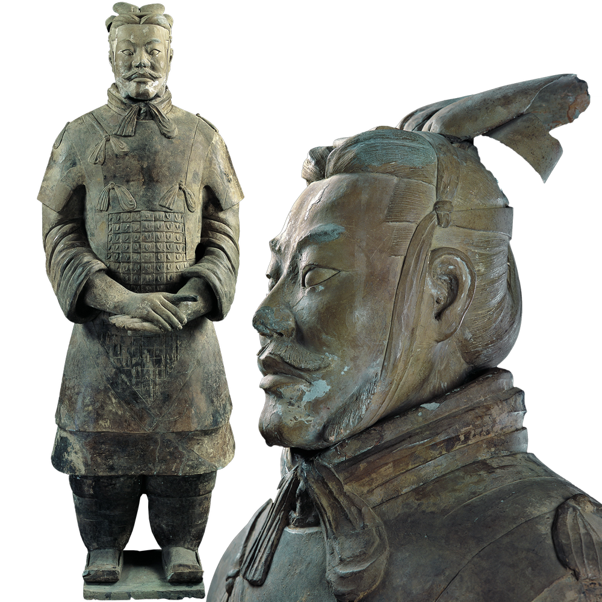
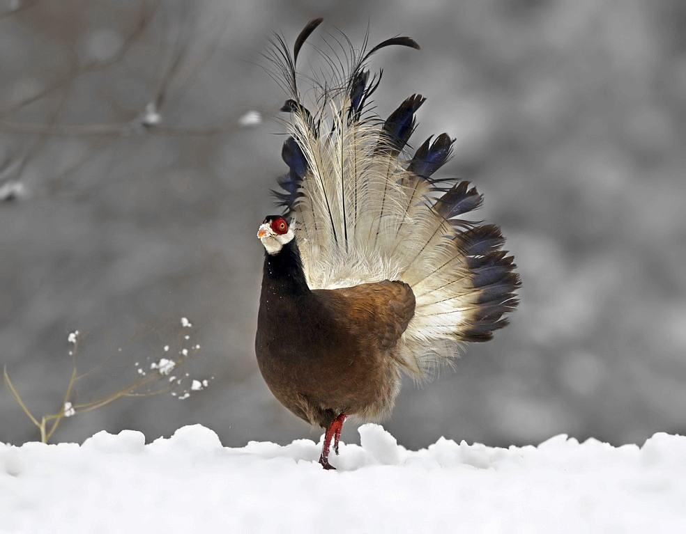

### 7月

<audio id="audio" controls="" preload="none" >
	<source id="mp3" src="../audio/Buckskin Stallion Blues.mp3">
</audio>

&nbsp;&nbsp;&nbsp;&nbsp;🍲2021年7月1日，多云，建党节。中午给我妈发消息，我妈问我啥时候考完试，考完后啥时候回家，我给我妈说不回去了，要在学校学习。儿行千里母担忧，我想我终会有一天在看到此刻时泪流满面。自己的愚蠢，让我妈受到的伤害，我把伤心一颗颗的投到我妈身上，前些年我妈会经常在对我说教后自己伤心的流泪，而我自己却毫不知耻，满面不懈，妈妈的眼泪会永远刻在我的心里。

 

摘抄去年看到的一篇微信文章片段.

##### 摘抄

4月8日武汉解禁那天，开车去上班，路过一个没有多少人，也没有红绿灯的斑马线。路边一个人在等着过马路。我习惯性减速。那个人明显犹疑不决要不要过，脚伸出来，又收回去。

在离斑马线大概还有一米的地方，我把车停了下来，才看清想过马路的是一个乞丐。应该不超过二十岁，分不清颜色的破烂衣衫，漏出瘦弱的小腿与纤细的胳膊，左手提着一个塑料袋，右手很吃力拽着搭在肩上的一个蛇皮袋。

最令我五味杂陈的，是他戴着一个脏脏的，不知道用了多久，很明显已没有任何防护作用的一次性口罩。

整个疫情期间，看了，听了那么多凄婉的生离死别，我都没有落过泪，但中国最现代城市深圳街头的这个脏不拉几的口罩，像一根针扎一样，让我一瞬间泪眼模糊。

为社会和人群的残酷分野，为生命的渺小卑微。

他戴这个没有任何防护作用的脏口罩，明显不是因为多么高看或者珍视自己的生命。大概率是因为如果不戴这个口罩，他将寸步难行，甚至因为不戴口罩行乞而饱受过白眼，驱逐。

我挥手示意他过马路。但他依旧很踌躇和犹豫。在我微笑着再三示意后，他才小跑着穿过，并回过头看了我一眼，眼神带着谦恭和惊恐。

武汉解禁那天，家乡朋友给我发来了两段从不同角度反映武汉的视频。一段是一块独自在风中凌乱飞舞的窗帘。朋友说从去年冬天到昨天，一直在等这家的主人回来收窗帘。树绿了，武汉也解封，仍不见主人回来，窗帘依然还在空中孤独飞舞。

另一段是武汉长江两岸的灯光秀。我表达了祝福，但没有表示太多的兴奋。我一向不太喜欢这种宏大叙事的集体荣耀，我担心这种璀璨的灯光会遮盖很多个体生命的无助，无奈与悲伤。

而如果每个生命，不能有尊严地活着，不能有尊严地死去，我们所有的努力与奋斗，所为何来？

生活从来不易。

祝福这块土地，祝福每家企业，祝福每个个体，都能渡劫。

愿上天赐予我们力量，愿我们互相帮助，一起还生命以尊严！

---

&nbsp;&nbsp;&nbsp;🍚2021年7月5日，星期一，晴转多云，刚在淘宝上买了一个将军俑工艺品，前天看关于兵马俑视频的介绍，被将军俑的装饰震慑，非常崇拜。介绍如下：

鹖，hé，一种像雉而善斗的鸟。

注：“似鸡，五色，冬无毛，赤裸，昼夜鸣”。按，黄黑色，勇于斗一死乃止，故赵武灵王表武士以鹖尾，竖左右为鹖冠。  鹖旦不鸣。——《礼记·月令》

 

 

---

&nbsp;&nbsp;&nbsp;🍲2021年7月6日，星期二，多云转晴。昨天下午把被罩洗了，今天把被子的棉套晒了晒，下午跑了3km。和老外先生依然保持着邮件交流，昨天老外先生告诉我他要送我一件小礼物，从西班牙发过来，我有点开心，但不知道到最后会不会是竹篮打水，国际快递应该是比较麻烦的。

&nbsp;&nbsp;&nbsp;刚在手机微信公众号“杨国斌的精神家园”里读到了杨老师和杨老师的夫人等待接女儿回家时的欣喜期待的感情和等待女儿回家时的各种准备。我想到了我的父母，他们应该也是这样，只不过他们没有这个条件来表达自己，记得在书里读到过一句话，大意是当年知青下乡后，我们通过后来知青们的回忆，了解到了当时下乡的知青吃了很多苦，受了很多难，但我们不知道的是，当时一直生活在乡下的农民，他们受的苦，受的难一点不比他们少，甚至比他们要更加困难，只不过农民们没有知青们的条件，他们不会写字，没办法表达自己，他们随着黄沙一代一代的消沉。（注：可用‘幸存者偏差’解释）

&nbsp;&nbsp;&nbsp;昨晚写了一份作业，自我感觉写的不错，内容如下：

&nbsp;&nbsp;&nbsp;春节是中国民间最隆重盛大的传统节日，是集祈福攘灾、欢庆娱乐和饮食为一体的民俗大节。在我的记忆中，小时候，过春节是自己一年之中最盼望的节日，春节正处在我们寒假假期之中，过节期间，小伙伴们可以无忧无虑的玩耍，可以吃到平时吃不到的食物，可以感受平时感受不到的快乐。

  &nbsp;&nbsp;&nbsp;现在想来，最令人回味与欣喜的时间便是年前的几天，外出打工的家人陆陆续续回家，爷爷奶奶忙碌的准备着年货，妈妈从行李包里拿出给我细心挑选的衣服，爸爸充满关心又严肃的询问我的学习成绩。

  &nbsp;&nbsp;&nbsp;过年，分为年前和年后，年前的几天是人们最忙碌的几天，人们要备制年货，蒸馍，蒸花馍，买猪肉，买瓜子，买糖，买鞭炮等等，最让我们男孩子兴奋的事情便是买上几盒火柴炮在村子里到处放，一种‘没有我崩不到的，只有你想不到的’神气洋溢在我们脸上。大年三十晚上，家人们围在一起吃饭，其乐融融，十分幸福。过完除夕，初一一早，村里人便会每家每户去拜年，这一天，作为孩子的我，是听到夸奖最多的一天，似乎每位上一辈都会对前来拜年的晚辈一顿夸耀，但夸耀中的真实性就不可细究了，人们都要图个吉利，我也爱听这话。之后的几天便是媳妇回娘家的日子，这也是压岁钱最为丰收的几天，但这钱终究是落不进自己的口袋。

  &nbsp;&nbsp;&nbsp;正月十五，年过完了，对我来说，春节是一年中最盼望到来的节日，也是来了后最让我难过的节日，它太快了，爸爸妈妈又要走了。

---

&nbsp;&nbsp;&nbsp;🥪2021年7月7日，星期三，多云。

#### 摘抄

&nbsp;&nbsp;&nbsp;魏祥致清华大学的一封信：

&nbsp;&nbsp;&nbsp;我叫魏祥，男，汉族，现年19岁，家住苦甲天下的甘肃定西，定西一中高三毕业生。

&nbsp;&nbsp;&nbsp;本人因先天性脊柱裂、椎管内囊肿，出生后双下肢运动功能丧失，大小便失禁，爸爸妈妈在我半岁、两岁定时先后奔赴定西市医院、西安西京医院，寻求专家为我手术治疗疾病，但两次手术病情均未见好转，身体残疾情况没有得到改善，更不幸的是下岗多年的爸爸又身患不治之症，医治无效于2005年去世，留下年幼无知身体残疾的我和年轻无助的妈妈。

&nbsp;&nbsp;&nbsp;坚强伟大的妈妈在悲痛欲绝的日子里，不但没有放弃过对我细心无微的照顾，反而更加疼爱我，竭尽全力为我付出，并省吃俭用，除供我上学之外，她将少得可怜的工资多一分都舍不得花积攒下来，为我治病。于2008年6月，妈妈再次背着我踏上了北去的火车，寻求北京天坛医院神经外科专家，为我实施第三次手术治疗。1个多月的住院治疗，我和妈妈相依为命，身心深受煎熬，我的身体几经折磨，痛不欲生，妈妈的精神频临奔溃，孤零零的她没了爸爸的陪伴和支撑，可怜无比，更使我再次深感妈妈的艰辛不易与伟大。可是不争气的我，3次手术都未能改善我的身体状况，残疾依旧，且随着年龄增长残疾日趋严重。

&nbsp;&nbsp;&nbsp;钢铁般坚强的妈妈，擦干了眼泪，一如既往，风雨无阻背我上学。从小学中学到高中，12年如一日，妈妈的背影穿梭于小学中学到高中的大街小巷、校门、教室，好像她从来不知疲倦；12年的妈妈不仅仅是一名医院上班的护士，更是一位残疾少年求学路上的陪读者，守护神；12年的妈妈身教残儿志不残，历尽沧桑终不悔；12年的我竭尽全力，克服身体残障，刻苦求学，完成了中小学阶段的基础教育，今日以648的高考成绩，给了我深爱的妈妈一份殷殷的报恩之礼，同时也给了不断关心呵护我，鼓励我，培养我的各阶段的恩师一份比较满意的答卷。

&nbsp;&nbsp;&nbsp;今有幸遇见举世闻名的清华大学老师，且有意备录我圆大学之梦，得此喜讯，我母子俩狂喜之余，又新添愁云，由于我的身体原因，无论我走到哪里，这辈子都离不开亲人的随身陪护，以照顾我的衣食住行，生活起居，妈妈为了陪我上学无奈放弃工作，仅有的经济来源将要斩断……在此，我恳切希望贵校在接纳我的同时，能够给我母子俩帮助解决一间陋宿，仅供我娘儿俩济身而已，学生我将万分万分感谢！

**清华回信：人生实苦，但请你足够相信**

&nbsp;&nbsp;&nbsp;亲爱的魏祥同学：

&nbsp;&nbsp;&nbsp;见字如面。

&nbsp;&nbsp;&nbsp;首先恭喜你即将来到清华大学，继续你的学习和生活。我们看到了你写给清华大学的文章《一位甘肃高分考生的请求》，相信你早已具备了清华人自强不息、厚德载物的品质，我们代表清华园欢迎来自甘肃定西的你！

&nbsp;&nbsp;&nbsp;《繁星·春水》中有这样一首小诗：“童年啊，是梦中的真，是真中的梦，是回忆时含泪的微笑。”想来这句话应该符合你的童年记忆吧。在梦一般的年华里，却要承受含泪的记忆，这泪水不包含欢喜，不代表留恋。不幸的人生，各有各的悲苦。但万幸的是，你在经历疾病和丧亲之痛后，依然选择了坚强和努力，活成了让我们都尊敬和崇拜的样子。你说“一个多月的住院治疗，我和妈妈相依为命，身心深受煎熬，我的身体几经折磨，痛不欲生，妈妈的精神濒临崩溃，孤零零的她没了爸爸的陪伴和支撑，可怜无比。”只言片语，我们知晓你母亲道阻且长的育子之路，更深切地感受到了你作为儿子对母亲深沉的爱和歉疚。但正如你所说，今日以高分佳绩考入清华，就是给了妈妈一份殷殷的报恩之礼！

&nbsp;&nbsp;&nbsp;邱勇校长在2015级新生开学典礼上曾说：“我是1983年进入清华的。我知道，无论那时还是现在，能够来到清华上学都是不容易的，你们在成长过程中一定遇到过各种各样的困难和挑战。”同样，对于你来说，来路或许不易，命运或许不公，人生或许悲苦，但是请你足够相信，相信清华，相信这个园子里的每一位师生，因为我们都在为一种莫名的东西付出，我想这应该就是情怀。党委书记陈旭老师也曾寄语自强计划的学生：“自强就要做到自主，大学能收获什么取决于自己怎么去努力。”所以也请你相信自己，可以在清华园里找到热爱，追求卓越。

&nbsp;&nbsp;&nbsp;读到你的来信后，清华大学招生办公室主任刘震老师在该微信文章下留言道“魏祥同学已经报考我校。我校老师已经与他取得联系，为他提供一切尽可能的资助！清华不会让任何一位优秀学生因为经济原因而辍学！”确实，清华大学多有与你有同样经历的学子，在家庭经济与身体因素的双重压力下，依然奋发图强。他们或携笔从戎，守护家国平安；或回馈基层，在公益组织中施展才能；或致知穷理，一举夺得清华大学本科生特等奖学金的殊荣......

&nbsp;&nbsp;&nbsp;现在，你的情况受到了清华师生、校友和社会各界的关注。昨天深夜，邱勇校长专门打来电话，关心你的录取情况和入校后的生活安排情况；陈旭老师也请学生部门第一时间对接，妥善安排解决你的后顾之忧。清华大学学生资助管理中心的老师也极力配合，在你被确认录取后会立刻开始资助。清华大学多位校友也在看到消息的第一时间，主动提出资助和协助你治疗的意愿，后续学校相关部门都会跟进落实。请你相信，校内外有足够多的支持，清华不会错过任何一位优秀学子！冰心赠葛洛的一首诗中说“爱在左，情在右，在生命的两旁，随时撒种，随时开花，将这一径长途点缀得花香弥漫，使得穿花拂叶的行人，踏着荆棘，不觉痛苦，有泪可挥，不觉悲凉。”在清华园里的所有学子，无论是生活困顿，抑或身体抱恙，都会有“爱” 与“情” 相伴。相信未来的你，也会和活跃在各领域的清华学子们一样，穿花拂叶，除却一身困顿，成就自己的不同凡响。

&nbsp;&nbsp;&nbsp;感谢社会各界人士对魏祥同学和我校本科招生工作的关注和关心。在此，我们想对在求学路上荆棘丛生的学子们说：人生实苦，但请你足够相信！

清华大学招生办公室

2017年6月27日

---

&nbsp;&nbsp;&nbsp;🍚2021年7月12日，星期一，多云转晴。今天学校正式放暑假，昨天下大雨，这两天自己的左侧屁股肌肉疼痛，不知是不是长期坐着的原因，下面粘贴我和老外先生的部分邮件内容：

#### 邮件摘抄

我的回复：

Dear Roge:

 A relaxing weekend is coming, and wishing you a relaxing weekend. You asked for some issues last week that made me feel uncomfortable. I think that is because we have different values and views about sex. It is true that it exists in our lives sexual behavior. that it is a useful way to relieve sex stress by masturbation for a mature single man. You ask me questions about the different masturbation techniques that men or women use. In my common life, I don't care about those things. I also don't know women's masturbation techniques. If we always talk about these issues, I will feel very embarrassed.

 Excuse me, what do you think about success? And what do you think about dreams?

 Best wishes to you.

 I'm looking forward to your reply.

Yours Fuxiang.

他的回复：

My dear Fuxiang:

I have been very happy to receive your email, because your news is always well received. I hope you are enjoying the weekend. My weekend is not relaxed at all, I work until the end of July and I still have many business to attend to. I'll explain later.
I'm very sorry that my questions last week made you uncomfortable. Obviously we have different values and views on sex due to our upbringing and culture. I will make some clarification or clarification about the comments you have made in your email and then to respect your decision I will not speak again about sexuality.

You say in your email: “It is true that it exists in our lives sexual behavior. that it is a useful way to relieve sex stress by masturbation for a mature single man ”¿???????

Masturbation is a useful way to relieve sexual stress NOT ONLY for a mature single man… Boys and girls reaching puberty and adolescents also masturbate. And young people and adults (men and women) who are happily married and enjoy their sexual relations, also masturbate alone.

You also say in your email: “You ask me questions about the different masturbation techniques that men or women use. In my common life, I don't care about those things. I also don't know women's masturbation techniques ”.

I believe that in daily life all boys and girls from different countries and cultures should be concerned and get information on these issues. I understand that for many people (young or old) talking, sharing, debating, asking about sexuality can be rude, rude, uncomfortable, offensive, and feel embarrassed. But I think it is necessary for people to be well informed, especially not to feel ashamed, fear or not know well how to proceed when getting married and having sex for the first time.
After these comments, we close the topic of sexuality and we will not talk about it again.

As I have told you before, I still have a lot of work during the month of July.

Yesterday Friday I finished taking the last exam to my students.

Now I am correcting several chapters of a doctoral thesis that I am directing on Horse Assisted Therapy or Equine Therapy applied to children with Autism Spectrum Disorders. At the same time, I am designing an instrument to observe and evaluate the Equine therapy sessions that these children receive.

I don't know if you've heard of Animal Assisted Therapies. They are those that are based on the promotion of an affective bond between a patient and an animal in order to promote an evolution in the patient's therapeutic process.

The principle on which Animal Therapies are based is that people, by being in contact with the animal, improve their emotional situation. Creating these emotional bonds with animals is also a stimulus for the brain, which responds both physically and psychically.
Therefore, Animal Assisted Therapy can be used both with patients with physical or intellectual disabilities (such as autism, Down syndrome, depression, cognitive impairment problems or with problems of social exclusion). It can also be used with the elderly and with people with chronic or degenerative diseases.
Finally, it should be emphasized that Animal Assisted Therapies have been shown to be especially useful in early stimulation in children, reducing their states of nervousness, aggression or stress and improving their cognitive abilities.

It is possible to do Assisted Therapy with different animals, although it is essential that they be docile. The most common are Dog Assisted Therapies, with horses and with dolphins. Dogs have always been linked to the human being as companion animals, and due to their versatility in size and character we can find docile, affable and affectionate breeds perfect for therapy. Horses, for their part, offer comprehensive help, both physical and emotional in cases of rehabilitation of children and adults at a neuromuscular, psychological, cognitive and social level.
Something similar happens with dolphin therapy in the water. Still, in countries like the UK there is a tradition of using global care for rabbits, guinea pigs, hamsters, birds and other species therapeutically.

Dear Fuxiang, in 2015 I directed a doctoral thesis entitled "Dolphin Assisted Therapy and its implementation in children with Down Syndrome: an experience in the United States and Mexico".

I attach the summary in English: ....

Another issue I work on during this month of July:

I belong to the EDUIN Research Group (Inclusive Education) of the University of Murcia and together with my fellow professors we have begun to carry out an investigation that will last three years to analyze if the social educational policies of the Region of Murcia are really inclusive or on the contrary are not enough and exclude certain groups of people.

And I'm also writing a book on: Blind Women Composers (Music) in History.

The truth is that I am looking forward to the holidays (the whole month of August) to rest and disconnect from work. Unfortunately in August we will not go to our second residence on the beach of La Manga del Mar Menor. My mother has health problems and is worse in terms of mobility and every time she gets up, walks, sits down, when she has to use transport (getting in the car, getting out of the car) or going up steps (even if they are few) You do a lot of damage to your hips and knees. Yes, we will stay at our usual address in Murcia

¿How are you?
¿How are your classes going?
¿When do you have exams?
¿When do you have vacations at the University?

I am sending you an attached file a document that I have prepared for you on the main monuments in Spain, with photos and an explanation in English. I hope you like it

¿Can I end this email by sending you a big, big hug?
I do not know if in China public expressions of affection between family and friends are correct: for example giving a hug.

Your brother and friend, ALWAYS:

Roge

我的回复：

My Dear Roge:

 Thank you very much for preparing the introduction to me about the main monument of Spain. I was delighted when I received your reply every time. Thank you for forgiving me of my rude words in my email to you last week. At that time, I was so bad manners to you. I'm sorry for my words.

 I hope your mother gets well as soon as possible and has a healthy body. Please send my best wishes to your mother. 

 I think carefully about our misunderstanding. I think I should have a scientific attitude to the problem of "sex" to understand it. I may have been overly sensitive about sex issues last time. My dear Roge, you can talk to me about sex without any inhibitions. I indeed didn't get the correct education about sex. If you have free time, please teach me some knowledge about sex.

 I'm not familiar with the animal-assisted therapy you mentioned. But I think that it must be very cool and significant research. I'm proud of what you've achieved in your research.

 I will have a holiday in one week, and I plan to continue my studies at home, because I will take the postgraduate entrance examination in December this year.

 Spain is really a country with a long history and a lot of charm. If I have a chance in the future, I will definitely travel to Spain.

 

 Best wishes to you and your family.

Yours Fuxiang

他的回复：

My dear Fuxiang

Thank you very much for your message. I am very happy every time I receive your news. In the short time we have known each other you have become very important and necessary in my life and I really appreciate our brotherhood and friendship very much. I believe that today most people are ignorant of the true meaning and meaning of friendship.

Friendship is an affective relationship that can be established between two or more people, to which fundamental values such as love, loyalty, solidarity, unconditionality, sincerity and commitment are associated, and that is cultivated with assiduous treatment and mutual interest over time.

We are surrounded by colleagues, but we must begin to ask ourselves who a friend really is and when you find your answer, value him and take care of him, because a good friend will always be by your side, in good times and bad, he will be there selflessly , without demands, without expecting anything.

A good friend will hug you when you are sad and dry your tears, just as he will bring out your best smile, celebrate your achievements, accompany you in your failures and remain by your side when the world turns its back on you.

A true friendship is a friendship for a lifetime and therefore it is very important to assess which friendships are worth remaining by our side. Learning to distinguish a good friend from a partner can be difficult on many occasions, but to know if a friendship is true, focus on the values of friendship that I have defined before are present.

A friendship will be sincere when the person gives everything of himself without expecting anything in return, although it is necessary that the interest, the predisposition, the continuity and the bond are reciprocal. On the other hand, a true friendship must be cared for and although it is not necessary to maintain physical or direct contact to maintain a friendship, other forms of communication must be found.

Regarding the meaning or definition of a friend, it is the person with whom this bond is selflessly maintained. Friendship does not understand ages, genders, types of relationships, ethnicities, ideologies, cultures, religions, political ideas ...

A friend, unlike your family, you choose. If the friendship is honest, that friend accepts you as you are and vice versa. That does not usually happen in the couple, where what your partner does not like is either tolerated or hated and they always try to change it.

Three types of unfounded friendship can be distinguished by Aristotle, who classified friendship as friendship for pleasure, for utility and for virtue, and all of them share a reciprocal affection, although their purpose is different.

**Friendship for pleasure** is the most frequent among young people, since they live pursuing their passions, what they find pleasant. This is based on a reciprocal friendship where both friends get what they want, through the satisfaction of both.

This friendship tends to appear when, for example, two friends share the same passion for sports activities, partying, playing in a music group, ... they are friendships that are founded through a shared passion and therefore tend to be more volatile, Because as age advances, our passions change and this type of friendship depends on mutual pleasure, so that when the pleasures that are pursued vary, the friendship tends to fade. For this reason, it is common for young people to fuse quickly, in the same way that they end easily.

**In friendship for utility**, the bond that keeps the two people together focuses on receiving some mutual benefit and therefore tends to occur between opposing people, since one expects from the other what they do not have. Friendships for utility tend to be easy to dissolve, since when one of the two people is no longer useful to the other, the friendship dissolves.

In friendship for utility, complaints and reproaches are frequent, because if what sustains friendship is utility, the person increasingly demands more, because he believes that he receives less than what he should deserve. Claims are only presented in this type of friendship, because in friendships for pleasure, after having shared moments of pleasure when they change, people separate, while friendships for utility do not separate so easily, as they will continue to present themselves as friends. As long as they can continue to take advantage of the friendship relationship and true friendship or friendship by virtue, it does not understand reproaches.

The third type of friendship is **friendship by virtue or true friendship**, known as the friendship of the good. This type of friendship conceives the appreciation of the good and the virtuous of life, without any added purpose, without expecting to take advantage of anything. True friendship relationships tend to be maintained throughout life, to be intimate and deep and do not hide a reason, they flow on their own.

In true friendship, neither bothers the other, since both want to share their time together, in true friendship both feel free to be able to share freely, discussing their disagreements without trying to impose one on the other, in true friendship the joys are shared and adversity becomes more pleasant. True friends grow together as people, they are sincere with each other, they seek to understand you without judging you, they maintain a constant concern for you, they know how to listen to you and help you with their heart, and they will give it to you without expecting anything in return, only that this love or affection is shared.

I am glad to know that you liked the document that I prepared for you on the main monuments of Spain. In this way you will know a little more about my country and I trust that as I explain more things about my country, you will fall in love with Spain and in the future, when possible, you will come to visit and learn about the great diversity and richness of facets: landscapes, climates, monuments, traditions and popular festivals, gastronomy ...

My Fuxiang, please don't have to continue to ask me for forgiveness for the misunderstanding that occurred between us. It is normal that with the language barrier and cultural differences there are different ways of approaching and interpreting things. The important thing is that we have clarified the situation and that everything is fine between us.

Thank you for your words and your wishes for my mother to recover. Unfortunately, her disease has no cure and is slowly progressing. We can only follow the doctor's instructions and treatment: rest, keep the legs raised, antibiotics to avoid skin infections and the appearance of ulcers, moisturizing cream on the legs and compression stockings to activate blood circulation.

In your previous email you say:

*“I think carefully about our misunderstanding. I think I should have a scientific attitude to the problem of "sex" to understand it. I may have been overly sensitive about sex issues last time. My dear Roge, you can talk to me about sex without any inhibitions. I indeed didn't get the correct education about sex. If you have free time, please teach me some knowledge about sex ”.*

My Fuxiang if you are sure and want me to explain and advise you on sexuality, okay. I will teach you (always with respect) the knowledge about sex that I believe that any young person, that any person should know.

About sexuality in other emails I will explain you about the following topics (if you agree or it seems good to you)

-Sex practices from different cultures and countries of the world. (Anthropology of sexuality).

-Some tips when you are going to have sex for the first time with a virgin girl

-Different positions for making love: advantages and disadvantages and what is the best position for the woman to become pregnant if she is looking to have a child

-How to cause a squirt (female ejaculation) to your partner

-Masturbation techniques used by men. Techniques to stimulate and masturbate women

-Sexual problems in men and women: priapism, premature ejaculation, vaginismus, frigidity.

 -Sexual fantasies, virginity in women and men.

-The G-spot in men and prostate massage. The G-spot in women.

-Contraceptive methods to prevent the woman from becoming pregnant or to avoid sexually transmitted diseases, etc.

-Sexual orientation (heterosexual, bisexual, homosexual).

 And of course we will continue to share and talk about other topics (not just about sexuality).

My Fuxiang, you are my little brother and my best friend and I don't want any more misunderstandings to be created between us, or for you to be offended, or angry or uncomfortable or embarrassed about talking and sharing about that topic with me. I couldn't bear to lose you, you mean so much to me.

Thank you for your words of praise to me for my research on Animal Assisted Therapy. They mean a lot coming from you. Really many times in my work I do not feel valued. I have two lines of research that I work:

-Accessibility and people with disabilities

-Animal Assisted Therapy and its application to different groups or vulnerable groups.

But when you depart from the traditional or classical lines of research, even if the lines of research or topics that I offer are something innovative, the academic authorities do not value or recognize your work and it is something that annoys, hurts and disappoints me.

It's good that you have a vacation in a week and that you go home and get together and spend time with your family. I think it is okay for you to continue studying at home, especially since you will be taking the Graduate entrance exam in December of this year. However, this saying continues: “Work to live; don't live to work exclusively ”. I understand that your studies and your future work are very important, but try to also keep the balance between your academic life and your personal life. You also have to leave time to be with the people you love: your family. To spend some time with your friends, go out, have a little fun, dedicate yourself to your hobbies or hobbies, sleep more, rest, do some sport. . You should not focus only on your studies. You also have to dedicate yourself, to take care of yourself. I don't want you to fall ill from exhaustion

My Fuxiang, ¿can you give me your home address?

I want to send for you and your family a certified package that will contain "turrón" tablets. A typical Spanish Christmas sweet that can be consumed without problem at any time of the year. The "turrón" tablets are vacuum-packed in plastic and each one inside its cardboard box. It has an expiration date until the end of 2022 so you can consume it safely. There are many varieties of "turrón": hard almond turrón with honey, almond praline turrón, chocolate and almond turrón; Toasted egg yolk turrón,   turrón candied fruit , catalan cream turrón, etc.

Turrón  helps sweeten life

I bought "The Book of the wonders of the world”, of Marco Polo (in facsimile edition) about your trip in Venice (Italy) to China doing the Silk Road. I love to travel literature. It's like transported in time and live all the experiences, landscapes, customs, culture. etc., of China…

I also bought the book "1421, the year China discovered the world".

And, "The tiger guest" (Pu Songling) and "Soul Mountain" (Gao Xingjian)

Thank you for being my little brother and best friend.

Many hugs for my Fuxiang
Roge

我的回复：

My Dear Roge:

 I'm glad to receive your letter. I am very willing to listen to you explain the topic about sex knowledge to me, so that I can have a more comprehensive and scientific understanding of life. I admire you for your deep understanding of friendship. At the same time, I also sincerely hope your mother's health is getting better and better.

 You are a really erudition man. By the way, I haven't read any of the books you bought. I often read some modern Chinese writers' books and literature about love. Maybe this style of books is more in line with my age now. But I'm also happy that you want to read about China. My Dear Roge, As far as I know, the book "1421, The Year China Discovered the World" is not very reliable in describing China. The author who wrote this book did not know much about Chinese history, so he wrote a book about China based on his own feelings. I think this book will lead people who do not know China to have a wrong understanding of Chinese history. "A Dream of Red Mansions" is a very good classical Chinese book. I recommend it to you(I know, you have bought it).

 Wow! I'm so surprised and excited. You want to give me a gift! I couldn't be happier. Thank you very, very much. My Dear Roge, I LOVE YOU!

 My Dear Roge, Can I choose a gift myself? I want a gift that can be kept forever, so that our friendship can be preserved forever. The Christmas candy you prepared for me is very considerate. Can you change it into something that is not to eat? like a pen or souvenir of Spain. Hahahahha, I feel like I'm being a little not polite to you. I want to keep the gift you gave me forever. 

 My home address is "West Campus of Henan Normal University, No. 46 Jianshe East Road, Muye District, Xinxiang City, Henan Province, China". The zip code is "453007". My mobile number is "+86 13183110179". My name is "Sun Fuxiang".

Best wishes to you and your family.

Yours Fuxiang

他的回复：

My dear Fuxiang:

&nbsp;&nbsp;&nbsp;Thank you for your two emails and for your availability and receptivity to listen to explanations on the subject of sexual knowledge. I believe that it will be enriching for your person and will help you make your life more complete and happy. I have sent you an introductory topic on sexual diversity in the world in another email. That is, sexual customs in different cultures, countries and religions. Some may seem strange, immoral, even disgusting, from the point of view of our culture, religion or morality, but they are part of that sexual diversity that exists in Humanity.

Now you know about my thoughts on friendship and I am very happy because I believe that our friendship is TRUE, DEEP AND SINCERE. Thank you for your concern for my mother's health; He will convey your greetings and your interest in improving her.

Thank you for informing me that the book "1421, the year China discovered the world" is not very reliable in describing the true history of China.

You don't have to thank me for wanting to send you a gift. You are my little brother, my close friend, my family and I like to have a little detail with you to remember you so you are always in my thoughts and in my heart. I ALSO LOVE YOU VERY MUCH MY FUXIANG !.

No problem. The package with the "nougat" pills will also carry a more personal gift for you, something that you can keep forever as proof and memory of our friendship (souvenir).

Thank you for giving me the address of your university. But I am a bit confused. If you are going to take a vacation in a week and return home, if I send the package to your university, you will not be there and it is likely that they will return it. So there are two options:

1- Do you prefer that I send the package to your home address?
2- Or do you prefer that I send you the package to the university? If you prefer this second option then tell me on what date you return to the university to send the package, so that you are there

I don't think there is any problem in sending the package to you by certified mail. I have asked at the Post Office and they have told me that there is no problem and that the packages that are sent from Spain usually reach their recipients (addressee)

You don't have to thank me for sending you a small gift. If it were up to me, the Moon would come down from heaven for you if that would make you happy.

Thank you for being my brother, my family, my friend. You are very important in my life and I never want to lose you.

Please say hello to your family for me.
And a very big and strong hug for my Fuxiang
Roge

我的回复：

My Dear Roge:
  I'm glad to receive your letter. The introduction of Spanish traditional festivals is really wonderful. You made me fall in love with Spanish culture. I fell in love with everything in Spain.

  Excuse me. In your letter of some pictures, people are wearing purple clothes and tall hats. What is the meaning of this? Are these clothes for the holidays? The "Murcia in Spring" is very beautiful. I like it very much.

  In the pictures, I can see that the Spanish people are handsome, healthy and beautiful. The young girls in Spain are so beautiful. Mucria is really a charming city. I really envy your life here. Thank you for sharing everything with me.

  My Dear Roge, My hometown is in the countryside, where there is no express service station. But my home is relatively close to the school. You can directly send the gift to the school. I can take a car one hour to the school to get the express. I am so grateful to you. I seldom receive gifts in normal times, especially such a meaningful gift to me. I cannot describe my happiness with words. On the day of receiving the gift, I will share my joy on the social network website. I want to share my joy with everyone.

  All in all, I thank you very much!!!

  You don't have to be in a hurry to reply to emails, you can reply to emails when you are not working, and I hope you have a good time every day.

  Best wishes to you!

Yours Fuxiang

---

&nbsp;&nbsp;&nbsp;🍪2021年7月14日，星期三，多云。昨晚一夜没睡着，可能是我昨天咖啡喝太多的的缘故，昨晚下载了抖音，刷到了周梦洁和她对象的视频，我的妈妈，晚上总会让人感到悲伤，周梦洁的视频刺激了我，使我更加悲伤！

&nbsp;&nbsp;&nbsp;我妈的抖音短视频真多，也刷到了陈梦雅的抖音，感觉她们在情感世界里很幸福，深深的刺激了我，恶性循环，雪上加霜。

---

&nbsp;&nbsp;&nbsp;🥘2021年7月15日，星期四，天气晴。在阿里云盘里发现了孙好想小时候的声音！

<audio id="audio" controls="" preload="none" >
	<source id="mp3" src="../audio/孙好想声音1.mp3">
</audio>

<audio id="audio" controls="" preload="none" >
	<source id="mp3" src="../audio/孙好想声音2.mp3">
</audio>

<audio id="audio" controls="" preload="none" >
	<source id="mp3" src="../audio/孙好想声音3.mp3">
</audio>

---

&nbsp;&nbsp;&nbsp;🥪2021年7月16日，星期五，多云转晴。最近三天失眠严重，摘抄在腾讯医典“活着”栏目看到的一句话：

“那些被抛弃的孩子，小时候没有形成足够的安全依恋，自我评价低，自尊低，总觉得不被喜欢、不受欢迎。而这些心灵的创伤归根结底都是关系的创伤，只有回到关系中才能修复。”

“她排斥那些山里娃考上北大清华的报道。现实是，这里的孩子大多连高中都上不了。”

“她担心媒体的报道会给人一种错觉：农村的孩子更努力，学习更有优势，成绩更好。”

“一件事的道德属性不在于它的结果，而在于它的动机。”

“要不要做一件事，不能通过后来的结果去反推，只能看它是不是当时最好的选择。”（注：个人认为这句话和‘事后诸葛亮同意’）

刚读完那篇文章，可恶啊，人性复杂，我也复杂！

---

&nbsp;&nbsp;&nbsp;🍞2021年7月18日，星期天，多云转阴。刚看了朋友圈，有了些感受，该来的总会来的，期望的或不期望的。

---

&nbsp;&nbsp;&nbsp;🥣2021年7月20日，星期二，大雨，昨晚和今天一直在下雨，手机收到新乡有暴雨红色预警。上午在实训楼学习，看到一个雨天防触电视频，自己有些想法，于是便发微信给杨国斌老师，中午杨老师便回复了我。

我的信息：

&nbsp;&nbsp;&nbsp;“  尊敬的杨老师，我是您小粉丝，我有一个困惑想请教您一下，不知道我的消息会不会打扰到您。最近中部地区总是在下雨，我刚在朋友圈里看到了朋友发的雨天防触电警示视频，但是脑海中无意中有一点其它的感触，在视频中第三段有一位穿白色衣服的人被电击倒，另外两个人马上去救他，但同时他们两个也被电击倒！这个场景很像电影中冲锋的战士倒下了，后边的战士相继冲上来。可让我困惑的是，如果后两位是好心的路人的话，这个意外的发生却没在一篇新闻报导上看到过。我想到了中印对峙，我们牺牲的战士，我们很多新闻都在歌颂，纪念他们，当然我也十分的为我们牺牲的战士感到痛心！但是，杨老师，我的困惑就在这里，视频中后两位被击倒的人不是同样也是为了他人而牺牲的吗？为什么我们在新闻中连他们的影子都没有见到过？难道不同的社会身份，人与人之间的差别真的这么大吗？”

&nbsp;&nbsp;&nbsp;"  杨老师，我感觉自己有时会被新闻报道和现实生活混乱！请问该如何平衡这之间的关系呢？是多读书，多思考吗？或者是两耳不闻窗外事，一心只做关乎自己的事儿？"

杨老师回复：

<audio id="audio" controls="" preload="none" >
	<source id="mp3" src="../audio/杨国斌老师语音.mp3">
</audio>

---

&nbsp;&nbsp;&nbsp;🍘2021年7月22日，星期四，小雨。昨晚上6点左右开始下大雨，天是黄色的，气象局显示昨天新乡牧野站的降雨量比郑州还要多，昨天微博和朋友圈里都是各种祝福和愿平安的动态，应该是普通人在这种罕见的关头都很激动，但是事情还是一码归一码的，祝福永远是嘴上说的事情，它是让另一批普通人打发无聊与参与这种互动的一种方式。昨晚上在实训楼睡觉，大概9点左右停水停电，手机信号变差我打开电脑看电子书，当时的环境安静的看电子书会是一个很美妙的事情，可是我还是把当时的注意力放在了看朋友圈，看QQ动态，看群消息上，参与了大家的集体自我感动！昨晚睡的不舒服，早上和学校的另外3个人一起走到了连接桥，有个送人的老头把我带到了西牧村卖早点的地方，路边的车停靠在那里，这种场景有点破败，外边没有积水，积水严重的地方是学校内，学校地势低，所以积了很多水。路上有大便，有垃圾，乱停放的车。早上看到了一个场景同时也感受到了一件事，一个老女人用袋子装上切剩下的饼拿了就走，她真可恶，小偷行为。我给室友刘光辉发微信消息，给他说要去他住的地方待一会，过了一会儿光辉回消息说他弟在他这里，表示的意思就是不想让我过去，我也给平时常见的同学也发了这消息几个小时候才回复我，说是手机没有信号。人呢，推托事情说起慌来真是漏洞百出。

&nbsp;&nbsp;&nbsp;上午收到牛笑光的微信，提醒我注意安全，他是我上高中时很崇拜的同学。

---

&nbsp;&nbsp;&nbsp;🍲2021年7月27日，星期二，天气晴。最近几天好忙，自己一直没有安下心来学习，现在在宿舍，就剩我和洪立两人，其它人都回家了，22号下大雨后，23日晚上又下了一夜的雨，东西区都被淹了，校外附近的路也有被淹的部分，新闻上说卫辉受灾最严重，我们收到了很多物资，昨天去搬水，累的腰好疼，今天下午去按摩了一会儿，觉得好了一些。上午起床去打开水看到了83集团军的兵哥哥们来我们学校帮我们清理积水，明天去西安，参加小闯的婚礼，顺便带我妹游泳。下面部分是这几天拍的小视频。

---

