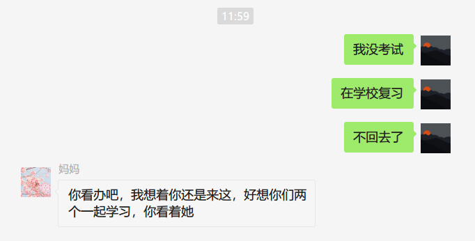

### 7月

<audio id="audio" controls="" preload="none" >
	<source id="mp3" src="../audio/Buckskin Stallion Blues.mp3">
</audio>

&nbsp;&nbsp;&nbsp;&nbsp;🍲2021年7月1日，多云，建党节。中午给我妈发消息，我妈问我啥时候考完试，考完后啥时候回家，我给我妈说不回去了，要在学校学习。儿行千里母担忧，我想我终会有一天在看到此刻时泪流满面。自己的愚蠢，让我妈受到的伤害，我把伤心一颗颗的投到我妈身上，前些年我妈会经常在对我说教后自己伤心的流泪，而我自己却毫不知耻，满面不懈，妈妈的眼泪会永远刻在我的心里。

 

摘抄去年看到的一篇微信文章片段.

##### 摘抄

4月8日武汉解禁那天，开车去上班，路过一个没有多少人，也没有红绿灯的斑马线。路边一个人在等着过马路。我习惯性减速。那个人明显犹疑不决要不要过，脚伸出来，又收回去。

在离斑马线大概还有一米的地方，我把车停了下来，才看清想过马路的是一个乞丐。应该不超过二十岁，分不清颜色的破烂衣衫，漏出瘦弱的小腿与纤细的胳膊，左手提着一个塑料袋，右手很吃力拽着搭在肩上的一个蛇皮袋。

最令我五味杂陈的，是他戴着一个脏脏的，不知道用了多久，很明显已没有任何防护作用的一次性口罩。

整个疫情期间，看了，听了那么多凄婉的生离死别，我都没有落过泪，但中国最现代城市深圳街头的这个脏不拉几的口罩，像一根针扎一样，让我一瞬间泪眼模糊。

为社会和人群的残酷分野，为生命的渺小卑微。

他戴这个没有任何防护作用的脏口罩，明显不是因为多么高看或者珍视自己的生命。大概率是因为如果不戴这个口罩，他将寸步难行，甚至因为不戴口罩行乞而饱受过白眼，驱逐。

我挥手示意他过马路。但他依旧很踌躇和犹豫。在我微笑着再三示意后，他才小跑着穿过，并回过头看了我一眼，眼神带着谦恭和惊恐。

武汉解禁那天，家乡朋友给我发来了两段从不同角度反映武汉的视频。一段是一块独自在风中凌乱飞舞的窗帘。朋友说从去年冬天到昨天，一直在等这家的主人回来收窗帘。树绿了，武汉也解封，仍不见主人回来，窗帘依然还在空中孤独飞舞。

另一段是武汉长江两岸的灯光秀。我表达了祝福，但没有表示太多的兴奋。我一向不太喜欢这种宏大叙事的集体荣耀，我担心这种璀璨的灯光会遮盖很多个体生命的无助，无奈与悲伤。

而如果每个生命，不能有尊严地活着，不能有尊严地死去，我们所有的努力与奋斗，所为何来？

生活从来不易。

祝福这块土地，祝福每家企业，祝福每个个体，都能渡劫。

愿上天赐予我们力量，愿我们互相帮助，一起还生命以尊严！

---

&nbsp;&nbsp;&nbsp;🍚2021年7月5日，星期一，晴转多云，刚在淘宝上买了一个将军俑工艺品，前天看关于兵马俑视频的介绍，被将军俑的装饰震慑，非常崇拜。介绍如下：

鹖，hé，一种像雉而善斗的鸟。

注：“似鸡，五色，冬无毛，赤裸，昼夜鸣”。按，黄黑色，勇于斗一死乃止，故赵武灵王表武士以鹖尾，竖左右为鹖冠。  鹖旦不鸣。——《礼记·月令》

 

 

<iframe 
    height=450 
    width=800
    src="../video/将军俑.mp4" 
    frameborder=0 
    allowfullscreen>
</iframe>

---

&nbsp;&nbsp;&nbsp;🍲2021年7月6日，星期二，多云转晴。昨天下午把被罩洗了，今天把被子的棉套晒了晒，下午跑了3km。和老外先生依然保持着邮件交流，昨天老外先生告诉我他要送我一件小礼物，从西班牙发过来，我有点开心，但不知道到最后会不会是竹篮打水，国际快递应该是比较麻烦的。

&nbsp;&nbsp;&nbsp;刚在手机微信公众号“杨国斌的精神家园”里读到了杨老师和杨老师的夫人等待接女儿回家时的欣喜期待的感情和等待女儿回家时的各种准备。我想到了我的父母，他们应该也是这样，只不过他们没有这个条件来表达自己，记得在书里读到过一句话，大意是当年知青下乡后，我们通过后来知青们的回忆，了解到了当时下乡的知青吃了很多苦，受了很多难，但我们不知道的是，当时一直生活在乡下的农民，他们受的苦，受的难一点不比他们少，甚至比他们要更加困难，只不过农民们没有知青们的条件，他们不会写字，没办法表达自己，他们随着黄沙一代一代的消沉。

&nbsp;&nbsp;&nbsp;昨晚写了一份作业，自我感觉写的不错，内容如下：

&nbsp;&nbsp;&nbsp;春节是中国民间最隆重盛大的传统节日，是集祈福攘灾、欢庆娱乐和饮食为一体的民俗大节。在我的记忆中，小时候，过春节是自己一年之中最盼望的节日，春节正处在我们寒假假期之中，过节期间，小伙伴们可以无忧无虑的玩耍，可以吃到平时吃不到的食物，可以感受平时感受不到的快乐。

  &nbsp;&nbsp;&nbsp;现在想来，最令人回味与欣喜的时间便是年前的几天，外出打工的家人陆陆续续回家，爷爷奶奶忙碌的准备着年货，妈妈从行李包里拿出给我细心挑选的衣服，爸爸充满关心又严肃的询问我的学习成绩。

  &nbsp;&nbsp;&nbsp;过年，分为年前和年后，年前的几天是人们最忙碌的几天，人们要备制年货，蒸馍，蒸花馍，买猪肉，买瓜子，买糖，买鞭炮等等，最让我们男孩子兴奋的事情便是买上几盒火柴炮在村子里到处放，一种‘没有我崩不到的，只有你想不到的’神气洋溢在我们脸上。大年三十晚上，家人们围在一起吃饭，其乐融融，十分幸福。过完除夕，初一一早，村里人便会每家每户去拜年，这一天，作为孩子的我，是听到夸奖最多的一天，似乎每位上一辈都会对前来拜年的晚辈一顿夸耀，但夸耀中的真实性就不可细究了，人们都要图个吉利，我也爱听这话。之后的几天便是媳妇回娘家的日子，这也是压岁钱最为丰收的几天，但这钱终究是落不进自己的口袋。

  &nbsp;&nbsp;&nbsp;正月十五，年过完了，对我来说，春节是一年中最盼望到来的节日，也是来了后最让我难过的节日，它太快了，爸爸妈妈又要走了。

---

