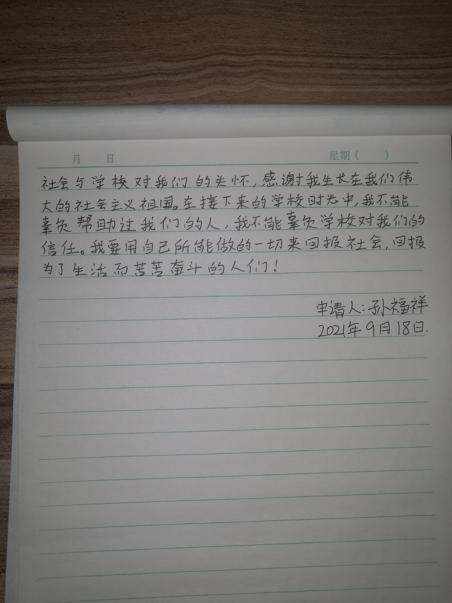

### 8月

<audio id="audio" controls="" preload="none" >
	<source id="mp3" src="../audio/Buckskin Stallion Blues.mp3">
</audio>

&nbsp;&nbsp;&nbsp;🥪2021年8月6日，星期五，天气晴。现在在西安，7月29日一天坐大巴来西安，30号参加小闯婚礼，小闯是我熟悉的同龄人中第一个结婚的，原因可能是他老婆怀孕，所以突然就结婚。30号晚上自己去南门和钟楼走了走，南门很繁华，周边的大楼很漂亮，晚上到家后接到通知河南疫情严峻，学校8月份封校，自己被困于西安，洪立帮忙把我的复习书和电脑寄了过来。昨天麻文杰的爷爷去世，听说是意外死亡，以前我见过他几次，人的一生是这么的虚无而又存在，这样的出生，这样的生活，这样的死亡！生命的过程，所经历的事情，都是过眼云烟，过后烟消云散，听说他是坐在三轮车（有车头，封闭式）上死亡的，昨天我妈给我姑打电话时我听到，我姑说叫法医检查花了4000多元说是正常死亡，作为我们亲属关系相对比较远的的这方，我们活着的人最大的关心是随礼时礼金的多少！生命是除自己之外，对于他人来说是多么的无关痛痒。我想我应该坚持把日记写下去，日后要做成书，要把我的思想留下来。

---

&nbsp;&nbsp;&nbsp;🥧2021年8月12日，星期四，晚上9点20，窗外在下雨，来西安后我过的简直是不是人的生活，自己成天睡觉，日夜颠倒，没有计划。局面好难堪！怪我爸吗？怪我吗？到了该谈婚论嫁的年龄，家里比较穷，爸妈催促，希望自己40多岁能比目前的我爸强！总体来说，在目前我的眼里，我爸的经济力量相比于同期来西安奋斗的朋友，我家里的表现是不近如人意的。要想变的不一样，我必须和爸妈分开，生活在一起，我总是太听话，爸妈的思想会一直影响我。

---

&nbsp;&nbsp;&nbsp;&nbsp;🥣2021年8月19日，星期四，外边在下雨现在，昨晚和今下午把《秋园》看完了，秋园一生好苦。前几天在网上看了几期《十三邀》节目，感觉很棒，主要看了几期采访对象是在学术上有名的人或商人，觉得他们对待事物都有自己独到的看法，而且还比较深刻，甚至是一针见血，可见读书对一个人的重要性是多么的不可替代，读书能让我们在思想上成为一个独立人，而不是人云亦云，新闻如何报导就如何去相信。自己感觉多接触一些女生，才能发现自己真正想要什么样的女生，而不是为了谈对象而谈对象，为了结婚而结婚。国际上，塔利班占领了阿富汗，今天新闻上报导塔利班建立新国家。

#### 摘抄

&nbsp;&nbsp;&nbsp;罗素说，参差多态是幸福的本源，一个多元化的社会，需要的就是大家对相同事情的不同理解。世界不是非黑即白，伟大与卑劣甚至会同时存在于同一个人身上。这本身没有什么对错可言，只是仁者见仁，智者见智，正是因为这些分歧，才能共同映照出一个事物的真实面貌。

---

&nbsp;&nbsp;&nbsp;🍚2021年8月23日，星期一，早上7点多起床。刚吃东西时在B站上看到了一个很好的讽刺视频，视频的发布大概是去年武汉疫情时期，看到下边的评论说微博已经把这个视频删除了，是为了舆论管控。上个月新乡暴雨内涝，学校和学院也收到了好多捐赠物资，以自己的短暂所见，和视频中的某些情景，几分相似。

（1）开头黑衣员工，60万买20万只口罩，然后再以100万10万只的价格卖给朱一旦，自己独吞十万只，相当于净赚30＋40＝70万元

（2）朱一旦捐给领导，仓库满了，领导作为补偿将十万口罩给男科医院院长

（3）男科医院院长，被欠债30万，得到10万口罩口罩以40万卖给蓝衣男，净赚10万元

（4）蓝衣男，花40万购入10万口罩，再以60万的价格把10万只口罩卖给v商，净赚20万

（5）V商将十万只口罩以80万卖给朱一旦员工，净赚20万

（6）朱一旦员工谎称从国外采购，将口罩以120万元卖给朱一旦，净赚40万，朱一旦将公司卖掉

（7）综上所述，朱一旦亏了（不计算口罩的进价）70万元＋公司

&nbsp;&nbsp;&nbsp;PS：实际上这种口罩（视频中暗示了口罩是假口罩）成本连五毛都达不到，如果按成本五毛来算的话卖口罩的人净赚55万。口罩经过一系列的流通从最初的成本价5毛变成了12元，成本整整翻了24倍，真是讽刺。如果口罩箱子哪怕只打开检查过一回，贵重的劳力士都会被人拿走。我觉得也可以理解为，这个口罩箱子辗转多次，连拆都没有拆过，没有人打开过关心过里面的口罩到底是怎样的，在乎的只是利益罢了

<iframe 
    height=450 
    width=800
    src="../video/朱一旦.mp4" 
    frameborder=0 
    allowfullscreen>
</iframe>
---

&nbsp;&nbsp;&nbsp;🍕2021年8月30日，小雨，现在是下午6点，读书能让人有一颗平静的心。

---

&nbsp;&nbsp;&nbsp;🍚2021年8月31日，预报今天一直会下雨，早上5点起床，在网上看了些信息，是关于程序员职业发展的谈论，总体来说，不是乐观的情况，中年程序员是我们的职业灾难，但这一天迟早回来！来到自习室后看了些关于抱怨的心理文章，家里我妈总是抱怨上班时的是是非非，这是负能量，我爸在家里没有任何发言权，我觉得我爸在权威与是非面前总是能力大次于我妈，我妈在家里权威方面是一手遮天。在我看来，我爸在家里没有主见，这在工作中也许也是这样，在重大或关键时刻不能自己做出判断，很多事都听从我妈的意见。我现在也在抱怨家里人，我真贱！自己一身白毛，还说别人是妖精。我目前知道的是，家里盖房，向我姑借了5万，向郭老三借了1万（我从小的印象里郭老三是一个比较穷的人，因为他老婆常年患病）。家里目前的经济现状跟我爸的能力脱不了一丝关系，市场上的小摊位，赚不到多少钱，更关键的是它也赔不了多少钱，这样就制造了一锅温水，不冷不热，刚刚好，作为奋斗者的我爸，便是锅里的青蛙！煮掉的是时间和精力。为什么会出现这种状况呢？应该跟人的性情有关，我的初恋对象和我分手时的理由是不喜欢我的性格。拥有勇气和不惧的胆识我想才是一个男人的魅力所在！

---

&nbsp;&nbsp;&nbsp;🍟2021年9月1日，多云转阴，今天孙好想农历生日，小学开学，上午去自习室学习，下午吃完饭后在家里睡觉到6点。自己把自己的生活规律做的十分糟糕，晚上10点多又睡着到12点起来，做了一个噩梦，自己在梦里弱小无助，恐惧。起来后在手机上看到西安地铁三号线发生的“保安强行拉扯女乘客”新闻。我更多地感到的是人心的丑恶与“非一般”情况中力量弱的一方的无助。这种情况很极端，很夺人眼球，但在我们普通人身上，披着文明外衣的野蛮行为不时的在发生着。对于我们生活中刚性需求的高收费（如很多农村地区高考成绩只能进入民办三本类学校的考生，其学费较高，一年学费堪比优秀高校四年的学费，这便给生活在农村的人们带来极大的经济负担），我生活中亲眼见到的场景，商场的保安，早市上的管理者，他们在治理时行为与言语很暴力，他们的执行对象便是生活在城市中没有资源但还要为支付某些高额费用的穷苦者。我想，其中的矛盾没有对与错，双方都是为了工作与生存！可怜。

---

&nbsp;&nbsp;&nbsp;🍥2021年9月2日，星期四，多云。晚上8点多开了年级会，离考研还剩100多天，外界情况复杂，心里很难过，抱怨外界环境的再多也是自己的抱怨，无法改变任何外界情况！别人的优秀是别人的，自己的事情依然是自己的。

---

&nbsp;&nbsp;&nbsp;🥙2021年9月11日，星期六，晴。最近早上起床后会去家附近的停车场背书。昨晚我妈和她的朋友（郝丽香）一起去万和城肯德基应聘工作，因为我妈身份证年龄显示已经50岁，应聘失败。昨晚我回到家后妈妈告诉我结果，我心里感到难过，一种较轻的失落感在心里，和自己在集体竞争中失败时的感觉大致一样，像考试落榜的感觉。今早上背完书后，去几家店帮我妈问招聘情况，每个店中的负责人都误以为我是来应聘的。我的感受是，即使是生活在城市中的打工者，也是依托着自己年轻的年龄资本在活着，年龄稍大后，便失去了自己唯一的优势资本，便会不值什么，便会可怜！但没人可怜你！反观我爸妈这大半辈子，仿佛我也活了他们的生活。自己万万不愿再重复他们这样的活法，但自己的不愿，在真实的生活面前会有效果吗？我50岁时，会是这样吗？会比这更让人失落吗？我会活到50岁吗？

&nbsp;&nbsp;&nbsp;我妈的朋友郝丽香，她的命运从我的角度看是悲伤的，她和自己的首任丈夫结婚生完孩子后离开了家庭，又和第二个男人一起生完孩子后离开这个男人，现在又和第三个男人在一起，而且，她又怀孕了。我看来，她十分不负责任，她不为自己孩子的命运感到悲伤吗？自己不会为了别人（自己的孩子）忍耐吗？全凭自己的感觉活着吗？人之所以是人，是因为我们有意识，但在意识之外，我们和动物没什么区别。

---

&nbsp;&nbsp;&nbsp;🍜2021年9月15日，星期三，晴。现在在恒基小区自习室，刚下楼去万和城上厕所，看到马路两旁站了很多人，有很多穿城管衣服的人，封了路上的汽车，因为习主席今晚要参加西安全运会的开幕式，车队从路上过时很有牌面，我看到了坐在车里的人，不知习主席有没有在里边。几天前这样的封路彩排过，当时是用大巴车来代替领导坐的中巴车，很有气派。以前看视频，金一南教授讲自己年轻时因访华领导车队要经过，导致道路被封，从而使自己上班迟到，但几十年后，他们竟坐在了同一张桌子上开会。我崇拜金一南教授，十分崇拜。金教授讲‘做难事，必有所得’。

---

&nbsp;&nbsp;&nbsp;🧂2021年9月16日，星期四，小雨。昨晚我爸我妈我们三个人一起去给我妈找工作，在一家牛肉火锅店做后厨。之前我妈在华莱士工作，因为一个叫“糜卷”的东西，她做了店长，对待同事态度十分蛮横，下作。所以在华莱士工作的员工都辞职不干了，我妈也在内。我妈是十分善良的人，有爱心，同情朋友，郝丽香有什么不顺心的事都给我妈说，我妈都会站在郝丽香这边帮她分忧，上次还因为郝丽香的一些事情，我妈去她家里来安慰她。可是，这多刺的生活，怎么不善待善良的人呢。昨晚我妈又去华莱士想重新上班，但是这家华莱士门店的总负责人督导以规章规定为由拒绝了我妈，我想这位督导根本不知道员工之间发生了什么，他在经营的层面只看到了他的员工都离职，给他的经营造成了影响，他怀怨在心，拒绝了我妈复职的请求。如果自己有一天有幸做了领导，自己又会遇到什么呢？我爸妈现在的工作状态已经不是起初来西安为赚钱的状态了，而是通过体力劳动来换取微薄的工资来养家糊口，准确的说是为了在城市中活着，已经谈不上赚钱了。生活的骤变悄无声息。

---

&nbsp;&nbsp;&nbsp;🥯2021年9月17日，星期五，中雨。昨天晚上学校发布研究生招生简章，今天年级群里通知9月22号返校，好快，8月底来西安，这20多天过的跟梦幻一样，但又感觉大学生活过的跟梦幻一样，静心想想，从小到大，过的都跟梦幻一样，时间快的十分彻底。刚吃午饭时，我爸给我说上学是对的，比中途辍学去打工强，站在总体角度来看，我爸妈的生活也很可怜，我妈小学三年级辍学，我爸初中上完便没有继续学业，爸妈学生时代的外部环境对他们坚持学习的观念培养也不是有利的，大概当时农村地区普通家庭都不重视孩子的教育。可见，在整体的大环境下，个人的命运就像漂浮在河水中的干草一样，也许我现在也是时代潮流中的稻草，也不知道自己漂到哪里。

&nbsp;&nbsp;&nbsp;刚吃饭时，自己脑子里想了一件事情的闭环连接，这个想法可以解决脑子里冒出的问题。问题是‘为什么有的人喜欢玩游戏’，脑子给出的答案是因为玩游戏的人并不是喜欢玩游戏本身，而是喜欢在玩游戏时不同阶段游戏平台给的虚拟奖励，在心理上满足人的被认同感，我平时看到，有的人在打游戏输了后，他们也会生气烦躁，甚至是发脾气，可见，在游戏上经过自己的努力后，没有得到及时的认同反馈，他们也会感到厌烦，情感会消极。人们爱游戏，爱的只是被认同感，我想我妈成天拍抖音，然后她的抖音粉丝给她点赞，我妈也是享受这被点赞的认同感，倘若我妈的视频连续一周没人点赞，我妈拍视频的热情便会下降好多。虚拟世界给用户及时反馈的成本很低，无非是让用户看到自己胜利后屏幕上出现一个“Victory”，这便让一些人十分喜爱。如果让每一个打游戏的人每局都输，自然就没有人打游戏了。

---

&nbsp;&nbsp;&nbsp;🧆2021年9月18日，星期六，中雨。昨晚刷抖音到两点多，早上睡到10点，防空警报拉响了几分钟，起床后吃了些东西后看电视一个关于“能源动力”的纪录片，感觉到了高科技的力量，感到了时代的变化，我需要学习的有很多。昨晚开视频年级会李淳老师说我们学校的学生发展是有上限的，这跟我们的高考成绩有关，这话虽然听着不是积极的鼓励话，但这应该是客观事实，认识规律，才能正确的把握规律。去年在家的时候老家新盖的房子在一场大雨中漏水很严重，楼梯处渗水最重，后墙大面积渗水，各窗户处也渗水，二楼隔间，一楼隔间都渗水，家里的热水器也是山寨货，总体来说，我对家里的这所房子12分不满意，爸妈在这种盖房事情上我觉得他们不够重视，花了大半辈子的钱买了个残次品，觉得父母没有抓住生活的重点，觉得他们在城市中过一天是一天，没有一个对家族发展的总体规划。记得去年我在给我妈反应家里窗户下雨渗水问题时，我妈还为说服我而辩解说别人家的窗户都会漏水，为窗户的漏水做辩护，甚至还为家里楼梯的漏水做辩护，给我一种自己在为自家房子漏水而辩护和推托责任的感觉。由此可见，爸妈的观点不可信，不可听，不可靠！我这种把生活不尽如人意的怨气全撒在父母身上的样子真是恶心，自己把怨气撒在了对自己无限宽容的父母身上，真不是个东西，是非常典型的无能的，懦弱的人，如果一直这样下去，自己在以后一定也会把将来的不如意撒在自己妻子身上，如果真的发生了，我真是个禽兽，不配做人，是对不起父母赋予我的生命，是对不起妻子的一切。生活就是事实，从事实中总结经验，也是很有必要的。今晚上听徐涛老师的考研政治，徐涛老师说每个人都是多面的，一个人不会是绝对的好下去，人的多面性也是客观事实。今天学的近代史，不由主的感觉我家也与晚清有些许类似，家庭观念需要变革，首先发现问题，然后思考，然后改变。知识的魅力真是太强大了！

&nbsp;&nbsp;&nbsp;下午写了份贫困申请，如下：

 

 

