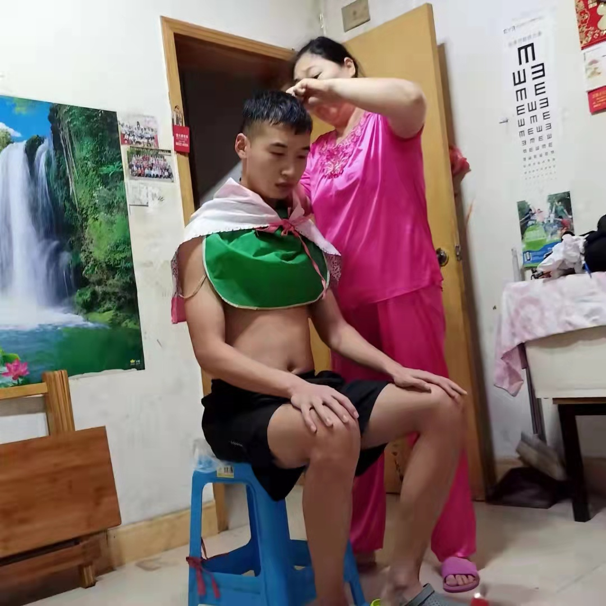
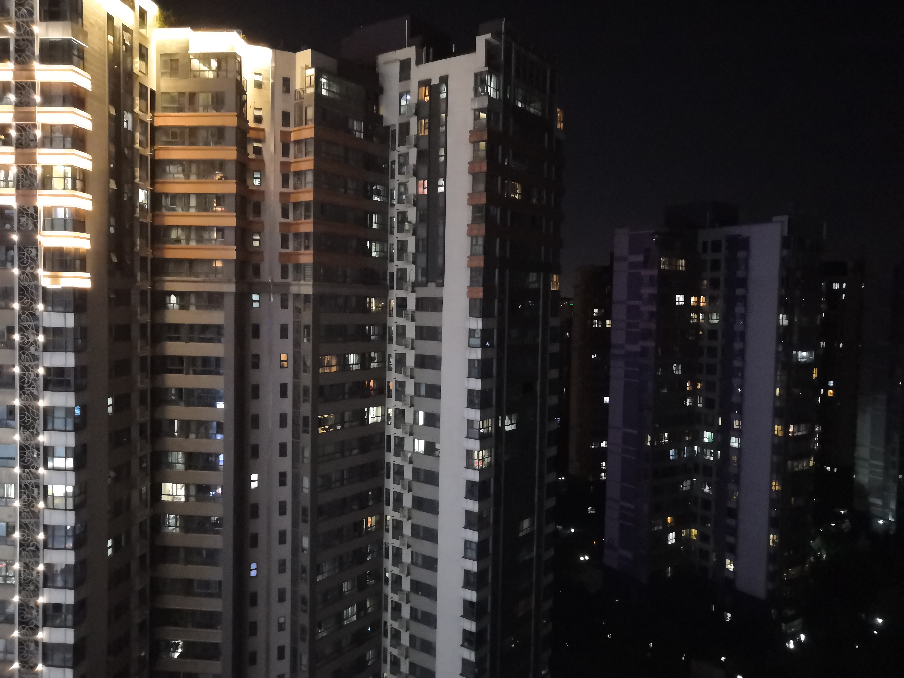

### 8月

<audio id="audio" controls="" preload="none" >
	<source id="mp3" src="../audio/Buckskin Stallion Blues.mp3">
</audio>

&nbsp;&nbsp;&nbsp;🥪2021年8月6日，星期五，天气晴。现在在西安，7月29日一天坐大巴来西安，30号参加小闯婚礼，小闯是我熟悉的同龄人中第一个结婚的，原因可能是他对象怀孕，所以突然就结婚。30号晚上自己去南门和钟楼走了走，南门很繁华，周边的大楼很漂亮，晚上到家后接到通知河南疫情严峻，学校8月份封校，自己被困于西安，洪立帮忙把我的复习书和电脑寄了过来。昨天麻文杰的爷爷去世，听说是意外死亡，以前我见过他几次，人的一生是这么的虚无而又存在，这样的出生，这样的生活，这样的死亡！生命的过程，所经历的事情，都是过眼云烟，过后烟消云散，听说他是坐在三轮车（有车头，封闭式）上死亡的，昨天我妈给我姑打电话时我听到，我姑说叫法医检查花了4000多元说是正常死亡，作为我们亲属关系相对比较远的的这方，我们活着的人最大的关心是随礼时礼金的多少！生命是除自己之外，对于他人来说是多么的无关痛痒。我想我应该坚持把日记写下去，日后要做成书，要把我的思想留下来。

---

&nbsp;&nbsp;&nbsp;🥧2021年8月12日，星期四，晚上9点20，窗外在下雨，来西安后我过的简直是不是人的生活，自己成天睡觉，日夜颠倒，没有计划。局面好难堪！怪我爸吗？怪我吗？到了该谈婚论嫁的年龄，家里比较穷，爸妈催促，希望自己40多岁能比目前的我爸强！总体来说，在目前我的眼里，我爸的经济力量相比于同期来西安奋斗的朋友，我家里的表现是不近如人意的。要想变的不一样，我必须和爸妈分开，生活在一起，我总是太听话，爸妈的思想会一直影响我。

---

&nbsp;&nbsp;&nbsp;&nbsp;🥣2021年8月19日，星期四，外边在下雨现在，昨晚和今下午把《秋园》看完了，秋园一生好苦。前几天在网上看了几期《十三邀》节目，感觉很棒，主要看了几期采访对象是在学术上有名的人或商人，觉得他们对待事物都有自己独到的看法，而且还比较深刻，甚至是一针见血，可见读书对一个人的重要性是多么的不可替代，读书能让我们在思想上成为一个独立人，而不是人云亦云，新闻如何报导就如何去相信。自己感觉多接触一些女生，才能发现自己真正想要什么样的女生，而不是为了谈对象而谈对象，为了结婚而结婚。国际上，塔利班占领了阿富汗，今天新闻上报导塔利班建立新国家。

#### 摘抄

&nbsp;&nbsp;&nbsp;罗素说，参差多态是幸福的本源，一个多元化的社会，需要的就是大家对相同事情的不同理解。世界不是非黑即白，伟大与卑劣甚至会同时存在于同一个人身上。这本身没有什么对错可言，只是仁者见仁，智者见智，正是因为这些分歧，才能共同映照出一个事物的真实面貌。

---

&nbsp;&nbsp;&nbsp;🍕2021年8月30日，小雨，现在是下午6点，读书能让人有一颗平静的心。

---

&nbsp;&nbsp;&nbsp;🍚2021年8月31日，预报今天一直会下雨，早上5点起床，在网上看了些信息，是关于程序员职业发展的谈论，总体来说，不是乐观的情况，中年程序员是我们的职业灾难，但这一天迟早回来！来到自习室后看了些关于抱怨的心理文章，家里我妈总是抱怨上班时的是是非非，这是负能量，我爸在家里没有任何发言权，我觉得我爸在权威与是非面前总是能力大次于我妈，我妈在家里权威方面是一手遮天。在我看来，我爸在家里没有主见，这在工作中也许也是这样，在重大或关键时刻不能自己做出判断，很多事都听从我妈的意见。我现在也在抱怨家里人，我真贱！自己一身白毛，还说别人是妖精。我目前知道的是，家里盖房，向我姑借了5万，向郭老三借了1万（我从小的印象里郭老三是一个比较穷的人，因为他老婆常年患病）。家里目前的经济现状跟我爸的能力脱不了一丝关系，市场上的小摊位，赚不到多少钱，更关键的是它也赔不了多少钱，这样就制造了一锅温水，不冷不热，刚刚好，作为奋斗者的我爸，便是锅里的青蛙！煮掉的是时间和精力。为什么会出现这种状况呢？应该跟人的性情有关，我的初恋对象和我分手时的理由是不喜欢我的性格。拥有勇气和不惧的胆识我想才是一个男人的魅力所在！

---

&nbsp;&nbsp;&nbsp;🍟2021年9月1日，多云转阴，今天孙好想农历生日，小学开学，上午去自习室学习，下午吃完饭后在家里睡觉到6点。自己把自己的生活规律做的十分糟糕，晚上10点多又睡着到12点起来，做了一个噩梦，自己在梦里弱小无助，恐惧。起来后在手机上看到西安地铁三号线发生的“保安强行拉扯女乘客”新闻。我更多地感到的是人心的丑恶与“非一般”情况中力量弱的一方的无助。这种情况很极端，很夺人眼球，但在我们普通人身上，披着文明外衣的野蛮行为不时的在发生着。对于我们生活中刚性需求的高收费（如很多农村地区高考成绩只能进入民办三本类学校的考生，其学费较高，一年学费堪比优秀高校四年的学费，这便给生活在农村的人们带来极大的经济负担），我生活中亲眼见到的场景，商场的保安，早市上的管理者，他们在治理时行为与言语很暴力，他们的执行对象便是生活在城市中没有资源但还要为支付某些高额费用的穷苦者。我想，其中的矛盾没有对与错，双方都是为了工作与生存！可怜。

---

&nbsp;&nbsp;&nbsp;🍥2021年9月2日，星期四，多云。晚上8点多开了年级会，离考研还剩100多天，外界情况复杂，心里很难过，抱怨外界环境的再多也是自己的抱怨，无法改变任何外界情况！别人的优秀是别人的，自己的事情依然是自己的。

---

&nbsp;&nbsp;&nbsp;🥙2021年9月11日，星期六，晴。最近早上起床后会去家附近的停车场背书。昨晚我妈和她的朋友（郝丽香）一起去万和城肯德基应聘工作，因为我妈身份证年龄显示已经50岁，应聘失败。昨晚我回到家后妈妈告诉我结果，我心里感到难过，一种较轻的失落感在心里，和自己在集体竞争中失败时的感觉大致一样，像考试落榜的感觉。今早上背完书后，去几家店帮我妈问招聘情况，每个店中的负责人都误以为我是来应聘的。我的感受是，即使是生活在城市中的打工者，也是依托着自己年轻的年龄资本在活着，年龄稍大后，便失去了自己唯一的优势资本，便会不值什么，便会可怜！但没人可怜你！反观我爸妈这大半辈子，仿佛我也活了他们的生活。自己万万不愿再重复他们这样的活法，但自己的不愿，在真实的生活面前会有效果吗？我50岁时，会是这样吗？会比这更让人失落吗？我会活到50岁吗？

&nbsp;&nbsp;&nbsp;我妈的朋友郝丽香，她的命运从我的角度看是悲伤的，她和自己的首任丈夫结婚生完孩子后离开了家庭，又和第二个男人一起生完孩子后离开这个男人，现在又和第三个男人在一起，而且，她又怀孕了。我看来，她十分不负责任，她不为自己孩子的命运感到悲伤吗？自己不会为了别人（自己的孩子）忍耐吗？全凭自己的感觉活着吗？人之所以是人，是因为我们有意识，但在意识之外，我们和动物没什么区别。

---

&nbsp;&nbsp;&nbsp;🍜2021年9月15日，星期三，晴。现在在恒基小区自习室，刚下楼去万和城上厕所，看到马路两旁站了很多人，有很多穿城管衣服的人，封了路上的汽车，因为习主席今晚要参加西安全运会的开幕式，车队从路上过时很有牌面，我看到了坐在车里的人，不知习主席有没有在里边。几天前这样的封路彩排过，当时是用大巴车来代替领导坐的中巴车，很有气派。以前看视频，金一南教授讲自己年轻时因访华领导车队要经过，导致道路被封，从而使自己上班迟到，但几十年后，他们竟坐在了同一张桌子上开会。我崇拜金一南教授，十分崇拜。金教授讲‘做难事，必有所得’。

---

&nbsp;&nbsp;&nbsp;🧂2021年9月16日，星期四，小雨。昨晚我爸我妈我们三个人一起去给我妈找工作，在一家牛肉火锅店做后厨。之前我妈在华莱士工作，因为一个叫“糜卷”的东西，她做了店长，对待同事态度十分蛮横，下作。所以在华莱士工作的员工都辞职不干了，我妈也在内。我妈是十分善良的人，有爱心，同情朋友，郝丽香有什么不顺心的事都给我妈说，我妈都会站在郝丽香这边帮她分忧，上次还因为郝丽香的一些事情，我妈去她家里来安慰她。可是，这多刺的生活，怎么不善待善良的人呢。昨晚我妈又去华莱士想重新上班，但是这家华莱士门店的总负责人督导以规章规定为由拒绝了我妈，我想这位督导根本不知道员工之间发生了什么，他在经营的层面只看到了他的员工都离职，给他的经营造成了影响，他怀怨在心，拒绝了我妈复职的请求。如果自己有一天有幸做了领导，自己又会遇到什么呢？我爸妈现在的工作状态已经不是起初来西安为赚钱的状态了，而是通过体力劳动来换取微薄的工资来养家糊口，准确的说是为了在城市中活着，已经谈不上赚钱了。生活的骤变悄无声息。

---

&nbsp;&nbsp;&nbsp;🥯2021年9月17日，星期五，中雨。昨天晚上学校发布研究生招生简章，今天年级群里通知9月22号返校，好快，8月底来西安，这20多天过的跟梦幻一样，但又感觉大学生活过的跟梦幻一样，静心想想，从小到大，过的都跟梦幻一样，时间快的十分彻底。刚吃午饭时，我爸给我说上学是对的，比中途辍学去打工强，站在总体角度来看，我爸妈的生活也很可怜，我妈小学三年级辍学，我爸初中上完便没有继续学业，爸妈学生时代的外部环境对他们坚持学习的观念培养也不是有利的，大概当时农村地区普通家庭都不重视孩子的教育。可见，在整体的大环境下，个人的命运就像漂浮在河水中的干草一样，也许我现在也是时代潮流中的稻草，也不知道自己漂到哪里。

&nbsp;&nbsp;&nbsp;刚吃饭时，自己脑子里想了一件事情的闭环连接，这个想法可以解决脑子里冒出的问题。问题是‘为什么有的人喜欢玩游戏’，脑子给出的答案是因为玩游戏的人并不是喜欢玩游戏本身，而是喜欢在玩游戏时不同阶段游戏平台给的虚拟奖励，在心理上满足人的被认同感，我平时看到，有的人在打游戏输了后，他们也会生气烦躁，甚至是发脾气，可见，在游戏上经过自己的努力后，没有得到及时的认同反馈，他们也会感到厌烦，情感会消极。人们爱游戏，爱的只是被认同感，我想我妈成天拍抖音，然后她的抖音粉丝给她点赞，我妈也是享受这被点赞的认同感，倘若我妈的视频连续一周没人点赞，我妈拍视频的热情便会下降好多。虚拟世界给用户及时反馈的成本很低，无非是让用户看到自己胜利后屏幕上出现一个“Victory”，这便让一些人十分喜爱。如果让每一个打游戏的人每局都输，自然就没有人打游戏了。

---

&nbsp;&nbsp;&nbsp;🧆2021年9月18日，星期六，中雨。昨晚刷抖音到两点多，早上睡到10点，防空警报拉响了几分钟，起床后吃了些东西后看电视一个关于“能源动力”的纪录片，感觉到了高科技的力量，感到了时代的变化，我需要学习的有很多。昨晚开视频年级会李淳老师说我们学校的学生发展是有上限的，这跟我们的高考成绩有关，这话虽然听着不是积极的鼓励话，但这应该是客观事实，认识规律，才能正确的把握规律。去年在家的时候老家新盖的房子在一场大雨中漏水很严重，楼梯处渗水最重，后墙大面积渗水，各窗户处也渗水，二楼隔间，一楼隔间都渗水，家里的热水器也是山寨货，总体来说，我对家里的这所房子十二分不满意，爸妈在这种盖房事情上我觉得他们不够重视，花了大半辈子的钱买了个残次品，觉得父母没有抓住生活的重点，觉得他们在城市中过一天是一天，没有一个对家族发展的总体规划。记得去年我在给我妈反应家里窗户下雨渗水问题时，我妈还为说服我而辩解说别人家的窗户都会漏水，为窗户的漏水做辩护，甚至还为家里楼梯的漏水做辩护，给我一种自己在为自家房子漏水而辩护和推托责任的感觉。由此可见，爸妈的观点不可信，不可听，不可靠！我这种把生活不尽如人意的怨气全撒在父母身上的样子真是恶心，自己把怨气撒在了对自己无限宽容的父母身上，真不是个东西，是非常典型的无能的，懦弱的人，如果一直这样下去，自己在以后一定也会把将来的不如意撒在自己妻子身上，如果真的发生了，我真是个禽兽，不配做人，是对不起父母赋予我的生命，是对不起妻子的一切。生活就是事实，从事实中总结经验，也是很有必要的。今晚上听徐涛老师的考研政治，徐涛老师说每个人都是多面的，一个人不会是绝对的好下去，人的多面性也是客观事实。今天学的近代史，不由主的感觉我家也与晚清有些许类似，家庭观念需要变革，首先发现问题，然后思考，然后改变。知识的魅力真是太强大了！

&nbsp;&nbsp;&nbsp;下午写了份贫困申请，如果将来自己家庭经济宽裕，我是不建议自己孩子写这种类似申请，因为这会让孩子丢失自尊自强的心，问题的关键是如何把家庭经济变得宽裕，这是我的事情，不是在这说几句明白话就能证明什么的，我们班王晔，他大学期间连续综测年级第一，每年都得国家奖学金，我没有在困难认定名单上见过他的名字。贫困申请如下：

 

 

---

&nbsp;&nbsp;&nbsp;🍖2021年9月19日，星期日，阴。今天是中秋节第一天假期，早上9点多起床，我妈的右眼昨天下午感到不适，眼球发红，一直流泪，我妈说眼睛里像有个小疙瘩一样磨得慌。今上午去云老四凉皮店吃了凉皮和肉夹馍，小时候觉得他家的凉皮很好吃，现在觉得一般化，没有小时候的好吃，应该是味道还是那个味道，只是我变了。在网上看到这样的话‘幸福的人都是相似的，不幸的人各有各的不幸’，这是托尔斯泰的《安娜卡列尼娜》中的表述，这本书如果有机会，我要读一读，我认为读这种关于爱情类的文学最好是在青春的时期，过了这个时间段再读，作品带来的感觉便会有所折扣。相反，如果太早读，也明白不了书中要表答的感情。刚在淘宝上给我妹买了哈利·波特全套，读书带来的感觉是其它所有媒体不能替代的，包括听书，听书也不美，只有通过眼睛看文字，在脑海中若隐若现的出现文字中描写的场景，这种感觉才是阅读的灵魂。阅读也应该选择在合适的时间，我的高中好友马银川在高中时间就很爱阅读，读了几十本文学书，有‘魔戒’，‘凡尔纳三部曲’，‘福尔摩斯’等，我在他的影响下也买了几本书（少于5本），但是马银川有时会在课堂上看这些书，这样不好，因为考试不考这些东西，不能通过考试，便是不能通过上升渠道，这就造成让人窘迫的局面。我总是分析别人时头头是道，当局者迷，我想，等数十年后，我翻开现在记录的东西，便能够相对看清自己是个什么状态了。

&nbsp;&nbsp;&nbsp;晚上回家吃的比较多，撑的慌，来西安这段时间自己感到焦虑烦躁，有怨气，自己每次从自习室回家都想朝父母发脾气，甩脸色，平静的气氛被我打破。可怜了家里人，觉得自己这样和上半年教我们的余怀安老师好像，他那时在班里讲他所谓的‘道理’，给我们传播了很多焦虑，现在的自己和他好像，现在静下来能够冷静一些，但每次那个时候（从自习室回到家），自己就像养成习惯一样开始发怨气。把这些真实感情记下来，等日后对这个世界有更多认识后，再做分析，人为什么会这样呢？

&nbsp;&nbsp;&nbsp;今天在微信文字表达上出现了状况，文字是文字，如何准确表达想表答的意思就需要措辞技巧了，日后可不能随意的发文字消息，感觉微信文字的表述会将‘说者无意，听者有意’的效果放大展现。晚上给好友朋友圈评论了一句，我没有任何恶意和不友好的意思，本意是和他开玩笑，但是评论文字展现在那里，可能让他感到不舒服，过后我看朋友圈，他已经把我屏蔽了。现在才感到屏蔽好友是一件让好友感到生气的事情，我赶快把自己微信屏蔽的好友取消掉。现在的感受是，不经常联系的人可不敢随意的开玩笑，好友们很可能觉得我的玩笑是认真的。去年就有过这样的教训，我的一位高中女同学让我帮她拼多多砍价，我回复了“不砍”，本想逗一下她，然后她就删了我，让我感到悲凉，我的文字回复让她感到难堪，生气，她生气后删我好友的反应也让我感到难堪，生气，但这件事情总的原因还是怪我，我不懂得网络社交的技巧。其实仔细想想，这样的事情发生在自己身边的还挺多的，特别是群里，可怕。

---

&nbsp;&nbsp;&nbsp;🍤2021年9月20日，星期一，天气晴。上午去北方医院做了核酸，明晚上坐火车回学校，上午回家时在小商品市场遇到了马娇，她现在胖了好多，我小时候她的摊位在我爸摊位对面，那时候她刚结婚，还没有小孩，现在她的小孩已经12岁了，和我妹一个班。她在生意场上做的有声有色，有自己的品牌，听我爸说她开了好几家门店，而且还是新城区妇联优秀青年创业代表。我感觉自己在以后她这个阶段时应该达不到她的优秀程度。自己现在就认怂了，垃圾。孙晓东在西安这些年也把生意做的很好，在西安买了房，过年回老家时开的宝马，老家也盖了新房，房子还喷了彩漆，30多岁就有了这样的成就，牛呀！我家的情况让我感受到生活不是容易的，前20年是我爸的主场，事实显示，我爸的表现不佳，接下来20年，是我的主场，愿上天保佑我，愿自己勇猛！

&nbsp;&nbsp;&nbsp;今天是在自习室的最后一晚，自习室在恒基小区内，离我们住的地方不远，这所小区很棒，在小区里很棒，因为没有，所以很渴望拥有。下面图片是今天拍的我妈给我理发，和自习室所在小区的图片：

 

 

---

&nbsp;&nbsp;&nbsp;🍕2021年9月22日，星期三，天气晴，现在在学校新联楼，上午来到学校，昨晚上坐卧铺，爸妈去送我，西安火车站变化很大，昨晚卧铺一路不是很累，来学校后整理东西，退役群里王晗给国家资助单位反应资助问题，得到反馈是河南省对国家这一政策解读有错误，王晗真能干！这个文件是前天方晴在群里提出的，经过王晗反馈后，发现河南省错误解读了该文件，太厉害了！王晗一直很能干。

---

&nbsp;&nbsp;&nbsp;🥡2021年9月23日，星期四，多云。现在在新联楼，昨晚在东区操场跑了5km,好累，两个多月没锻炼，昨晚最后一段冲刺跑后，感觉自己呼吸快跟不上了，大概有30秒左右的时间，自己头晕，干呕，如果这样的状态持续太长，我想自己一定会倒在地上。大概死亡是这样感觉的加重版，自己能清除的感受到身体机能做的反应，虽然当时自己的意识能控制自己站着，但是呼吸和干呕已经不是自己能够控制，只能感受到呼吸和干呕带来的感觉，轮不上脑子想其他的事情。早上收到学校通知，学校里一个人是感染新冠的密切接触者，正在隔离，全校要核酸检测。昨晚给我妈开视频，看我妹的表情有想哭的样子，真是可怜了我妹，小小的人就经历了一次又一次的分别。刚在朋友圈看到马永强排长获得了好多证书，他高考是安徽省排名前几千名内，学习成绩好，确实是能力的体现！

&nbsp;&nbsp;&nbsp;刚在听徐涛老师讲我国建国初期，在实行社会主义改造的必要性和条件时讲到“对个体农业进行社会主义改造，是保障工业发展，实现国家工业化的一个必要条件”，这条路线的提出，表示我国农业要对工业做出巨大的牺牲。我们实行了很多年的农产品剪刀差的价格，即农民收来的粮食，不能够自己依照市场上的价格进行买卖，由国家来收，国家往往会压一个比较低的价格，这样能够确保工业部门能够以一个很低的价格采购到农业原材料。也就是说农村巨大的农业价值被源源不断的输入到了工业部门，保障工业优先发展。可见，我们农村地区，这么多年为城市的发展做出了巨大的牺牲。这造成的差异，会以农村户口和城市户口体现出来。这样看来，一个普通农村人想痴心在城市中买一套属于自己的商品房，是不切实际的，但又是可能的，但难度系数是不一样的。

---

&nbsp;&nbsp;&nbsp;🧈2021年9月25日，星期六，阴。昨晚大雨，从新联楼回来路上都存了很多水，学校的排水功能真的不怎么样，住在西安的有几天也在下雨，路上却没有任何积水。寝室李鹏坤这个人我厌烦他，如果厌烦一个人，他的一言一行，甚至他的出现，就会感到厌烦，这是由自己的心决定的，外界事物只是客观存在，不会由自己的意志而转移。自己在家人面前张牙舞爪，可对外人为什么唯唯诺诺？这是为什么？是懦弱？这是内心胆小怕事的表现，是没能力，自负但又不去努力。

&nbsp;&nbsp;&nbsp;为什么胆小怕事？网络回答摘抄：做事诸事不顺，慢慢就不争取了，就变得无比懦弱。我认为，抽时间一定要读一读毛主席，毛主席不仅自己一生在抗争，而且带领我们全民族被压迫的人一起抗争。徐涛老师讲，政治就是团结一部分人，去对抗另一部分人。个人所感，管理学的更高级形式就是政治。

---

&nbsp;&nbsp;&nbsp;🍳2021年10月7日，星期四，阴。今天是国庆节最后一天，前天开始降温，今天已把秋裤穿上，我妈今天下午到家，我奶去路口接我妈，我妈刚给我打电话抱怨说家里地面上晒的都是花生，门上的锁也松动，门上全是灰土，套间粉的墙也长毛脱落。现在我的心情不好，学校通知自习室要收回去给低年级上课用，所以自己要重新找自习地方。我刚在电话里问我妈在家里盖的房子满意吗，我妈立刻把向我抱怨家里凌乱破败时的语气改变，回答说‘满意啊’。盖房子是家里用为数不多的积蓄来达到面子上利益最大化的表现，据我所知，前年家里盖房子我大姨家把欠我们家的钱给我们（大概10000元），这是我爸给我说的事情，大概我爸对这件事情一直耿耿于怀，但是面子上又不能表现出来，暑假闲聊给我说这件事后特别强调我不能给我妈说这件事。郭老三给我家10000元，我姑给我家50000元，我在部队和退伍回来后都给我妈转过钱（大概合起来有5000以上），家里地板砖是我姑父和我二姨夫贴的，没有给他们工钱，如果请别人贴，又要花一些钱。

&nbsp;&nbsp;&nbsp;小学时在西安记得我爸说这个小生意不赚钱，但是也不赔钱。当时仿佛这个‘不赔钱’掩盖或美化掉了事情的一切，现在看来，就是这个‘不赔钱’造成了现在家里的状况。小学时我和小闯在曹强家玩，当时在曹强家的有小闯他爸，还有其它人，我爸没在那儿，曹强给他们大人闲聊说‘大家都清楚，小摊儿根本不赚钱’，这也是他无意说的话，当时在场的他们都是门店，他们起初也是从小摊儿做起，然后换成商场里的门店，只有我家一直是小摊儿，但是这话无意中被我听到，这个场景在我脑海里现在还记得，当时的我心里感到难过，难过中含有不服，像是夹心饼干，不服的感情被难过紧紧夹裹着，准确的说是难过更胜一筹，有种家庭尊严被人踢一脚的感觉，那天其它事情我没有记忆，唯独这个，我一直记得。但是现实证实了他的话，曹强和二孩都已在西安买房买车，实现了当初农村人到城市里赚钱的愿景，我家依然是我家，尽管在老家盖了所房，但这不令人满意。初一时我二姨和我姥来西安，孙好想出生，我晚上放学后二姨会带着我一起去菜市场捡菜贩们扔的菜，这些菜是坏的，卖不出去的菜。孙好想的名字也是二姨在医院中办手续时随心想的，我昨晚看了一段视频，内容是不同收入的男人对待老婆怀孕时的反应，这段视频和真实生活也有接轨之处，收入越高的男人对怀孕的媳妇越是关心，相反，收入低的男人在得知妻子怀孕后表现出的却是推托的样子。我的感想是，我爸妈连孙好想的名字都没考虑过，那时的生活一定很艰难。

---

&nbsp;&nbsp;&nbsp;🍠2021年10月13日，星期三，天气晴。今天天气是到学校后最好的一天，前些天要么阴要么下小雨，早上起床后把被子和床垫拿到外面晒。学校新生已经全部到校，他们今年没有军训，最近几天在自习室回来的路上会听《琵琶行》朗诵，很有感情，很能触动人心。我妈回老家后现在还没去西安，昨晚我给我爸发消息说‘我妈不爱劳动，我妈还没看到家里主要问题的严重性’，我爸回复我说让我管好自己的事就行。我奶在我心里十分勤劳，很能吃苦，我个人感觉如果我奶和我妈在同时期内去劳动生活，我奶创造的财富一定比我妈多很多。但是家里的家风不好，家风不好，应该是我奶的责任大些。结婚是人一生一个重要选择，嫁给什么人，或娶了什么人，会在个人的命运中起到很大作用。目前我对婚姻没什么经验可谈，只能反观上一辈，我三姨嫁给了一位包工头，他把家庭打理的有声有色，我三姨是我妈他们姐妹中家庭相对富裕的人。我姑嫁给了我姑父，他们靠自己的劳动在工地上积攒了积蓄，现在在县城中买了房买了车。记得小时候我父母也对自己工作大概评论过，意思是说做生意不用出力气了，不用靠力气去挣钱了，当时的我听了感觉挺划算，也感觉有相对的‘沾沾自得’感，但那时我是生活在父母的思想体系下的，是看问题不全面的，父母如何思考，我便会十分赞同，便会十分听话。小学时放暑假我妈便会带着我和1岁左右的妹妹回老家住在我舅家，小时候我妈给我灌输的思想全是我奶我爷对我妈多么的不好，这让我痛苦，十分痛苦。我现在认为这是大粪思想，十分恶臭。网上说女人在情感压抑时会善于向别人倾诉，但作为一位母亲，向自己孩子倾诉这些，合适吗？自己孩子那童真的心灵，能接受这些吗？自己的母亲不愿自己的孩子在家庭外受到别人的侵害，但在家庭内，你就可以了吗？我妈在给我讲我奶不好时，会让我感情撕裂，会让我对这个真实的世界判断出错。但残忍的事实是，我妈又把她的思想抱怨，讲给了我妹。事情总是多面的，事情也总是矛盾的。我爱我妈，但在一些方面我又不爱我妈。

---

&nbsp;&nbsp;&nbsp;🍘2021年10月15日，星期五，阴。我想以后自己要随身装个小本子，记录想法，有时候自己的想法很奇妙，自己在脑子里能自圆其说，甚至还很有道理。

---

&nbsp;&nbsp;&nbsp;🧈2021年10月16日，星期六，晴，有风，今天降温了很多。中午外出理了头发，晚上张立杰，王伸，我们三个一起吃饭，我个人觉得王伸的情商很高，和他说话不会有任何的不舒服感，他给人一种自己傻傻的，什么事情都不太清楚。他不会给人一种故意的低调或故意的‘优雅’的感觉，但他在现实中的关键事情，他都得到了，他能分析别人的意图，说话时懂得顾虑别人的感受，不会在人前有意的显摆自己，客观来说，他是我们宿舍唯一上研究生的人，而且他的考研分数很高，在一些关键名额上他有份。我应该多向王伸学习。他在平时是最能让人掉以轻心的人。

---

&nbsp;&nbsp;&nbsp;🧀2021年10月17日，星期日，晴。不记录每天的作息了，记录后令人焦虑。早上吃饭时想到一些事情，觉得很有道理，打算回教室后就把它记录下来，但回来后就忘了是什么了。昨晚在手机上看小视频，系统会推荐给我平时看时长较多的相关视频，主要是给年轻人讲社会道理的，比较符合我现在的口味。我发现很多人包括我自己很乐意给别人讲自己对生活的感悟或所谓的道理，去年袁满哥送我上学时他就告诉我他如果是个老师，他就要给学生讲他对生活的看法和道理，实训认识的余怀安老师更是如此，他把教室完全当成了个人秀场，讲的让我感到厌烦。“人情似纸张张薄，世事如棋局局新。贫居闹市无人问，富在深山有远亲。不信但看宴中酒，杯杯先敬富贵人”，“人穷别说话，位卑莫劝人”。

&nbsp;&nbsp;&nbsp;暑假去西安，有几天我爸一直把“人之初，性本善”这句话重复提及，并且告诉我这句话是错误的。我爸说人遇到好事时，都会第一个想到自己，比如一位老师教学生路上捡到钱后，要交给警察，但事实可能是如果这位老师捡到了钱，他可能会装进自己口袋。我认为这句话正确与否应该考虑所述对象是谁，如果所述对象是大众，就要说的符合大众的意愿。前天在网上看溥仪《我的前半生》部分内容，他做为皇帝的奢华确实让我震撼，从书中的描写，也最能反应人性本真的样子，因为身为天子的皇上或她的妃子们，凌驾于普通人道德约束之上，可以说不受这个无形框架约束，他们可以随意的伤害别人，没有任何的现在社会上所谓的“理”可言。我想我们平时生活中所谓的道德，所谓的道理，就是我们自己屈服于强大社会公共意识的结果，因为我们被这无形的观念制约，就会便于‘管理者’管理，这些‘管理者’把这些观念当做自己的工具，“君子生非异也，善假于物也”。网上看文章或短视频，上面说抱怨自己父母的人没有出息，很明显，我就是，但这是真的吗？网上搜索为甚么自己会抱怨父母，给的结果是因为父母没有给我们想要的东西，听起来很合理。我上面的日记，包括真实的生活，我就是在埋怨父母，这是真实存在的，我如果不承认或刻意的美化自己的埋怨，是不真实的。既然存在，就应该从真实中认识它。

---

&nbsp;&nbsp;&nbsp;🍙2021年10月20日，星期三，阴转小雨。昨晚很晚睡着，今上午10点多起来。昨晚看一个微信公众号，主要是写军官生活感受的文章，生活把围城效应写的很具体，得不到的才是最好的，上面的文章很多都是写做军官后不得志的感受。我想，为什么他们会感到不得志?因为他们本身就很优秀，部队的条条框框限制了年轻的他们，这是不优秀的我羡慕也羡慕不来的事情。昨晚的感受是，优秀的人，是有能力去操控自己命运的。没有能力的我要么在后悔当初，要么在抱怨环境，要么在感伤自己。能做军官的人，他们在选拔考试中都是佼佼者，这就是能力。

---

&nbsp;&nbsp;&nbsp;🌯2021年10月22日，星期五，晴。昨天看考研英语阅读，感觉有些难，昨晚上回宿舍通过视频给孙好想讲了一道数学题。今上午在宿舍通过百词斩把考研核心词汇一刷完毕，中午我妈给我打语音电话，无意中聊到郑孩结婚的事情，这让我有些焦虑。生活是自己的一个体验过程，我们普通人穷尽一生都在生活中挣扎，都是为了钱吗？郑兴磊娶陈梦雅，在我们家，我爸妈认为郑孩真是太幸运了，遇上大好事了，陈梦雅家在郑州，拆迁给她们家补偿了6套房，我妈刚在电话上说陈梦雅她爸妈太好啦，语言语气中带有崇拜羡慕尊敬的样子。我觉得吧，我妈为什么说他们好，因为他们家背后有富裕的经济做支撑，我妈已经40多岁了，我应该听从我妈的经验吗？但我有时又觉得她对待生活中的一些事情缺乏客观的思考。父母给我的思想总是让我在判断生活时感到混乱，我在部队时，爸妈就十分阻拦我退伍，当时应该是我爸妈听从我姨，我姨夫的建议，他们都反对我退伍。我缺乏生活经历，看不清其中的样子，现在只能把这些事情记录下来，将来经历世事后，再回味一番。如果他们是对的（当然，成年人的世界没有对错，只有合适与不合适），郑孩的幸运是我羡慕也羡慕不来的，生活中有太多羡慕也羡慕不来的事情。人性的丑恶在我身上弥散出来，郑孩结婚是他自己的事情，我为什么会有这种感觉，身边的人，看不得身边的人好，我真坏，我真邪恶。我二姨对我很好，郑孩也有情有义，小时候，郑孩想让我去他家玩，我因为二姨家的房子有些破而不愿意去郑孩家住，因为我不愿意去，郑孩急的哭。高中时郑孩为了一个女生在我们学校被人打，他们人数偏多，当时我也在场，郑孩给我说让我赶紧走，郑孩的朋友和郑孩被别人打，那个女生在其中哭喊着劝阻，我的懦弱与恐惧让我只能像路人一样在一旁观看。

&nbsp;&nbsp;&nbsp;为什么我会有嫉妒的感觉，每个人都会这样吗？还是被教育成这样了呢？暑假在西安时，我爸拿回家一幅孙好想朋友的毛笔字，她和孙好想一样大，我在孙好想面前一直说别人多么好，一样的年龄就能写出这样好的毛笔字，孙好想之后给我说她嫉妒她的朋友，想把这幅字弄坏。我想我的言语与表现在刻意的伤害孙好想和她的朋友的感情，回想自己的成长经历，我也没少听到这样类似的语言。小时候李一凡在我家吃饭，我爸妈一直夸李一凡学习多么好，李一凡也夸夸其谈的说‘学习就跟玩一样，学习数学是多么的简单..’，我知道当时我很生气，因妒忌而生气，就把一整个馒头塞进了嘴里。

摘抄阎连科《她们》片段：

&nbsp;&nbsp;&nbsp;  她从我迎面走过来，背上背着很大一个蓝包袱，左边有个三四岁的姑娘扯着她的衣襟儿，右边还有个两三岁的姑娘扯着她右边的衣襟儿，而在她的怀里边，还抱着一个女娃儿。更为重要的，是我们一步一步走近时，我看见她又怀孕了，肚子鼓得和她背上的包袱一模样。她就那么慢慢拖着脚步走，背负着我留给她黑暗的人生和命运，像驮着世界上所有乡村女性的苦难朝我走过来。

&nbsp;&nbsp;&nbsp;我立马呆在路的中央愕住了。扭头刚好看见路边有上帝设在那儿的男厕所，便慌慌拉着儿子拐进了厕所里。今天去想那时的窘迫和难堪，是知道那一厕脏地正该归我的存留去处呢，只是不该把儿子拖进那个脏地方。

##### 摘抄

##### 知乎上的回答可信度高吗？

&nbsp;&nbsp;&nbsp;不可靠，因为知乎上获得赞同最高的回答都是最满足看客心理的，就像总统选举说话，谁说的话合意，谁的得票就高。知乎的高赞回答，或许可以理解为这个观点刚好符合某一类人，这类人刚好在这条回答上聚集，并且点赞。但是，高赞回答就是可以用来指导现实行动吗？恐怕不能。恐怕这仅仅是人们在此回答上获得了共鸣，获得了某种理解，获得了某种归属感，减轻了几分现实中的焦虑。比如一些过年走亲戚类的回答，高赞的，几乎都是不想去走亲戚那类观点。现实是，人是社会性动物，走亲戚是必须的，以后经历社会的事多了就会发现。

##### 娶有钱老婆能幸福吗？

&nbsp;&nbsp;&nbsp;"我们拒绝承认，一切更美好的东西都是以某种更大的代价而换来。"

&nbsp;&nbsp;&nbsp;答1：是老婆有钱还是老婆家里有钱？老婆有钱说明她挣得多，在家里你就得听她的。老婆家里有钱，你用人家父母的钱，你岳父岳母就有权利对你的生活指手画脚。当一个人没有钱的时候，觉得钱是最重要的，当有钱之后，自由，价值，又比钱更重要了。

&nbsp;&nbsp;&nbsp;答2：你这种心态，是娶不到有钱人的，大概率下，财富和智商是成正比的。功利心太强，满满的物质欲写在脸上，聪明人一眼就看出来了。

&nbsp;&nbsp;&nbsp;答3：你要相信命运为你安排的礼物已经标好价格了。如果你奋斗所想要的只是一个相对富裕的物质条件和这层关系所能带来的东西，那么在其它方面，两人地位可能也许会不平等，如果来自周围怀疑的目光你都可以忽略和忍受，那确实真的可以少奋斗好多年甚至一辈子。如果你要的是势均力敌的夫妻关系，则是通过自己能力提升来获得的别人的认可，是精神格局的成长，那么一个有钱的老婆只能作为你一的个老师，更多修行在个人。

---

&nbsp;&nbsp;&nbsp;🍚2021年10月23日，星期六，晴。今天学校百团大战，社团招新，时间好快。摘抄，在你前进的道路上，生活会剥夺你几乎所有的家当，你要做的就是避开障碍。如果你因它们而止步或者分心，你就没有做好自己的分内事，而这一点将使你懊悔不已。

---

&nbsp;&nbsp;&nbsp;🍘2021年10月24日，星期日，晴。我感觉每一代人都会有基本的生活规律，这个规律会重复，因为它是规律。上午想到，我三姨嫁给了一位有能力的人，她的生活过的就相对富裕，郑孩现在也步入了婚姻，这条规律在郑孩的生命中将再次开始表现。写日记还是有些作用的，能够记录些想法，然后为整体的分析坐铺垫。昨天看了一段话，大意是学外语不仅是学外语本身，它能带我们去了解不同国家人民的思考方式，让我们知道的更多。在部队时有一次屈班生气的问我‘看那些书有什么用？’，我哑口无言，甚至到现在我也不能很好的回答这个问题，因为在部队这个环境中，对于一个义务兵来说，看书是没用的，部队要义务兵是来训练和干活的，读书属于自己的事情，如果因为读书而耽误了部队中的训练或干活，在部队是不被允许的。新兵连时别人午休时都睡觉，我会看20分钟书后再睡，但被同班的战友给班长报告说我午休时看‘课外书’，我因此被班长教训。部队不是反对看书学习，只是看书对那时的我来说没用，不是当时我的主要矛盾，当时主要矛盾是如何提高训练成绩。我当兵的直接原因是我为缓解我爸的经济负担。在家庭这艘船上，如果想跑的和别人家一样快，‘我爸出力少了的话，我就要费力划’。这句话是我的心里话，也是说给我自己听的话。我不应为自己有这样的想法自责，但我可以接受惩罚，我愿意将来我的儿子在抱怨我的无能时而对我的恶狠狠惩罚。昨天看到一句话，说是如果国家面临经济危机时，它会倾向于煽动民族主义情绪。

---

&nbsp;&nbsp;&nbsp;🍜2021年10月25日，星期一，天气晴。上午背单词时想到，小闯他爸在老家这一片儿（我相对熟悉的人）是相对‘混的不错’的人，但站在他个人的角度来看待人生，也很悲伤，小闯小时候，他爷爷去世，我在老家上学时，他奶奶去世，小闯的爸爸，在他在西安打拼时，没有了父亲母亲。我姑父，也是在近几年，母亲父亲相继去世，他们在物质成就上，是我熟悉的人中相对较好的。我感觉，做父亲这一辈所取得的的一些财富积累或物质表现，是让他的下一代或他的妻子能够和他一起享受这物质所带来的体验，这便是一个男人用自己最勇猛的青壮年时期去争取的事情，也是一个人活着所耗费最大精力的事情，或者是‘活着的意义’。我埋怨自己的父母，我想我正是在埋怨父母没有给我带来像别人父母那样给他的子女所带来的相似的物质体验感觉，如所住的房子，所开的车子。我为什么会有这种强烈感觉？或者说这种感觉占据了我目前整个思想，原因是我太幼稚，还不成熟，还像小孩子一样只知道朝父母索取东西！（注：这个道理是我23岁才悟到的！也就是今天）

##### 摘抄

&nbsp;&nbsp;&nbsp;在社会稳定又无干涉状态下，社会成员之间的总体趋势是强者越来越强，弱者越来越弱，因为强者可以利用强的先天优势获得越来越多，资源会持续集中到强者手中，如果社会形态稳定，这个过程是不可逆转的，最终结果是所有资源集中到最强者手中。如果这个最强者力量强大到超过其他所有人的联合，那么他可以永远占有所有资源。问题是，还没这样强的人出现过。这只是从个体力量竞争的角度，社会除了个体竞争，还有群体竞争，你一个人力量是大，但我们一群人力量又比你大了，你的力量就不足以占有你的资源。这就出现了两个情况，一是资源占有者联合保护资源，二是资源缺乏者联合抢夺资源。而资源占有者的联合保护资源会因为他们之间也有强者夺取弱者资源的状态，这个状态会使资源占有者人数越来越少，他们资源占有量越来越大，但是可有效使用的保护资源的力量越来越小，最终资源占有与可使用力量不平衡，力量不能保护占有的资源，社会结构推倒重建。历史一直是这样的，没有例外，未来也还会这样，但是我们变聪明了，不断想办法阻止最终结果的到来，想办法使力量与资源占有相匹配，问题是，社会越“和谐”，越有利于强者聚集资源，根本阻止不了这个趋势，所以历史上的盛世就是王朝的丧钟。怎么解决这个问题？要么像历史上的长命政权一样，通过持续小规模的逆转自然状态下资源向强者的集中来实现，比如局部战争，比如雍正的作为。要么就从社会制度构建中实现资源自然聚集于强者与制度干涉逆转之间的平衡。都没有做到，最终必然是一场大动乱完成资源的从新分配。现在的世界，我们走的就是用制度干涉对抗自然竞争来实现平衡，只是没有完全平衡住，风险度还在迅速累加。所有政权的生命长度，取决于它对抗资源向强者集中的力度。

---

&nbsp;&nbsp;&nbsp;🧇2021年10月28日，星期四，晴。现在有些不敢记录时间，太快，最近晚上会焦虑，昨下午在网上搜索‘Should young people join the army?’,看到了国外的回答，和国内的答案大致相同，为了荣耀，为了好的福利待遇。但当在现实中如果给别人说去当兵是为了福利待遇的话，这是不合适的，我们的大环境氛围宣传参军是一种荣耀，是光荣的，是保家卫国，当然，我也很赞同，但如果一个没有经历过参军的人把当兵过程全部认为是一个十分有意义的事情的话，我认为也是不全面的，是不客观不现实的。昨天有一篇文章写美国人参军目的中有一个核心原因，为了‘Money’。我们生活在现实社会中的人都在追求高收入的事情，比如我们找工作时会去看这项工作的福利待遇，考虑的首先就是我们自己所能得到的利益。在部队，我们被教育要奉献，部队的氛围是崇尚荣耀，去越艰苦的岗位越是荣耀，我想，部队的价值观和社会的价值观是有区别的，部队的无形等级框架给权力的拥有者提供了绝对的力量支撑，这便是规章制度，换言之是‘军纪’，只可惜我没能加入拥有权利的团体中。叔本华说‘因为热情依靠一种错觉，这种错觉把只对种族有价值的东西认为对个人也有价值，所以在达到种族的目的之后，造化的骗术必然消失。个体发现自己已经成为了种族欺骗的对象’。昨晚看微信文章，解放军报报导一位退役军人做服务类的公司，把公司做的很大，管理了上百人，讲到他在部队时就是多么的优秀。但是我感觉，这类的报导会给人一种错觉，会让人觉得参军使他变得优秀，我认为优秀与否是他自己的事情，是个人对待事物的看法与干一件事情的行动力，我所看到的生活是，部队有很多优秀的人，也有很多不优秀的人。我个人对待部队的种种看法只是个人感受，但在他人面前我要站定立场，社会环境给军人塑造了一个很好的形象，我得保持这个形象。

---

&nbsp;&nbsp;&nbsp;🥗2021年11月2日，星期二，阴。昨晚做考研英语，大致能知道文章的意图，正确率是每篇对3道，昨晚看微信公众号，报导了常俊标校长的科研成就，我发现，每一位成功人的经历背后都有很多段‘资源’匮乏的经历，在部队时一位特战营营长，带领比武队员在当时资源‘匮乏’的条件下夺得第一，大方面来看，以毛主席为代表的的革命前辈，正是在环境极其不利，资源极度匮乏的条件下取得的革命胜利。由此可见，匮乏，是人生的常态，不能以资源的匮乏来安慰自己诸事不顺，遇人不淑，天不助我。昨上午给我妈视频，我妈说在家里没事儿干，由于疫情还没找到活儿干，我感到家庭的生活已经走向下坡路，虽然没有上世纪吃不到饭的情况，但现在家庭状况横向来看，危在旦夕。我的想法，每个家庭中的中坚力量正是靠年轻人撑起来的，男人在40岁左右时便能体现出大概情况，也就是这个男人在这个家庭中有没有‘本事’的表现，之后他便会开始走向下坡路。前天上午给住金斗打语音，问了些问题，感到自己在思想方面的差距，自己不和别人交流，活在自己的世界中，只会沾沾自喜，自己说服自己相信自己的想法，因为这些想法让自己感到舒服。下面记录一段昨晚生活的小片段：

鹏坤：“兵哥，我有咱学校你要考专业的历年真题，发给你吧！”

我：“噢，不用了，我16级的室友发给我过了。”

鹏坤：“嗯？那你把那套题发给我，我看看咱俩的题一样不，一样的话我就不发给你了。”

我：“好吧。”

鹏坤：“我可是为你着想啊，我向学长要真题的时候把你要考的也要来一份。”（注：鹏坤对象也考河师大）

洪立：“鹏坤，兵哥考的专业和你有关系吗？你整天什么资料都有”

鹏坤去洗衣服-------ing

我：“鹏坤整天玄玄乎乎的，说要给我发真题，然后又反过来朝我要真题。”

洪立：“就是，想发直接发不就行了，弄得这是”

&nbsp;&nbsp;&nbsp;我的感觉是，要多观察鹏坤，他能把我平时自己都忽略的人性缺点表现出来，从他身上总结经验，尽力让自己以后少犯类似错误。直白来说，他的情商有些低，他会把一些事情表现的很具体，成年人讲究看透不说透，他给我的感觉是和他相处感觉不舒服，喜欢给人泼冷水，暑假前他要找我帮他搬东西，还没等我回答，他就先入为主的说我们怎样怎样，帮他写入党推荐书时也是如此，给人一种让人讨厌的感觉。

---

